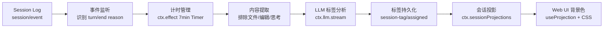

# dsh-session-tag-manage

DeepSeek dsh 插件 · 会话管理：自动为会话打标签（异常终止 / 等待 / 进行中 / 完结 / 无效），并通过 Web UI 背景色高亮 + 每日 17:00 桌面提醒，帮助用户快速识别需要重点跟进的会话。

## 核心功能

- **自动打标签**：监听 `turn/end`，异常终止（error / max-tokens / aborted / blocked / interrupted）即时标记，正常完成的轮次延迟 7 分钟分析
- **规则前置 + LLM 兜底**：结构化信号（reason / approval 配对 / todo/write）走规则判定，规则判不了的语义判断（完结 / 无效 / 进行中）交给 LLM
- **Web UI 背景色渲染**：异常红、等待橙重点强调，其他标签灰淡；CSS 类名定位，规避 ui-workspace 内部类名哈希化风险
- **每日 17:00 会话梳理提醒**：浏览器桌面通知，统计当日有活动且标签 ∈ {等待, 异常} 的会话，两项皆 0 不打扰
- **手动标签更新**：Web UI 下拉修改标签，支持"锁定手动标签"（自动分析不覆盖，新轮次自动重置为进行中）
- **标签随日志持久化**：标签写入 SessionEvent（`session-tag/assigned`），重启 / 恢复 / Fork 语义自动一致

## 架构



宿主侧（Node）负责监听、计时、分析、写事件；客户端（浏览器）只读投影成品值并渲染样式。

## 目录结构

```
dsh-session-tag-manage/
├── package.json
├── cordis.yml              # 本地开发 patch 注册
├── src/
│   ├── index.ts            # 宿主入口：事件监听与计时编排
│   ├── config.ts           # 配置 Schema（Schemastery）
│   ├── events.ts           # SessionEventMap 声明合并（session-tag/assigned）
│   ├── tagger.ts           # 核心：计时 + 内容提取 + LLM 兜底
│   ├── rules.ts            # 规则判定器（纯函数）
│   ├── projection.ts       # SessionProjection 注册
│   ├── override.ts         # 宿主 Typert RPC 服务（手动改标签）
│   └── client/
│       ├── index.ts        # 背景色渲染
│       ├── reminder.ts     # 每日 17:00 桌面提醒
│       └── tagEditor.tsx   # 手动标签编辑组件
└── dist/
```

## 配置

| 字段 | 默认值 | 说明 |
|---|---|---|
| `delayMs` | 7 分钟 | 延迟分析时长 |
| `analysisModel` | `deepseek-v4-flash` | 打标签用的模型 |
| `maxLastTurnMessages` | 50 | 参与分析的最后一轮消息上限 |
| `highlightTags` | `['abnormal_end', 'waiting']` | 重点高亮标签 |
| `dailyReminderTime` | `17:00` | 每日会话梳理提醒时间（HH:mm） |
| `desktopReminderEnabled` | `true` | 桌面消息提醒开关 |
| `manualTagUpdateEnabled` | `true` | Web UI 手动改标签开关 |

## 使用

本地开发（`cordis.yml` 中路径须写绝对路径）：

```bash
pnpm dsh web --patch ./dsh-session-tag-manage/cordis.yml
```

打包发布后安装：

```bash
dsh plugin --profile web add dsh-session-tag-manage
```

## 验证路径

1. 触发权限审批指令 → 7 分钟后出现 `waiting` 标签
2. 中途 ESC 取消轮次 → 立即出现 `abnormal_end`
3. 完整跑完主题任务 → 判定为 `completed`
4. 发"你好" → 判定为 `invalid`
5. 刷新页面 → 背景色从投影恢复（持久化 + 冷读验证）
6. 今日置 `waiting` / `abnormal_end` 会话，17:00 后聚焦页签 → 桌面通知弹出且数字正确
7. Web UI 手动改标签 → 事件写入、投影更新、背景色同步；关闭开关后编辑入口隐藏且服务拒绝写入
