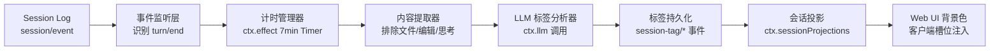

基于 DeepSeek Harness "一切皆插件" 的架构原则，会话管理插件的核心定位是一个**独立目录下的 TypeScript 揸件包**，它通过 `ctx.on('session/event')` 监听轮次结束事件，用 `ctx.effect()` 管理 7 分钟定时器，调用 `ctx.llm` 完成标签分析，再通过 `ctx.sessionProjections` 把标签投影到 Web UI，最后用客户端槽位注入背景色渲染逻辑。下面给出完整的设计方案。
## 一、插件定位与整体架构
DSH 的会话是一份仅追加的类型化 `SessionEvent` 日志，所有派生态（UI、持久化、恢复）都从同一组事件派生，`turn/end` 事件携带 `reason` 字段（取值 completed / error / max-tokens / aborted / blocked / interrupted）。本插件不侵入 Agent Loop，纯粹作为事件消费者 + 投影贡献者存在，整体架构分四层：

整个链路里，宿主侧（Node 进程）负责监听、计时、调用 LLM、写事件；客户端侧（浏览器）只读取投影结果并渲染样式，两边通过 `session/projection` 推送帧同步。
## 二、目录结构与配置定义
推荐的目录结构：
```
dsh-session-tag-manage/
├── package.json
├── cordis.yml              # 本地开发时的 patch 注册
├── README.md
├── src/
│   ├── index.ts            # 宿主侧入口：apply(ctx, config)，事件监听与计时编排
│   ├── config.ts           # 配置 Schema（Schemastery）
│   ├── events.ts           # 自定义 SessionEventMap 声明合并（session-tag/assigned）
│   ├── tagger.ts           # 核心逻辑：计时 + 内容提取 + LLM 兜底判定
│   ├── rules.ts            # 规则判定器（纯函数）：abnormal / waiting / todo 推断
│   ├── projection.ts       # SessionProjection 注册（纯同步 fold + Zod schema）
│   ├── override.ts         # 宿主侧 Typert RPC 服务（sessionTagOverride.set）：校验 + 追加 user-override 事件
│   └── client/
│       ├── index.ts        # 客户端插件：背景色渲染（CSS 类名定位 + useProjection）
│       ├── reminder.ts     # 客户端插件：每日 17:00 会话梳理桌面提醒（定时 + 聚焦兜底）
│       └── tagEditor.tsx   # 客户端插件：会话标签手动编辑组件（Typert RPC 调用 override 服务）
└── dist/                   # 构建产物（若打包发布）
```
`src/config.ts` —— 用 `@deepseek-ai/schemastery` 定义可配置字段：
```typescript
import Schema from '@deepseek-ai/schemastery'
export interface Config {
  delayMs: number                          // 延迟分析时长，默认 7 分钟（用于会话打标签）
  analysisModel: string                    // 用于打标签的模型 id
  maxLastTurnMessages: number              // 参与分析的最后一轮消息上限
  highlightTags: string[]                  // 需要重点高亮的标签
  dailyReminderTime: string                // 每日会话梳理提醒时间（HH:mm），默认 '17:00'
  desktopReminderEnabled: boolean          // 浏览器桌面消息提醒开关，默认开启
  manualTagUpdateEnabled: boolean          // Web UI 手动更新标签开关，默认开启
}
export const Config: Schema = Schema.object({
  delayMs: Schema.number().default(7 * 60 * 1000),
  analysisModel: Schema.string().default('deepseek-v4-flash'),
  maxLastTurnMessages: Schema.number().default(50),
  highlightTags: Schema.array(Schema.string())
    .default(['abnormal_end', 'waiting']),
  dailyReminderTime: Schema.string().default('17:00'),   // 格式 HH:mm，运行时校验
  desktopReminderEnabled: Schema.boolean().default(true),
  manualTagUpdateEnabled: Schema.boolean().default(true),
})
```
`cordis.yml` 本地开发注册（Windows 下 name 必须写 `file:///` URL，`C:/` 盘符路径会被 ESM 视为非法协议）：
```yaml
- insert:
  - id: session-tagger
    name: 'file:///C:/global-user-data/ai-workspace/dsh-session-tag-manage/src/index.ts'
```
启动（在项目目录内运行）：`cd dsh-session-tag-manage && pnpm dsh web --patch ./cordis.yml`
## 三、事件监听：识别 AI 回复结束与异常终止
`session/event` 是唯一的日志事件入口，`turn/*` 不是同名 Cordis 事件，必须在监听器里检查 `event.type`。宿主侧入口 `src/index.ts`：
```typescript
import type { Context } from '@deepseek-ai/cordis'
import { Config } from './config'
import { SessionTagger } from './tagger'
import './events'          // 副作用导入，激活 SessionEventMap 合并
import './projection'      // 注册投影
export const name = 'session-tagger'
export const inject = ['llm', 'sessionProjections']
export function apply(ctx: Context, config: Config) {
  const tagger = new SessionTagger(ctx, config)
  ctx.on('session/event', (session, event) => {
    // 只关心当前轮次结束事件
    if (event.type !== 'turn/end') return
    const reason = event.data.reason
    // 异常终止类 reason：error / max-tokens / aborted / blocked / interrupted
    // 这些情况可以立即标记，无需等待 7 分钟
    if (['error', 'max-tokens', 'aborted', 'blocked', 'interrupted'].includes(reason)) {
      tagger.markImmediately(session, 'abnormal_end')
      return
    }
    // 正常完成的轮次，启动/重置 7 分钟计时器
    if (reason === 'completed') {
      tagger.schedule(session, config.delayMs)
    }
  })
}
```
`turn/end` 的 `reason` 枚举是判断"异常终止"最可靠的信号源——它由 Agent Loop 在轮次关闭时写入持久日志，回放、恢复、Fork 都会保留。
## 四、7 分钟计时器管理
计时器必须走 `ctx.effect()` 纳入生命周期管理，这样插件卸载或会话销毁时定时器自动回收，不留幽灵回调。`src/tagger.ts` 的计时部分：
```typescript
import type { Context } from '@deepseek-ai/cordis'
import type { Session } from '@deepseek-ai/dsh-session/types'
export class SessionTagger {
  private timers = new Map<string, () => void>()   // sessionId -> 取消函数
  constructor(
    private ctx: Context,
    private config: { delayMs: number; analysisModel: string; maxLastTurnMessages: number },
  ) {}
  schedule(session: Session, delayMs: number) {
    const sessionId = session.id
    // 同一会话新轮次结束，重置旧计时器
    this.timers.get(sessionId)?.()
    const cancel = this.ctx.effect(() => {
      const timer = setTimeout(async () => {
        this.timers.delete(sessionId)
        await this.analyze(session)
      }, delayMs)
      return () => clearTimeout(timer)
    })
    this.timers.set(sessionId, cancel)
  }
  markImmediately(session: Session, tag: SessionTag) {
    // 异常终止直接写事件，不走计时
    this.appendTagEvent(session, tag, `turn/end reason indicates ${tag}`)
  }
  dispose() {
    for (const cancel of this.timers.values()) cancel()
    this.timers.clear()
  }
}
```
**边界处理**：如果 7 分钟内用户发了新消息（即新的 `turn/start` 出现），应取消旧计时并标记回 `in_progress`；这需要在同一个 `session/event` 监听器里补充对 `turn/start` 的处理。
## 五、会话内容提取：排除文件、编辑与思考过程
要求只取"最后一轮会话"且排除输入文件、编辑文件、思考过程。从事件词汇表看：
- `user/message` 和 `assistant/message` 是 Surface 事件，会进入派生历史
- `tool/call` / `tool/result` 里属于文件读写类工具（如 `str_replace_editor`、`fs` 系列）的调用要过滤掉
- `assistant/chunk` 是原始流式分片，组装后的 `assistant/message` 才是权威
- 思考过程（reasoning content）通常在 `assistant/message` 的 `message.content` 里的 `reasoning` 类型块中，需要过滤
提取逻辑：
```typescript
private extractLastTurn(session: Session): ExtractedContent {
  const log = session.read()                    // 读取全部事件
  // 从后往前找最后一个 turn/start 的 seq 作为边界
  let lastTurnStartSeq = -1
  for (let i = log.length - 1; i >= 0; i--) {
    if (log[i].type === 'turn/start') { lastTurnStartSeq = log[i].seq; break }
  }
  const messages: { role: 'user' | 'assistant'; text: string }[] = []
  for (const ev of log) {
    if (ev.seq < lastTurnStartSeq) continue
    if (ev.type === 'user/message') {
      // 只保留文本 content，跳过文件附件类 block
      const text = ev.data.content
        .filter(b => b.type === 'text')
        .map(b => b.text).join('\n')
      if (text.trim()) messages.push({ role: 'user', text })
    } else if (ev.type === 'assistant/message') {
      // 过滤 reasoning 块，只留 text / tool_use 之外的可读内容
      const text = ev.data.message.content
        .filter(b => b.type === 'text')
        .map(b => b.text).join('\n')
      if (text.trim()) messages.push({ role: 'assistant', text })
    }
    // tool/call、tool/result、assistant/chunk 一律不进分析输入
  }
  // 截断到配置的上限
  return { messages: messages.slice(-this.config.maxLastTurnMessages) }
}
```
## 六、标签分类：规则前置 + LLM 兜底
五类标签的判定策略遵循"**规则能判的不给模型，模型只做规则判不了的语义判断**"，这样能显著降低误判和 Token 消耗。
| 标签 | 判定规则（优先） | LLM 判定提示要点 |
|---|---|---|
| 异常终止 | `turn/end.reason ∈ {error, max-tokens, aborted, blocked, interrupted}` | 无需 LLM |
| 会话等待 | 日志末尾存在 `approval/asked` 且没有配对的 `approval/decided` | 无需 LLM |
| 会话完结 | `todo/write` 最新快照全为 `completed` 或列表为空，且最后 turn 已 closed | 判断主题任务是否全部完成、无剩余事项 |
| 无效会话 | 规则难以判定 | 判断是否仅为打招呼 / 输入与主题无关无法确定意图 |
| 进行中 | 7 分钟内出现新 `turn/start`，或 `todo/write` 存在 `pending`/`in_progress` 项；`agent/status` 为 `running` 属 whole-agent 运行态、官方明示不可作单轮信号，仅可选参考 | 无需 LLM |
`approval/asked` 与 `approval/decided` 通过 `id` 配对，`decided` 一定在 `asked` 之后追加——这是识别"等待用户授权 / 确认继续"最直接的结构化信号。`todo/write`（全量快照，`status ∈ pending | in_progress | completed`）与 `agent/status`（`idle | running`，已核实存在但为 whole-agent 运行态、官方明示不可作单轮信号，降级为可选）则分别是判定"完结/进行中"与"进行中"的辅助结构化信号，应一并前置到规则层。
LLM 调用走 `ctx.llm` 服务统一接口，把提取出的最后一轮对话发给配置的 `analysisModel`：
```typescript
private async analyze(session: Session) {
  const extracted = this.extractLastTurn(session)
  // 1. 先跑规则判定
  const ruleTag = this.applyRules(session)
  if (ruleTag) {
    this.appendTagEvent(session, ruleTag, 'rule-based')
    return
  }
  // 2. 规则判不了，走 LLM 语义判断（完结 / 无效 / 默认进行中）
  // 真实 API：ctx.llm.stream(GenerateOptions): AsyncIterable<StreamChunk>，chat() 不存在
  const prompt = this.buildPrompt(extracted)
  const chunks = this.ctx.llm.stream({
    // provider 路由必填：值按目标 dsh 版本配置（或走默认路由）
    model: this.config.analysisModel,
    messages: [{ role: 'user', content: prompt }],
  })
  // 流式分片需经 BlockAssembler 组装成完整文本（组装细节按目标 dsh 版本核对）
  const text = await assembleBlocks(chunks)
  const tag = this.parseTagResult(text)
  this.appendTagEvent(session, tag, 'llm-based')
}
private applyRules(session: Session): SessionTag | null {
  const log = session.read()
  // 规则 1：异常终止（已在 turn/end 时即时处理，这里兜底）
  const lastTurnEnd = [...log].reverse().find(e => e.type === 'turn/end')
  if (lastTurnEnd?.data.reason && lastTurnEnd.data.reason !== 'completed') {
    return 'abnormal_end'
  }
  // 规则 2：会话等待 —— 末尾有未决的 approval/asked
  const askedIds = new Set<string>()
  for (const ev of log) {
    if (ev.type === 'approval/asked') askedIds.add(ev.data.id)
    if (ev.type === 'approval/decided') askedIds.delete(ev.data.id)
  }
  if (askedIds.size > 0) return 'waiting'
  return null
}
```
LLM 提示词模板要求模型只输出枚举值之一（`completed` / `invalid` / `in_progress`），并用 JSON 约束输出格式，避免自由文本污染结果。
## 七、标签持久化：自定义 SessionEvent
参照 Conversation Node 的最佳实践，标签事件用声明合并扩展 `SessionEventMap`，这是插件贡献事件的标准入口。`src/events.ts`：
```typescript
import type { Branded } from '@deepseek-ai/dsh-brand'
export type SessionTag =
  | 'in_progress' | 'abnormal_end' | 'waiting' | 'completed' | 'invalid'
export type TagId = Branded<'TagId'>
declare module '@deepseek-ai/dsh-session/types' {
  interface SessionEventMap {
    /**
     * 会话标签写入事件。whole-value 快照式：每次携带完整标签状态。
     * 非 SurfaceEventType 的 log-only 事件：不参与派生历史，无需 SurfaceIntent。
     * @mode emit
     */
    'session-tag/assigned': {
      tagId: TagId
      tag: SessionTag
      source: SessionTagSource
      reason?: string
      assignedAt: number
    }
  }
}
```
写入用 `session.append()`，注意 payload 必须可 JSON 序列化，否则在源头就被拒绝：
```typescript
private appendTagEvent(session: Session, tag: SessionTag, source: string) {
  session.append({
    type: 'session-tag/assigned',
    // 信息性记录：缺失不影响日志重建，标记 ignorable
    ignorable: true,
    data: {
      tagId: `tag-${session.id}` as TagId,
      tag, source,
      assignedAt: Date.now(),
    },
  })
}
```
这样标签天然随会话日志持久化，重启、恢复、Fork 后都能重放。
## 八、Web UI 背景色渲染：投影 + 客户端槽位
### 宿主侧：注册会话投影
`ctx.sessionProjections` 是向客户端投递会话派生状态的正式通道。`src/projection.ts`：
```typescript
import type { Context } from '@deepseek-ai/cordis'
import { SessionTag } from './events'
interface TagState {
  tag: SessionTag | null
  source: SessionTagSource | null   // 标签来源（含 user-override），供 UI 显示"手动"徽标
  assignedAt: number | null
  lastActiveAt: number | null   // 最近一次会话活动时间（epoch ms，用于"当日活动"判定）
}
// 合并声明两个类型表（ProjectionDefinition 正确契约）：
//  - SessionProjectionMap：客户端可见值（= wire.view 输出）
//  - SessionProjectionStateMap：宿主 fold 状态（= apply 维护的持久化 state）
declare module '@deepseek-ai/dsh-session-projection/types' {
  interface SessionProjectionMap {
    'session-tag': { tag: SessionTag | null; source: SessionTagSource | null; lastActiveAt: number | null }
  }
  interface SessionProjectionStateMap {
    'session-tag': { tag: SessionTag | null; source: SessionTagSource | null; assignedAt: number | null; lastActiveAt: number | null }
  }
}
// 视为"会话活动"的事件类型：出现即刷新 lastActiveAt
const ACTIVITY_EVENTS = new Set([
  'turn/start', 'user/message', 'assistant/message',
  'tool/call', 'tool/result', 'approval/asked',
])
export function registerTagProjection(ctx: Context) {
  ctx.sessionProjections.register({
    key: 'session-tag',
    // 字段名是 stateSchema（校验持久化 state），不是顶层 schema
    stateSchema: Schema.object({
      tag: Schema.string().nullable(),
      source: Schema.string().nullable(),
      assignedAt: Schema.number().nullable(),
      lastActiveAt: Schema.number().nullable(),
    }),
    stateVersion: 3,          // view 新增 source，升版本使旧缓存失效
    init: () => ({ tag: null, source: null, assignedAt: null, lastActiveAt: null }),
    apply(state, event) {
      // 纯同步 fold：对无关事件必须返回同一引用（Object.is 相等 → 零下游工作）
      const lastActiveAt = ACTIVITY_EVENTS.has(event.type) ? event.time : state.lastActiveAt
      if (event.type === 'session-tag/assigned') {
        return { tag: event.data.tag, source: event.data.source, assignedAt: event.data.assignedAt, lastActiveAt }
      }
      if (lastActiveAt === state.lastActiveAt) return state
      return { ...state, lastActiveAt }
    },
    // 客户端视图：wire 对象（可选）；viewSchema 校验 view() 输出，须与 SessionProjectionMap 一致
    wire: {
      viewSchema: Schema.object({
        tag: Schema.string().nullable(),
        source: Schema.string().nullable(),
        lastActiveAt: Schema.number().nullable(),
      }),
      view(state) {
        return { tag: state.tag, source: state.source, lastActiveAt: state.lastActiveAt }
      },
    },
  })
}
```
注册后，`dsh-host-apiproxy` 会通过 `session/projection` 推送帧把 `session-tag` 的值实时送到浏览器端。
### 客户端侧：背景色注入（CSS 类名定位）
> **探索结论**：会话列表项由 ui-workspace 内部渲染进 `sidebar.workspaces` 单槽，**没有逐会话行的扩展槽位**（已核对 slots.ts 与 Rows.tsx）。因此背景色渲染改用 **CSS 类名定位**：客户端只读投影成品值，遍历会话行 DOM 元素，按 `tag` 给行挂插件自有 class 并注入全局样式。`src/client/index.ts`：
```typescript
import type { ClientContext } from '@deepseek-ai/dsh-client-runtime/client'
const TAG_STYLES: Record<string, { className: string; css: string }> = {
  abnormal_end: {
    className: 'stag-abnormal',
    css: 'background: rgba(239, 68, 68, 0.12) !important; border-left: 3px solid #ef4444;',
  },
  waiting: {
    className: 'stag-waiting',
    css: 'background: rgba(245, 158, 11, 0.12) !important; border-left: 3px solid #f59e0b;',
  },
  completed: {
    className: 'stag-done',
    css: 'background: rgba(34, 197, 94, 0.08);',
  },
  invalid: {
    className: 'stag-invalid',
    css: 'opacity: 0.55; background: rgba(107, 114, 128, 0.08);',
  },
  in_progress: { className: 'stag-running', css: '' },
}
export const inject = ['slots', 'clientRuntime']
export function apply(ctx: ClientContext) {
  // 1. 注入插件自有全局样式（不依赖 ui-workspace 内部类名，规避生产哈希化风险）
  const style = document.createElement('style')
  style.textContent = Object.values(TAG_STYLES)
    .map(s => `.dsh-session-row.${s.className} { ${s.css} }`).join('\n')
  document.head.appendChild(style)
  // 2. 读投影：客户端 hook 是 useProjection(key)，经标准槽位 kit 注入（SessionStandardProps.useProjection）
  // 3. CSS 定位：MutationObserver 监听会话列表容器，用 data-session-id 关联行元素，
  //    按投影 tag 给行挂 dsh-session-row.{tagClass}；投影更新后重新 apply
  // 4. 标签编辑入口经同一定位注入（见 client/tagEditor.tsx），受 manualTagUpdateEnabled 控制
  // 5. 每日 17:00 会话梳理提醒（浏览器桌面通知），实现见 client/reminder.ts
  setupDailyReminder(ctx, config)
}
```
异常终止（红系）和会话等待（橙系）按需求做重点视觉强调，用 `!important` 确保能覆盖主题默认背景。

**CSS 类名定位的风险与缓解**（阻断点 1 决策 A）：
- ui-workspace 内部类名生产环境 CSS-module 哈希化，**不能依赖其内部类名**；优先用会话行 `data-session-id` 属性定位，缺失时用稳定容器选择器 + 行序匹配。
- 用 `MutationObserver` 监听列表容器增删、投影更新后重新 apply，避免渲染时序竞态。
- 若未来 harness 提供逐会话行槽位，可平滑迁移到上游加槽位方案（方案 C）。
## 九、异常终止与会话等待的识别细节
这两个重点标签的可靠性直接决定插件价值：
**异常终止的三个信号层级**（置信度从高到低）：
1. `turn/end.reason` 明确为非 completed 枚举 —— 最高置信度，`interrupted` 表示用户中途取消，`error` 表示请求失败，`max-tokens` 表示截断
2. `assistant/message` 事件带 `interrupted: true` 标记
3. 打开的 `turn/start` 在会话关闭时没有配对的 `turn/end`（崩溃恢复场景）
**会话等待的配对追踪**：维护一个 `Map<ApprovalRequestId, 'asked'>`，收到 `approval/decided` 时按 `id` 删除；分析时刻集合非空即判为 `waiting`。`decided` 的 `outcome` 取官方枚举 `allowed-once / rejected / cancelled / unavailable`（仅 `allowed-once` 是放行），非 `allowed-once` 表示"等待已解除但未放行"，标签层面统一归为"等待解除"。审批审计事件由 `ctx.approval`（dsh-user-approval 包）成对追加，属 log-only、不进模型转录。
## 十、打包发布与验证
打包成标准插件包，`package.json` 加 `dsh-plugin` 声明后可发布到社区：
```json
{
  "name": "dsh-session-tag-manage",
  "version": "0.1.0",
  "type": "module",
  "main": "src/index.ts",
  "files": ["src", "cordis.yml"],
  "dsh": {
    "bundle": { "patch": "./cordis.yml" },
    "client": "./src/client/index.ts"
  }
}
```
安装：`dsh plugin --profile web add dsh-session-tag-manage`
**验证路径**建议按事件链自底向上：
1. 发一条会触发权限审批的指令（如写文件），确认 `waiting` 标签在 7 分钟后出现
2. 中途 ESC 取消一个轮次，确认立即出现 `abnormal_end`
3. 完整跑完一个主题任务，确认 LLM 判定为 `completed`
4. 发"你好"，确认判定为 `invalid`
5. 刷新页面，确认背景色从投影恢复（验证持久化 + 客户端冷读）
6. 造一条 `waiting` + 一条 `abnormal_end`（今日活动），17:00 后聚焦页签，确认桌面通知弹出且文案数字正确
7. 在 Web UI 把 `abnormal_end` 手动改为 `invalid`，确认事件写入、投影更新、背景色同步变化；关闭开关后编辑入口隐藏且服务拒绝写入
---
**几个关键工程决策的取舍**：7 分钟用 `setTimeout` 而不是 cron，是因为它天然随插件生命周期回收，且用 `ctx.effect` 包裹后能与 Fiber 状态机联动；标签写进 SessionEvent 而不是独立存储，是为了让 Fork / Resume / 回放场景下标签语义自动一致，不产生"差不多正确"的第二份状态——这正是 DSH Session Log 设计哲学的直接受益；规则前置 + LLM 兜底的混合判定，则是在准确性、延迟、Token 成本之间的平衡点，如果后续发现 LLM 判"无效会话"的准确率不足，可以把 `approval` 配对检测这类结构化规则继续前置。

---

## 十一、每日 17:00 会话梳理提醒（浏览器桌面通知）

### 需求与统计口径
- 每日 `dailyReminderTime`（默认 **17:00**）执行一次梳理提醒；`desktopReminderEnabled`（默认 **true**）为总开关。
- 统计口径：**当天有活动**（投影 `lastActiveAt` 落在今日）且标签 ∈ {`abnormal_end`, `waiting`} 的会话。
- 通知文案：`有 XX 个会话等待确认、XX 个会话异常`；两项皆为 0 时不打扰。
- 载体：**浏览器桌面通知（Web Notifications API）**，不占页签内 UI，页签未激活也能弹出，避免失焦漏看。

### 判定条件细节
- "当天有活动"以投影 `lastActiveAt` 判断；日期归属按客户端本地时区（桌面端宿主与浏览器同机，一般一致）。
- 异常终止即时打标，17:00 时必然可见；等待标签需经 7 分钟分析，17:00 前 7 分钟内结束的会话可能尚未出标签，属可接受边界。
- 仅统计今日有活动的会话，避免历史旧会话每天重复轰炸。

### 数据通路（三方案）

| 方案 | 思路 | 优点 | 缺点 | 结论 |
|---|---|---|---|---|
| A 客户端本地汇总（推荐） | 投影扩展 `lastActiveAt`；客户端在 17:00 定时 + 聚焦兜底时，遍历会话投影本地统计并弹桌面通知 | 全部基于已验证机制（投影 + 槽位 + Notification）；无需新增宿主/推送通道 | 浏览器后台 `setTimeout` 节流可能延迟，需聚焦兜底；投影订阅范围需覆盖全部会话 | ✅ |
| B 宿主权威计时 + 客户端拉取 | 宿主 17:00 计算摘要缓存；客户端定时/聚焦时经 Typert RPC 拉取 | 计时可靠（Node 无节流）、数据完整 | 需验证 client→host Typert RPC 拉取通路 | 备选 |
| C 宿主计算后主动推送 | 宿主 17:00 计算摘要并主动 push 到客户端 | 最实时 | 宿主→客户端通用推送通道未在文档验证，需 spike 确认 | ✗ |

推荐 **A**：零未验证依赖、与"客户端只收成品值"哲学一致；若投影订阅范围不足以覆盖全部会话，或需更强实时性，再升级到 B。

### 浏览器桌面通知实现要点（客户端，`src/client/reminder.ts`）
1. 权限：`Notification.requestPermission()`，拒绝则静默降级（不打扰）；尊重 `desktopReminderEnabled` 开关。
2. 排程：计算距下一次 `HH:mm` 的毫秒数，`setTimeout` 循环排程，走客户端 `ctx.effect` 生命周期托管。
3. **后台节流兜底**：浏览器对后台页签 `setTimeout` 节流，仅靠定时器可能延迟。补充监听 `visibilitychange` / `window.focus`——若当前已过今日提醒时刻且今日未提醒过（`localStorage` 记 `last-notified-date`），立即补查触发。
4. 统计：遍历会话投影，过滤 `lastActiveAt` 属今日且 `tag ∈ {abnormal_end, waiting}`，计数并组装文案；两数皆 0 不发。
5. 去重：`last-notified-date` 持久化在浏览器本地，防止重复提醒。

### 配置扩展
对应 `src/config.ts` 新增两个字段：
```typescript
dailyReminderTime: string       // 每日会话梳理提醒时间（HH:mm），默认 '17:00'
desktopReminderEnabled: boolean // 浏览器桌面消息提醒开关，默认开启
```

### 验证路径
1. 造数：今日置一条 `waiting`、一条 `abnormal_end`，17:00 后聚焦页签 → 弹出桌面通知且文案数字正确。
2. 关掉开关 → 不弹；拒绝通知权限 → 静默；两项计数为 0 → 不弹。
3. 非今日活动的旧会话不计入提醒。

---

## 十二、Web UI 手动标签更新（用户覆盖）

### 需求
- 用户在 Web UI 层可手动修改会话标签，如把 `abnormal_end`（异常终止）改为 `invalid`（无效会话）。
- 更新后：会话标签数据（事件日志 + 投影）与 UI 背景色同步变化。
- 提供开关 `manualTagUpdateEnabled`（默认开启）控制是否允许手动更新。

### 数据通路（与既有机制完全复用，零新增投影逻辑）
```
Web UI 标签下拉 → 客户端经 Typert RPC 调用宿主 override 服务
  → 宿主校验（开关 / 合法标签 / 会话存在）
  → session.append(session-tag/assigned, source: 'user-override')
  → 投影 fold 新事件（whole-value 快照，后写覆盖）
  → session/projection 推帧 → 客户端 useProjection 重渲染 → 背景色同步
```
- 事件写入走宿主侧，标签持久化在会话日志，重启 / 回放 / Fork 语义一致。
- 投影是 whole-value 快照、"后写覆盖"：手动写一条 `source: 'user-override'` 事件即完成数据与 UI 同步。
- 手动覆盖会自然影响每日 17:00 梳理统计（如把 `abnormal_end` 改为 `invalid` 后，该会话不再计入"异常"）。

### 客户端→宿主写通路：Typert RPC（阻断点 2 决策 B）
- Typert RPC 是 dsh **构建时生成**的类型化 RPC：在插件里声明 Typert contract（如 `SessionTagOverrideService.set(sessionId, tag)`），构建时生成客户端调用桩 + 宿主服务桩，避免手写协议编解码。
- 对独立插件而言 Typert 工具链较重，但换取类型安全与宿主/客户端接口一致；`ctx.webServer` + `fetch` 的 HTTP 路由（方案 A）更轻量，但需自管鉴权/参数校验/错误映射，且不享受类型生成。
- 实现要点：宿主注册 `sessionTagOverride` 服务实现（含开关 / 合法标签 / 会话存在校验），客户端经生成的 RPC 桩调用；构建命令与 Typert contract 语法按目标 dsh 版本核对后落地。


### 配置扩展
`src/config.ts` 新增：
```typescript
manualTagUpdateEnabled: boolean  // Web UI 手动更新标签开关，默认开启
```
双重生效：客户端隐藏/禁用编辑入口（交互层）；宿主 override 服务拒绝写入（权威兜底）。

### 宿主侧：手动标签服务（`src/override.ts`）
```typescript
const VALID_TAGS: ReadonlySet<SessionTag> = new Set([
  'in_progress', 'abnormal_end', 'waiting', 'completed', 'invalid',
])
export function registerTagOverrideService(ctx: Context, config: Config) {
  ctx.service.register('sessionTagOverride', {
    async set(sessionId: string, tag: SessionTag): Promise<{ ok: boolean; reason?: string }> {
      if (!config.manualTagUpdateEnabled) return { ok: false, reason: 'manual tag update disabled' }
      if (!VALID_TAGS.has(tag)) return { ok: false, reason: 'invalid tag' }
      const session = await ctx.sessions.get(sessionId)
      if (!session) return { ok: false, reason: 'session not found' }
      session.append({
        type: 'session-tag/assigned',
        ignorable: true,
        data: {
          tagId: `tag-${session.id}` as TagId,
          tag, source: 'user-override',
          reason: 'web ui manual',
          assignedAt: Date.now(),
        },
      })
      return { ok: true }
    },
  })
}
```
（客户端→宿主写通路采用 Typert RPC，见上文「客户端→宿主写通路」小节；宿主侧服务实现保持上方代码形态。）

### 客户端侧：标签编辑组件（`src/client/tagEditor.tsx`）
- 随会话行 CSS 定位注入（同背景色定位，见第八章）：鼠标悬停显示下拉，列出 5 个合法标签，当前标签高亮；`source === 'user-override'` 时显示"手动"徽标。
- 切换后调用宿主 `sessionTagOverride.set(sessionId, next)`；失败（开关关闭 / 非法值 / 会话不存在）时保留原值并提示。
- `manualTagUpdateEnabled === false` 时不渲染编辑入口。

### 冲突策略：手动标签 vs 自动标签（三方案）

| 方案 | 行为 | 优点 | 缺点 | 结论 |
|---|---|---|---|---|
| A 允许自动覆盖 | 手动改后，后续 7 分钟自动分析可再次覆盖 | 实现最简 | 用户修正被回滚，体验差 | ✗ |
| B 锁定手动标签（推荐） | 当前标签 `source === 'user-override'` 时，自动分析跳过不覆盖；新 `turn/start` 仍重置为 `in_progress` | 用户修正稳定；会话重新活跃时自动回到进行中，逻辑自洽 | 需在 `analyze()` 前置一个 source 检查 | ✅ |
| C 时间窗加权 | 手动标签在 N 天内优先，之后允许自动覆盖 | 灵活 | 规则复杂、可预期性差 | ✗ |

推荐 **B**：在 `analyze()` 写自动标签前，读取最近一次 `session-tag/assigned` 的 `source`，若为 `user-override` 则跳过本次写入（不产生新事件、不覆盖投影）。用户仍可再次手动修改，或等新轮次开始后由系统重置为 `in_progress`。

### 验证路径
1. Web UI 把 `abnormal_end` 手动改为 `invalid` → 事件写入（source=user-override）、投影更新、背景色同步变为无效会话灰淡样式。
2. 手动改后 7 分钟内再次触发分析 → 标签不被覆盖（方案 B）；新发一条消息（新 `turn/start`）→ 重置为 `in_progress`。
3. 关闭 `manualTagUpdateEnabled` → 编辑入口隐藏，且直接调用服务被拒。
4. 刷新页面 → 手动标签从投影缓存恢复（持久化验证）。

---

## 十三、官方 API 核对与校准记录

本设计在落地前对照 DeepSeek Harness 官方插件文档（[develop/basic](https://deepseek-harness.github.io/deepseek-harness/develop/basic/)）与 GitHub 源码逐项核对，校准结论如下：

| 设计稿写法 | 官方真实契约 | 状态 |
|---|---|---|
| `ctx.on('session/event')` + 检查 `event.type` | 官方："`turn/*`、`step/*`、`tool/call` 等是持久会话事件，不是同名 Cordis 事件，监听 `session/event` 并检查 `event.type`" | ✅ 正确 |
| `turn/end.data.reason` 枚举 | `TurnEndReason`：`completed / error / max-tokens / aborted / blocked / interrupted` | ✅ 正确 |
| `SessionEventMap` 声明合并扩展 | merge-extensible 类型表，插件经 declaration merging 加变体 | ✅ 正确 |
| `approval/asked` / `approval/decided` 配对判等待 | 真实存在：`ctx.approval`（dsh-user-approval）成对追加，`ApprovalRequestId` 配对，log-only 审计事件、不进模型转录 | ✅ 正确 |
| `ctx.sessionProjections.register({key,schema,...})` | 实际字段名是 **`stateSchema`**（Zod 校验持久化 state）+ **`wire:{viewSchema,view}`**（客户端视图）；需合并声明 `SessionProjectionMap`（客户端可见值）+ `SessionProjectionStateMap`（宿主 fold 状态）两个类型表；`apply` 须同步且对无关事件返回同一引用 | ❌ 已修正 |
| `ctx.llm.chat({model,messages})` | 不存在；真实 API 是 `ctx.llm.stream(GenerateOptions): AsyncIterable<StreamChunk>`，`GenerateOptions` 含 provider 路由 + model + `messages: Message[]`，文本经 **BlockAssembler** 组装 | ❌ 已修正 |
| package.json `dsh.clientEntry` | 官方字段为 `dsh.bundle.patch`（组合包）+ `dsh.client`（浏览器端插件声明） | ❌ 已修正 |
| 客户端槽位渲染 | `packages/client`：shell / wire / object services / **slots** / ui-* 插件；**会话列表项由 ui-workspace 渲染进 `sidebar.workspaces` 单槽，无逐会话行槽位** | ✅ 正确（无逐行槽位） |
| 投影推送方 | `dsh-host-apiproxy` 的 history tail + `session/projection` push frame | ✅ 正确 |

**本设计新增利用的官方信号（此前未纳入）**：
1. **`todo/write` 事件**：全量快照 `TodoItem[]`，`status ∈ pending | in_progress | completed` —— 判定"进行中 vs 完结"的结构化权威信号，前置到规则层，减少 LLM 依赖。
2. **`agent/status`**（`idle | running`）：真实存在的 agent 运行态（官方 `docs/defensive-patterns.md` "Async state is not synchronous state" 一节明确提及 `agent/status` / `whenIdle()`），但属 **whole-agent 运行态、非逐会话信号**，且官方防御模式文档明示"**Never treat `agent/status` or `whenIdle()` as the result of one follow-up**"（多个排队 follow-up / steering / 注入任务可共享同一个 `running` 区间）——因此设计上**降级为可选**；"进行中"主信号由 `todo/write` + `turn/start` 承担，不依赖它。

**落地注意事项**：
- 自定义 `session-tag/assigned` 属非 `SurfaceEventType` 的 log-only 事件，无需 `SurfaceIntent`；信息性记录应置 `ignorable: true`（本设计已加）。
- 投影 `wire.view()` 输出须过 `viewSchema` 校验；`apply` 对无关事件必须返回同一状态引用（`Object.is` 相等才产生零下游工作）。
- 会话列表无逐行槽位（`sidebar.workspaces` 单槽、ui-workspace 内部渲染），背景色与标签编辑入口用 **CSS 类名定位**（见第八章）；`dsh.client` 字段格式需按目标 dsh 版本核对（当前 0.1.0-rc.x ~ 0.1.1-rc.1，官方预告破坏性变更，投影 API 已在 rc.1 升级过）。
- 客户端读取自身配置、遍历会话投影与列表的 API 需按目标 dsh 版本核对；桌面通知为标准 Web API（`Notification`），需用户授权权限。
- 客户端→宿主的手动标签写入采用 **Typert RPC**（构建时生成类型化接口；宿主侧 `sessionTagOverride` 服务实现见第十二章），构建命令与 contract 语法按目标 dsh 版本核对。

### 本次探索结论（2026-08-25）

**已核实的契约（设计正确）**：

| 设计主张 | 官方契约 | 状态 |
|---|---|---|
| `ctx.on('session/event')` + 检查 `event.type` | `turn/*` 是持久日志事件，非同名 Cordis 事件 | ✅ |
| `turn/end: { turn, reason: TurnEndReason }` | 存在，6 种 reason | ✅ |
| `SessionEventMap` 声明合并扩展 | merge-extensible 类型表 | ✅ |
| `approval/asked`/`approval/decided` 配对 | `ApprovalRequestId` 品牌配对，`ApprovalOutcome` 闭集 | ✅ |
| `todo/write` 全量快照 | `TodoItem[]`，3 态 status | ✅ |
| `assistant/message` 的 `interrupted: true` | 存在 | ✅ |
| `Session.append()` JSON 校验 | `isJsonValue` 运行时校验 | ✅ |
| `ctx.sessions.get(id)` | 存在 | ✅ |
| 投影注册表自动订阅 `session/event` 驱动 fold | 注册表驱动单元，插件无需自持订阅 | ✅ |
| 客户端模块 `dsh.client` + `dsh.bundle.patch` | 两个 manifest 面 | ✅ |

**需修正的 4 处（已回写正文）**：
1. `ProjectionDefinition` 字段名 → `stateSchema` + `wire:{viewSchema,view}`，且合并声明 `SessionProjectionMap`（客户端可见值）+ `SessionProjectionStateMap`（宿主 fold 状态）。
2. `ctx.llm.chat()` → `ctx.llm.stream(GenerateOptions)`，文本经 BlockAssembler 组装（第六章已改）。
3. `useSessionProjection` → `useProjection(key)`，经标准槽位 kit 注入（`SessionStandardProps.useProjection`）（第八章已改）。
4. `sidebar.session.item` 槽位不存在 → 会话列表由 ui-workspace 渲染进 `sidebar.workspaces` 单槽，无逐行槽位（第八章/决策 4 已改）。

**两个阻断点决策**：
- 阻断点 1 背景色渲染挂载点 → **CSS 类名定位**（决策 A）：DOM 定位会话行 + 插件自有 class + 全局样式；`MutationObserver` 兜底增删；规避生产哈希化。
- 阻断点 2 客户端→宿主写通路 → **Typert RPC**（决策 B）：构建时生成类型化 RPC，宿主注册 `sessionTagOverride` 服务，客户端经生成的桩调用；工具链较重但类型安全。

**未核实项（本轮已补充核实并收敛）**：
- `agent/status`（`idle|running`）：已确认真实存在（官方 `docs/defensive-patterns.md` 明示），但它是 **whole-agent 运行态**——多个 follow-up / steering / 注入任务共享一个 `running` 区间，官方明确警告**不可作为单次 follow-up / 单轮次的完成信号**。设计上**降级为可选**（不参与规则判定）；"进行中"主信号由 `todo/write` + `turn/start` 承担，语义不受影响。

**新发现（2026-08-25 阶段 1 代码审查，已回写实现）**：

| 事项 | 结论 |
|---|---|
| 自定义事件 `ignorable: true` 写入 | **受 `Session.append` API 限制暂不可达**：`dsh-session@0.1.1-rc.2` 的 `append(type, data, ...opts)` 签名仅支持非 Surface 事件空 opts，生成的事件信封（envelope）只含 `type/seq/time/data/surfaceMetadata`，无 `ignorable` 字段。`KNOWN_SESSION_EVENT_TYPES` 明示插件自定义事件不在集合内、读取路径对集合外事件**无 ignorable 标记将拒绝重建**——该拒绝逻辑当前未启用（信封校验只查结构），但未来启用后含 `session-tag/assigned` 的会话将无法重建，插件侧无任何手段设置标记。**处置**：代码按 log-only 语义写入（不影响当前功能），风险已记录，待上游提供插件事件注册 / ignorable 设置表面后补齐；spec/design 中"置 `ignorable: true`"表述同步降级为"log-only 非 Surface 语义（ignorable 受 API 限制暂不可设）"。 |
| 规则 1 覆盖新轮次 | `applyRules` 仅查最后一个 `turn/end` reason，异常终止后用户开新轮次会被 7 分钟后回标 `abnormal_end`。**已修复**：规则 1 增加 `isLastTurnClosed(events)` 前置（最后事件为 `turn/start` 时不判 abnormal），并补回归用例。 |
| 手动锁定被即时打标绕过 | `markImmediately` 原不检查 user-override。**已修复**：`markImmediately` 增加 `{ ignoreLock }` 选项，异常终止路径受锁保护跳过；`turn/start` 重置 `in_progress` 豁免锁定（与冲突策略 B 一致），补锁保护 / 豁免用例。 |
| LLM 兜底异步竞态 | 计时到期后 `analyze` 异步（LLM 数秒）期间新 `turn/start` 到达会覆盖。**已修复**：`schedule` 记录 `baseSeq = session.seq`，`analyze` 写事件前比对 `logMoved`，日志已推进则放弃写入。 |
| provider 硬编码 | `DEFAULT_PROVIDER = 'deepseek'` 写死。**已修复**：提为配置项 `analysisProvider`（默认 `deepseek`）。 |

## 十四、关键决策与方案选型

### 总体实现方案（三选一）

| 方案 | 思路 | 优点 | 缺点 | 结论 |
|---|---|---|---|---|
| A 纯事件 + 侧栏 class | 不注册投影，客户端从事件流读标签 | 依赖最少 | 违背"客户端只收成品值"哲学；冷读/刷新背景色缺失；与官方机制割裂 | ✗ |
| **B 投影 + 槽位（推荐）** | 写事件 → `ctx.sessionProjections` 纯同步 fold → `session/projection` 推帧 → 客户端 slots | 与官方设计一致；缓存持久化 + 冷读恢复免费；unit 卸载自动清理；headless 无 registry 时自动不挂载 | 链路多一环，需 `inject: ['sessionProjections']`；`view` 必须同步 | ✅ |
| C 独立存储标签 | 标签存独立 KV/文件，走自定义 HTTP 路由 | 读写直观 | 违背日志唯一真源；Fork/Resume 语义不一致；需自建持久化 | ✗ |

### 决策 1：标签判定策略 —— 规则前置 + LLM 兜底（推荐）
结构化信号全走规则（abnormal / waiting / todo 推断），LLM 只判规则判不了的 `completed` / `invalid` / `in_progress`，JSON 约束输出枚举。兼顾准确率、延迟与 Token 成本。

### 决策 2："会话等待"信号 —— 审计事件配对为主、ask-user 为辅（推荐）
- 主：分析时刻扫日志，`approval/asked` 无配对 `approval/decided` 即 `waiting`（可回放、幂等）。
- 辅：`tool-ask-user` 产生的用户确认请求合并进 `waiting` 判定，覆盖需求中"等待用户确认继续 / 是否继续"。
- 备选：监听 `approval/request` 瀑布事件实时置 `waiting`，但属非持久事件、重启丢失。

### 决策 3：计时管理 —— 重置式 setTimeout + ctx.effect（推荐）
每次 `turn/end(completed)` 重置 7 分钟；`turn/start` 取消旧计时并回 `in_progress`；异常 reason 即时标记不等计时。`ctx.effect` 托管生命周期，卸载自动回收，不产生幽灵回调。

### 决策 4：Web UI 渲染 —— 投影 + CSS 类名定位（推荐，阻断点 1 决策 A）
会话列表由 ui-workspace 渲染、无逐行槽位，故客户端用 `useProjection('session-tag')`（经 `SessionStandardProps` 注入）读投影成品值，DOM 定位会话行并挂插件自有 `dsh-session-row.stag-*` class；异常红、等待橙 `!important` 强调。用 `MutationObserver` 兜底行增删；生产环境 CSS-module 哈希化风险通过插件自有 class 规避。

### 决策 5：打包与分发 —— 先本地 patch，后 bundle
- 开发期：`cordis.yml` + `--patch`（`name` 用 `file:///` URL 引用 src）。
- 分发：`package.json` 声明 `dsh.bundle.patch`（宿主）+ `dsh.client`（浏览器端），`dsh plugin --profile web add ./dsh-session-tag-manage`。

### 决策 6：每日 17:00 提醒通路 —— 客户端本地汇总 + 聚焦兜底（推荐）
投影扩展 `lastActiveAt`，客户端在定时与 `visibilitychange`/`focus` 兜底时本地统计，用 `Notification` 弹桌面提醒；不引入未验证的宿主→客户端推送通道。宿主权威计时 + Typert RPC 拉取（方案 B）作为投影覆盖不足或需更强实时性时的升级路径。

### 决策 7：手动标签更新 —— Typert RPC 写通路 + 投影"后写覆盖" + 锁定手动标签（推荐）
写通路：客户端经 **Typert RPC**（阻断点 2 决策 B）调用宿主 `sessionTagOverride.set`，宿主校验后追加一条 `source: 'user-override'` 的 `session-tag/assigned` 事件，投影 whole-value 快照自动同步数据与 UI；开关 `manualTagUpdateEnabled`（默认开）在客户端隐藏入口 + 宿主拒绝写入双重生效。冲突策略选"锁定手动标签"：`source === 'user-override'` 时自动分析不覆盖，新 `turn/start` 仍重置为 `in_progress`。

