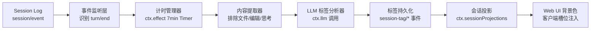

基于 DeepSeek Harness "一切皆插件" 的架构原则，会话管理插件的核心定位是一个**独立目录下的 TypeScript 揸件包**，它通过 `ctx.on('session/event')` 监听轮次结束事件，用 `ctx.effect()` 管理 7 分钟定时器，调用 `ctx.llm` 完成标签分析，再通过 `ctx.sessionProjections` 把标签投影到 Web UI，最后用客户端槽位注入背景色渲染逻辑。下面给出完整的设计方案。
## 一、插件定位与整体架构
DSH 的会话是一份仅追加的类型化 `SessionEvent` 日志，所有派生态（UI、持久化、恢复）都从同一组事件派生，`turn/end` 事件携带 `reason` 字段（取值 completed / error / max-tokens / aborted / blocked / interrupted）。本插件不侵入 Agent Loop，纯粹作为事件消费者 + 投影贡献者存在，整体架构分四层：

整个链路里，宿主侧（Node 进程）负责监听、计时、调用 LLM、写事件；客户端侧（浏览器）只读取投影结果并渲染样式，两边通过 `session/projection` 推送帧同步。
## 二、目录结构与配置定义
推荐的目录结构：
```
dsh-session-tagger/
├── package.json
├── cordis.yml              # 本地开发时的 patch 注册
├── README.md
├── src/
│   ├── index.ts            # 宿主侧入口：apply(ctx, config)，事件监听与计时编排
│   ├── config.ts           # 配置 Schema（Schemastery）
│   ├── events.ts           # 自定义 SessionEventMap 声明合并（session-tag/assigned）
│   ├── tagger.ts           # 核心逻辑：计时 + 内容提取 + LLM 兜底判定
│   ├── rules.ts            # 规则判定器（纯函数）：abnormal / waiting / todo 推断
│   ├── projection.ts       # SessionProjection 注册（纯同步 fold + Zod schema）
│   └── client/
│       └── index.ts        # 客户端插件：背景色渲染（slots + useSessionProjection）
└── dist/                   # 构建产物（若打包发布）
```
`src/config.ts` —— 用 `@deepseek-ai/schemastery` 定义可配置字段：
```typescript
import Schema from '@deepseek-ai/schemastery'
export interface Config {
  delayMs: number                          // 延迟分析时长，默认 7 分钟
  analysisModel: string                    // 用于打标签的模型 id
  maxLastTurnMessages: number              // 参与分析的最后一轮消息上限
  highlightTags: string[]                  // 需要重点高亮的标签
}
export const Config: Schema = Schema.object({
  delayMs: Schema.number().default(7 * 60 * 1000),
  analysisModel: Schema.string().default('deepseek-v4-flash'),
  maxLastTurnMessages: Schema.number().default(50),
  highlightTags: Schema.array(Schema.string())
    .default(['abnormal_end', 'waiting']),
})
```
`cordis.yml` 本地开发注册（路径必须写绝对路径）：
```yaml
- insert:
  - id: session-tagger
    name: '/绝对路径/dsh-session-tagger/src/index.ts'
```
启动：`pnpm dsh web --patch ./dsh-session-tagger/cordis.yml`
## 三、事件监听：识别 AI 回复结束与异常终止
`session/event` 是唯一的日志事件入口，`turn/*` 不是同名 Cordis 事件，必须在监听器里检查 `event.type`。宿主侧入口 `src/index.ts`：
```typescript
import type { Context } from '@deepseek-ai/cordis'
import { Config } from './config'
import { SessionTagger } from './tagger'
import './events'          // 副作用导入，激活 SessionEventMap 合并
import './projection'      // 注册投影
export const name = 'session-tagger'
export const inject = ['llm', 'sessionProjections']
export function apply(ctx: Context, config: Config) {
  const tagger = new SessionTagger(ctx, config)
  ctx.on('session/event', (session, event) => {
    // 只关心当前轮次结束事件
    if (event.type !== 'turn/end') return
    const reason = event.data.reason
    // 异常终止类 reason：error / max-tokens / aborted / blocked / interrupted
    // 这些情况可以立即标记，无需等待 7 分钟
    if (['error', 'max-tokens', 'aborted', 'blocked', 'interrupted'].includes(reason)) {
      tagger.markImmediately(session, 'abnormal_end')
      return
    }
    // 正常完成的轮次，启动/重置 7 分钟计时器
    if (reason === 'completed') {
      tagger.schedule(session, config.delayMs)
    }
  })
}
```
`turn/end` 的 `reason` 枚举是判断"异常终止"最可靠的信号源——它由 Agent Loop 在轮次关闭时写入持久日志，回放、恢复、Fork 都会保留。
## 四、7 分钟计时器管理
计时器必须走 `ctx.effect()` 纳入生命周期管理，这样插件卸载或会话销毁时定时器自动回收，不留幽灵回调。`src/tagger.ts` 的计时部分：
```typescript
import type { Context } from '@deepseek-ai/cordis'
import type { Session } from '@deepseek-ai/dsh-session/types'
export class SessionTagger {
  private timers = new Map<string, () => void>()   // sessionId -> 取消函数
  constructor(
    private ctx: Context,
    private config: { delayMs: number; analysisModel: string; maxLastTurnMessages: number },
  ) {}
  schedule(session: Session, delayMs: number) {
    const sessionId = session.id
    // 同一会话新轮次结束，重置旧计时器
    this.timers.get(sessionId)?.()
    const cancel = this.ctx.effect(() => {
      const timer = setTimeout(async () => {
        this.timers.delete(sessionId)
        await this.analyze(session)
      }, delayMs)
      return () => clearTimeout(timer)
    })
    this.timers.set(sessionId, cancel)
  }
  markImmediately(session: Session, tag: SessionTag) {
    // 异常终止直接写事件，不走计时
    this.appendTagEvent(session, tag, `turn/end reason indicates ${tag}`)
  }
  dispose() {
    for (const cancel of this.timers.values()) cancel()
    this.timers.clear()
  }
}
```
**边界处理**：如果 7 分钟内用户发了新消息（即新的 `turn/start` 出现），应取消旧计时并标记回 `in_progress`；这需要在同一个 `session/event` 监听器里补充对 `turn/start` 的处理。
## 五、会话内容提取：排除文件、编辑与思考过程
要求只取"最后一轮会话"且排除输入文件、编辑文件、思考过程。从事件词汇表看：
- `user/message` 和 `assistant/message` 是 Surface 事件，会进入派生历史
- `tool/call` / `tool/result` 里属于文件读写类工具（如 `str_replace_editor`、`fs` 系列）的调用要过滤掉
- `assistant/chunk` 是原始流式分片，组装后的 `assistant/message` 才是权威
- 思考过程（reasoning content）通常在 `assistant/message` 的 `message.content` 里的 `reasoning` 类型块中，需要过滤
提取逻辑：
```typescript
private extractLastTurn(session: Session): ExtractedContent {
  const log = session.read()                    // 读取全部事件
  // 从后往前找最后一个 turn/start 的 seq 作为边界
  let lastTurnStartSeq = -1
  for (let i = log.length - 1; i >= 0; i--) {
    if (log[i].type === 'turn/start') { lastTurnStartSeq = log[i].seq; break }
  }
  const messages: { role: 'user' | 'assistant'; text: string }[] = []
  for (const ev of log) {
    if (ev.seq < lastTurnStartSeq) continue
    if (ev.type === 'user/message') {
      // 只保留文本 content，跳过文件附件类 block
      const text = ev.data.content
        .filter(b => b.type === 'text')
        .map(b => b.text).join('\n')
      if (text.trim()) messages.push({ role: 'user', text })
    } else if (ev.type === 'assistant/message') {
      // 过滤 reasoning 块，只留 text / tool_use 之外的可读内容
      const text = ev.data.message.content
        .filter(b => b.type === 'text')
        .map(b => b.text).join('\n')
      if (text.trim()) messages.push({ role: 'assistant', text })
    }
    // tool/call、tool/result、assistant/chunk 一律不进分析输入
  }
  // 截断到配置的上限
  return { messages: messages.slice(-this.config.maxLastTurnMessages) }
}
```
## 六、标签分类：规则前置 + LLM 兜底
五类标签的判定策略遵循"**规则能判的不给模型，模型只做规则判不了的语义判断**"，这样能显著降低误判和 Token 消耗。
| 标签 | 判定规则（优先） | LLM 判定提示要点 |
|---|---|---|
| 异常终止 | `turn/end.reason ∈ {error, max-tokens, aborted, blocked, interrupted}` | 无需 LLM |
| 会话等待 | 日志末尾存在 `approval/asked` 且没有配对的 `approval/decided` | 无需 LLM |
| 会话完结 | `todo/write` 最新快照全为 `completed` 或列表为空，且最后 turn 已 closed | 判断主题任务是否全部完成、无剩余事项 |
| 无效会话 | 规则难以判定 | 判断是否仅为打招呼 / 输入与主题无关无法确定意图 |
| 进行中 | 7 分钟内出现新 `turn/start`，或 `todo/write` 存在 `pending`/`in_progress` 项，或 `agent/status` 为 `running` | 无需 LLM |
`approval/asked` 与 `approval/decided` 通过 `id` 配对，`decided` 一定在 `asked` 之后追加——这是识别"等待用户授权 / 确认继续"最直接的结构化信号。`todo/write`（全量快照，`status ∈ pending | in_progress | completed`）与 `agent/status`（`idle | running`）则分别是判定"完结/进行中"与"进行中"的辅助结构化信号，应一并前置到规则层。
LLM 调用走 `ctx.llm` 服务统一接口，把提取出的最后一轮对话发给配置的 `analysisModel`：
```typescript
private async analyze(session: Session) {
  const extracted = this.extractLastTurn(session)
  // 1. 先跑规则判定
  const ruleTag = this.applyRules(session)
  if (ruleTag) {
    this.appendTagEvent(session, ruleTag, 'rule-based')
    return
  }
  // 2. 规则判不了，走 LLM 语义判断（完结 / 无效 / 默认进行中）
  const prompt = this.buildPrompt(extracted)
  const result = await this.ctx.llm.chat({
    model: this.config.analysisModel,
    messages: [{ role: 'user', content: prompt }],
  })
  const tag = this.parseTagResult(result)
  this.appendTagEvent(session, tag, 'llm-based')
}
private applyRules(session: Session): SessionTag | null {
  const log = session.read()
  // 规则 1：异常终止（已在 turn/end 时即时处理，这里兜底）
  const lastTurnEnd = [...log].reverse().find(e => e.type === 'turn/end')
  if (lastTurnEnd?.data.reason && lastTurnEnd.data.reason !== 'completed') {
    return 'abnormal_end'
  }
  // 规则 2：会话等待 —— 末尾有未决的 approval/asked
  const askedIds = new Set<string>()
  for (const ev of log) {
    if (ev.type === 'approval/asked') askedIds.add(ev.data.id)
    if (ev.type === 'approval/decided') askedIds.delete(ev.data.id)
  }
  if (askedIds.size > 0) return 'waiting'
  return null
}
```
LLM 提示词模板要求模型只输出枚举值之一（`completed` / `invalid` / `in_progress`），并用 JSON 约束输出格式，避免自由文本污染结果。
## 七、标签持久化：自定义 SessionEvent
参照 Conversation Node 的最佳实践，标签事件用声明合并扩展 `SessionEventMap`，这是插件贡献事件的标准入口。`src/events.ts`：
```typescript
import type { Branded } from '@deepseek-ai/dsh-brand'
export type SessionTag =
  | 'in_progress' | 'abnormal_end' | 'waiting' | 'completed' | 'invalid'
export type TagId = Branded<'TagId'>
declare module '@deepseek-ai/dsh-session/types' {
  interface SessionEventMap {
    /**
     * 会话标签写入事件。whole-value 快照式：每次携带完整标签状态。
     * 非 SurfaceEventType 的 log-only 事件：不参与派生历史，无需 SurfaceIntent。
     * @mode emit
     */
    'session-tag/assigned': {
      tagId: TagId
      tag: SessionTag
      source: 'rule-based' | 'llm-based' | 'user-override'
      reason?: string
      assignedAt: number
    }
  }
}
```
写入用 `session.append()`，注意 payload 必须可 JSON 序列化，否则在源头就被拒绝：
```typescript
private appendTagEvent(session: Session, tag: SessionTag, source: string) {
  session.append({
    type: 'session-tag/assigned',
    // 信息性记录：缺失不影响日志重建，标记 ignorable
    ignorable: true,
    data: {
      tagId: `tag-${session.id}` as TagId,
      tag, source,
      assignedAt: Date.now(),
    },
  })
}
```
这样标签天然随会话日志持久化，重启、恢复、Fork 后都能重放。
## 八、Web UI 背景色渲染：投影 + 客户端槽位
### 宿主侧：注册会话投影
`ctx.sessionProjections` 是向客户端投递会话派生状态的正式通道。`src/projection.ts`：
```typescript
import type { Context } from '@deepseek-ai/cordis'
import { SessionTag } from './events'
interface TagState {
  tag: SessionTag | null
  assignedAt: number | null
}
declare module '@deepseek-ai/dsh-session-projection/types' {
  interface SessionProjectionMap {
    'session-tag': { tag: SessionTag | null }
  }
}
export function registerTagProjection(ctx: Context) {
  ctx.sessionProjections.register({
    key: 'session-tag',
    schema: /* Zod schema */,
    stateVersion: 1,
    init: () => ({ tag: null, assignedAt: null }),
    apply(state, event) {
      if (event.type === 'session-tag/assigned') {
        return { tag: event.data.tag, assignedAt: event.data.assignedAt }
      }
      return state   // 未变化必须返回同一引用
    },
    view: state => ({ tag: state.tag }),
  })
}
```
注册后，`dsh-host-apiproxy` 会通过 `session/projection` 推送帧把 `session-tag` 的值实时送到浏览器端。
### 客户端侧：背景色注入
背景色用 CSS 变量 + 主题 class 实现，通过客户端插件的槽位系统挂进会话列表项的渲染。`src/client/index.ts`：
```typescript
import { createElement } from 'react'
import type { ClientContext } from '@deepseek-ai/dsh-client-runtime/client'
import { useSessionProjection } from '@deepseek-ai/dsh-client-runtime/client'
const TAG_STYLES: Record<string, { className: string; css: string }> = {
  abnormal_end: {
    className: 'stag-abnormal',
    css: 'background: rgba(239, 68, 68, 0.12) !important; border-left: 3px solid #ef4444;',
  },
  waiting: {
    className: 'stag-waiting',
    css: 'background: rgba(245, 158, 11, 0.12) !important; border-left: 3px solid #f59e0b;',
  },
  completed: {
    className: 'stag-done',
    css: 'background: rgba(34, 197, 94, 0.08);',
  },
  invalid: {
    className: 'stag-invalid',
    css: 'opacity: 0.55; background: rgba(107, 114, 128, 0.08);',
  },
  in_progress: { className: 'stag-running', css: '' },
}
export const inject = ['slots', 'clientRuntime']
export function apply(ctx: ClientContext) {
  // 注入全局样式
  const style = document.createElement('style')
  style.textContent = Object.values(TAG_STYLES)
    .map(s => `.session-item.${s.className} { ${s.css} }`).join('\n')
  document.head.appendChild(style)
  // 通过 useSessionProjection hook 读取标签，给会话列表项挂 class
  ctx.slots.inject('sidebar.session.item', () => {
    return ctx.slots.register(
      { name: 'sidebar.session.item', key: 'session-tagger' },
      () => {
        const { tag } = useSessionProjection('session-tag')
        const style = TAG_STYLES[tag ?? 'in_progress']
        return createElement('div', { className: style.className })
      },
    )
  })
}
```
异常终止（红系）和会话等待（橙系）按需求做重点视觉强调，用 `!important` 确保能覆盖主题默认背景。
## 九、异常终止与会话等待的识别细节
这两个重点标签的可靠性直接决定插件价值：
**异常终止的三个信号层级**（置信度从高到低）：
1. `turn/end.reason` 明确为非 completed 枚举 —— 最高置信度，`interrupted` 表示用户中途取消，`error` 表示请求失败，`max-tokens` 表示截断
2. `assistant/message` 事件带 `interrupted: true` 标记
3. 打开的 `turn/start` 在会话关闭时没有配对的 `turn/end`（崩溃恢复场景）
**会话等待的配对追踪**：维护一个 `Map<ApprovalRequestId, 'asked'>`，收到 `approval/decided` 时按 `id` 删除；分析时刻集合非空即判为 `waiting`。`decided` 的 `outcome` 取官方枚举 `allowed-once / rejected / cancelled / unavailable`（仅 `allowed-once` 是放行），非 `allowed-once` 表示"等待已解除但未放行"，标签层面统一归为"等待解除"。审批审计事件由 `ctx.approval`（dsh-user-approval 包）成对追加，属 log-only、不进模型转录。
## 十、打包发布与验证
打包成标准插件包，`package.json` 加 `dsh-plugin` 声明后可发布到社区：
```json
{
  "name": "dsh-session-tag-manage",
  "version": "0.1.0",
  "type": "module",
  "main": "src/index.ts",
  "files": ["src", "cordis.yml"],
  "dsh": {
    "bundle": { "patch": "./cordis.yml" },
    "client": "./src/client/index.ts"
  }
}
```
安装：`dsh plugin --profile web add dsh-session-tag-manage`
**验证路径**建议按事件链自底向上：
1. 发一条会触发权限审批的指令（如写文件），确认 `waiting` 标签在 7 分钟后出现
2. 中途 ESC 取消一个轮次，确认立即出现 `abnormal_end`
3. 完整跑完一个主题任务，确认 LLM 判定为 `completed`
4. 发"你好"，确认判定为 `invalid`
5. 刷新页面，确认背景色从投影恢复（验证持久化 + 客户端冷读）
---
**几个关键工程决策的取舍**：7 分钟用 `setTimeout` 而不是 cron，是因为它天然随插件生命周期回收，且用 `ctx.effect` 包裹后能与 Fiber 状态机联动；标签写进 SessionEvent 而不是独立存储，是为了让 Fork / Resume / 回放场景下标签语义自动一致，不产生"差不多正确"的第二份状态——这正是 DSH Session Log 设计哲学的直接受益；规则前置 + LLM 兜底的混合判定，则是在准确性、延迟、Token 成本之间的平衡点，如果后续发现 LLM 判"无效会话"的准确率不足，可以把 `approval` 配对检测这类结构化规则继续前置。

---

## 十一、官方 API 核对与校准记录

本设计在落地前对照 DeepSeek Harness 官方插件文档（[develop/basic](https://deepseek-harness.github.io/deepseek-harness/develop/basic/)）与 GitHub 源码逐项核对，校准结论如下：

| 设计稿写法 | 官方真实契约 | 状态 |
|---|---|---|
| `ctx.on('session/event')` + 检查 `event.type` | 官方："`turn/*`、`step/*`、`tool/call` 等是持久会话事件，不是同名 Cordis 事件，监听 `session/event` 并检查 `event.type`" | ✅ 正确 |
| `turn/end.data.reason` 枚举 | `TurnEndReason`：`completed / error / max-tokens / aborted / blocked / interrupted` | ✅ 正确 |
| `SessionEventMap` 声明合并扩展 | merge-extensible 类型表，插件经 declaration merging 加变体 | ✅ 正确 |
| `approval/asked` / `approval/decided` 配对判等待 | 真实存在：`ctx.approval`（dsh-user-approval）成对追加，`ApprovalRequestId` 配对，log-only 审计事件、不进模型转录 | ✅ 正确 |
| `ctx.sessionProjections.register({key,schema,stateVersion,init,apply,view})` | `ProjectionDefinition` 签名吻合；`schema` 为 **Zod**；`apply` 须同步且对无关事件返回同一引用；`state` 须纯 JSON | ✅ 正确 |
| `ctx.llm.chat({model,messages})` | `ctx.llm` 服务存在，确切方法名未核实，实现前查 `@deepseek-ai/dsh-llm` 类型 | ⚠️ 待定 |
| package.json `dsh.clientEntry` | 官方字段为 `dsh.bundle.patch`（组合包）+ `dsh.client`（浏览器端插件声明） | ❌ 已修正 |
| 客户端槽位渲染 | `packages/client`：shell / wire / object services / **slots** / ui-* 插件；"渲染属于槽位系统" | ✅ 正确 |
| 投影推送方 | `dsh-host-apiproxy` 的 history tail + `session/projection` push frame | ✅ 正确 |

**本设计新增利用的官方信号（此前未纳入）**：
1. **`todo/write` 事件**：全量快照 `TodoItem[]`，`status ∈ pending | in_progress | completed` —— 判定"进行中 vs 完结"的结构化权威信号，前置到规则层，减少 LLM 依赖。
2. **`agent/status` Cordis 事件**（`idle | running`）：`running` 覆盖驱动器排空区间，作为"进行中"的实时辅助信号。

**落地注意事项**：
- 自定义 `session-tag/assigned` 属非 `SurfaceEventType` 的 log-only 事件，无需 `SurfaceIntent`；信息性记录应置 `ignorable: true`（本设计已加）。
- 投影 `view()` 输出须过 Zod 校验；`apply` 对无关事件必须返回同一状态引用（`Object.is` 相等才产生零下游工作）。
- 客户端槽位路径（`sidebar.session.item`）与 `dsh.client` 字段格式需按目标 dsh 版本核对（当前 0.1.0-rc.x ~ 0.1.1-rc.1，官方预告破坏性变更，投影 API 已在 rc.1 升级过）。

## 十二、关键决策与方案选型

### 总体实现方案（三选一）

| 方案 | 思路 | 优点 | 缺点 | 结论 |
|---|---|---|---|---|
| A 纯事件 + 侧栏 class | 不注册投影，客户端从事件流读标签 | 依赖最少 | 违背"客户端只收成品值"哲学；冷读/刷新背景色缺失；与官方机制割裂 | ✗ |
| **B 投影 + 槽位（推荐）** | 写事件 → `ctx.sessionProjections` 纯同步 fold → `session/projection` 推帧 → 客户端 slots | 与官方设计一致；缓存持久化 + 冷读恢复免费；unit 卸载自动清理；headless 无 registry 时自动不挂载 | 链路多一环，需 `inject: ['sessionProjections']`；`view` 必须同步 | ✅ |
| C 独立存储标签 | 标签存独立 KV/文件，走自定义 HTTP 路由 | 读写直观 | 违背日志唯一真源；Fork/Resume 语义不一致；需自建持久化 | ✗ |

### 决策 1：标签判定策略 —— 规则前置 + LLM 兜底（推荐）
结构化信号全走规则（abnormal / waiting / todo 推断），LLM 只判规则判不了的 `completed` / `invalid` / `in_progress`，JSON 约束输出枚举。兼顾准确率、延迟与 Token 成本。

### 决策 2："会话等待"信号 —— 审计事件配对为主、ask-user 为辅（推荐）
- 主：分析时刻扫日志，`approval/asked` 无配对 `approval/decided` 即 `waiting`（可回放、幂等）。
- 辅：`tool-ask-user` 产生的用户确认请求合并进 `waiting` 判定，覆盖需求中"等待用户确认继续 / 是否继续"。
- 备选：监听 `approval/request` 瀑布事件实时置 `waiting`，但属非持久事件、重启丢失。

### 决策 3：计时管理 —— 重置式 setTimeout + ctx.effect（推荐）
每次 `turn/end(completed)` 重置 7 分钟；`turn/start` 取消旧计时并回 `in_progress`；异常 reason 即时标记不等计时。`ctx.effect` 托管生命周期，卸载自动回收，不产生幽灵回调。

### 决策 4：Web UI 渲染 —— 槽位注入 + CSS class（推荐）
客户端 `ctx.slots.inject('sidebar.session.item')` + `useSessionProjection('session-tag')`，给列表项挂 `stag-*` class；异常红、等待橙 `!important` 强调。

### 决策 5：打包与分发 —— 先本地 patch，后 bundle
- 开发期：`cordis.yml` + `--patch`（绝对路径引用 src）。
- 分发：`package.json` 声明 `dsh.bundle.patch`（宿主）+ `dsh.client`（浏览器端），`dsh plugin --profile web add ./dsh-session-tag-manage`。

