# dsh-session-manager 项目完整说明文档

## 1. 项目概览

### 1.1 项目定位

`dsh-session-manager` 是一个 **DeepSeek Harness (DSH) 插件**，为 DSH Web UI 提供全面的会话管理能力。它在不修改 DSH 核心代码的前提下，通过宿主侧（Host）HTTP 路由 + 客户端侧（Client）UI 注入的方式，实现了会话的删除（含回收站）、恢复归档、统计、继续/暂停、fork、未读标记、工作区管理、上下文压缩阈值设置等功能。

当前版本适配 DSH `0.1.1-rc.1`。

### 1.2 核心设计原则

| 原则 | 说明 |
|------|------|
| **只通过官方 RPC / HTTP 路由操作** | 绝不直接修改 DSH 核心代码或存储文件 |
| **先归档再移动** | 删除会话先走官方归档通道（侧边栏立即隐藏），再移文件到回收站 |
| **可恢复优先** | 删除为软删除（移入回收站），保留最近 10 条，支持恢复 |
| **运行中保护** | 正在思考（running）的会话禁止删除 |
| **对模型行为零影响** | 无系统提示词改动、无模型工具新增 |

---

## 2. 项目架构

### 2.1 整体架构图

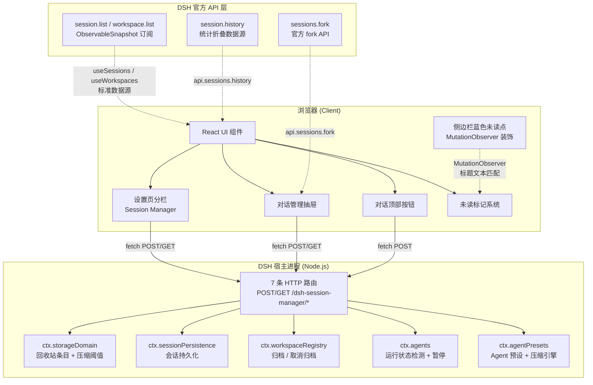

### 2.2 目录结构

```
dsh-session-manager/
├── package.json              # 包描述 + dsh.plugin manifest
├── cordis.patch.yml          # DSH 运行时 provider 注册补丁
├── tsconfig.json             # TypeScript 配置
├── tsdown.config.ts          # 构建配置（Host ESM + Client CJS 双产物）
├── src/
│   ├── index.ts              # 宿主侧入口：7 条路由 + 压缩阈值逻辑
│   ├── contract.ts           # Host ↔ Client 共享类型 + 路由常量
│   └── client/
│       └── index.ts          # 客户端入口：设置分栏 / 抽屉 / 按钮 / 未读 / 侧边栏装饰
├── lib/                      # 构建产物（提交到仓库）
│   ├── index.js              # Host 产物（ESM）
│   ├── client.js             # Client 产物（CJS，UMD wrapper）
│   └── types/                # TypeScript 类型声明
│       ├── index.d.ts
│       ├── contract.d.ts
│       └── client/
│           └── index.d.ts
├── tests/
│   └── index.test.ts         # openFolderCommand 跨平台测试
├── docs/
│   ├── design.md             # 设计文档
│   └── dsh-session-manager.md
├── assets/                   # 截图
├── README.md / README.en.md
├── CHANGELOG.md
└── LICENSE
```

### 2.3 构建产物说明

构建使用 `tsdown`，产出两个独立 bundle：

| 产物 | 格式 | 平台 | 目标 | 说明 |
|------|------|------|------|------|
| `lib/index.js` | ESM | Node.js | ES2024 | 宿主侧插件，所有 `@deepseek-ai` 包保持 external |
| `lib/client.js` | CJS | Browser | ES2022 | 客户端插件，通过 `window.__ModuleLoader__` UMD wrapper 加载 |

客户端构建通过 `banner` + `footer` 注入模块加载器：
```javascript
window.__ModuleLoader__.load({ id: "dsh-session-manager", factory: (require) => {
  // ... client code ...
  return module.exports; } });
```

---

## 3. 宿主侧（Host）详解

### 3.1 插件注册

```typescript
export const name = 'dsh-session-manager'
export const inject = [
  'webServer',           // HTTP 路由注册
  'sessionPersistence',  // 会话持久化查询
  'workspaceRegistry',   // 工作区归档/取消归档
  'agents',              // Agent 运行状态检测
  'storageDomain',       // 持久化存储域（回收站 + 阈值）
  'loader',              // 插件加载器
  'agentPresets',        // Agent 预设服务
]
```

### 3.2 路由注册总览

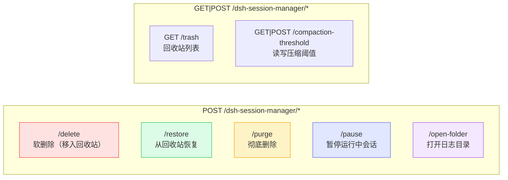

### 3.3 数据存储架构

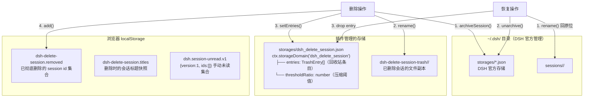

### 3.4 回收站条目结构（TrashEntry）

```typescript
interface TrashEntry {
  sessionId: string      // 会话 id（三种格式均支持）
  cwd?: string           // 删除时的工作目录
  originalPath?: string  // 原始磁盘路径（恢复时移回）
  deletedAt: number      // 删除时间戳 (epoch ms)
}
```

支持的会话 id 格式：
- `session-<uuid>` — Web UI 创建
- `session-<n>` — Store minted（如 fork 创建）
- `<uuid>` — 子代理（subagent）创建

### 3.5 串行化互斥锁（Mutation Lock）

所有修改操作（delete / restore / purge / compaction-threshold）共享一个 Promise 链式的互斥锁：

```typescript
let mutationTail: Promise<void> = Promise.resolve()
const withMutationLock = <T>(operation: () => Promise<T>): Promise<T> => {
  const result = mutationTail.then(operation, operation)
  mutationTail = result.then(() => undefined, () => undefined)
  return result
}
```

这保证多浏览器页面同时操作时不会读到旧状态互相覆盖。

---

## 4. 客户端（Client）详解

### 4.1 插件入口与服务注入

```typescript
export const name = 'dsh-session-manager/client'
export const inject = ['slots', 'locale', 'connection', 'sessions', 'workspaces']
```

客户端通过 DSH 官方插槽系统注入 UI 组件：

### 4.2 插槽注册总览

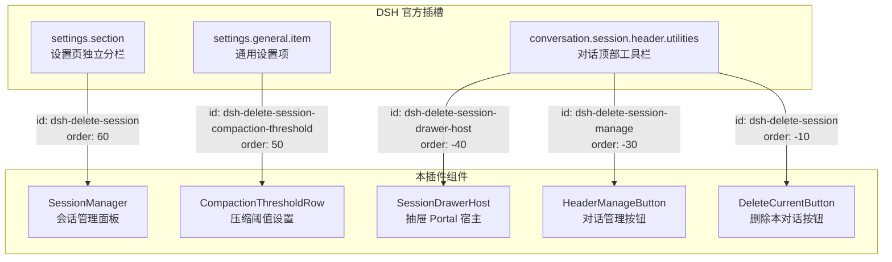

### 4.3 会话管理面板（SessionManager）

设置页的核心组件，功能包括：

| 功能 | 说明 |
|------|------|
| 会话列表 | 按工作区分组，组内按最后使用时间排序（最新/最旧切换） |
| 已归档会话 | 底部折叠区，支持一键恢复 |
| 回收站 | 底部折叠区，保留最近 10 条，支持恢复 / 彻底删除 |
| 批量删除 | 复选框全选 / 工作区级全选 / 逐个选择 |
| 工作区管理 | 拖拽排序、置于顶部、重命名、删除（二次确认） |
| 行操作 | 继续 / 暂停 / fork / 统计 / 文件夹 / 删除 |
| 未读标记 | 蓝色（手动）/ 琥珀（官方等待）/ 绿色（官方完成）/ 转圈（运行中） |

### 4.4 抽屉（SessionDrawer）

对话顶部的右侧抽屉面板，通过 `createPortal` 渲染到 `document.body`：

- 通过 `sessions.list`（ObservableSnapshot）实时订阅官方会话列表
- 每 5 秒轮询一次工作区列表和回收站，保持 running/idle 状态同步
- 支持图钉固定（pinned 模式下点击外部不收起）
- 每行有「更多」悬浮菜单（统计 / 文件夹 / fork / 删除）

### 4.5 未读标记系统

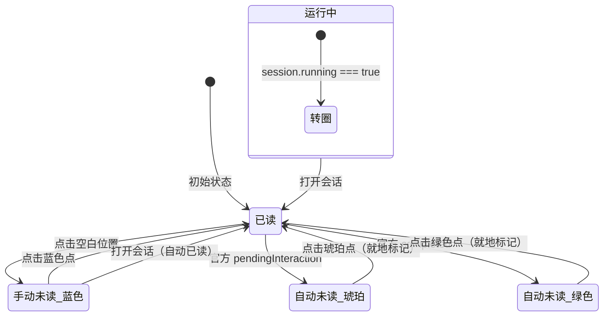

**存储机制**：
- 手动未读集保存在浏览器 localStorage 共享 key `dsh.session-unread.v1`
- 格式：`{version: 1, ids: string[]}`（与其他会话管理插件互通）
- 侧边栏蓝色未读点通过 `MutationObserver` 装饰官方树节点（按标题文本匹配）

**状态优先级**（从高到低）：
1. `running === true` → 转圈（ongoing）
2. 手动未读（blue）
3. `pendingInteraction !== undefined` → 琥珀（warning）
4. `completed === true` → 绿色（done）

---

## 5. 核心交互流程

### 5.1 删除会话流程（软删除）

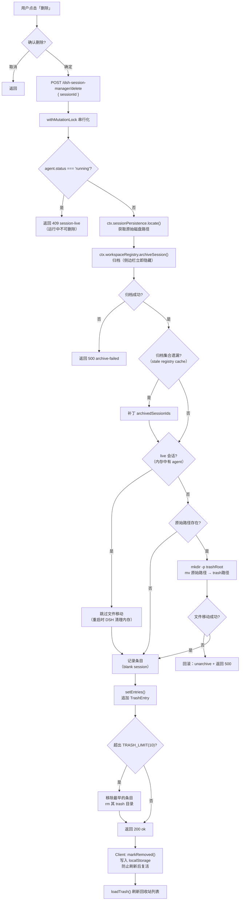

### 5.2 恢复会话流程

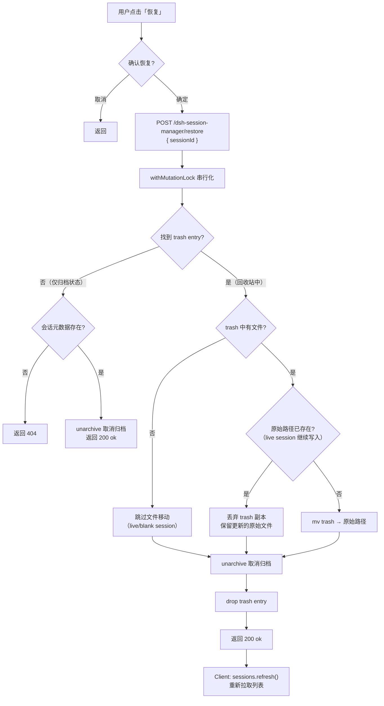

### 5.3 彻底删除流程

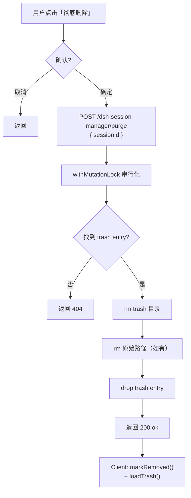

### 5.4 上下文压缩阈值流程

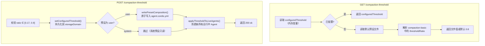

**全局生效机制**：宿主在每个 `agent/pre-step` 钩子中强制注入阈值：

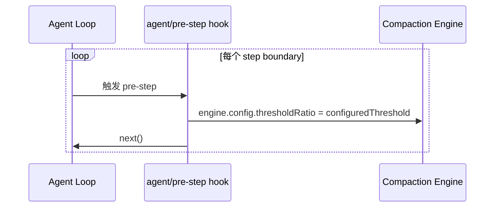

### 5.5 侧边栏未读标记装饰流程

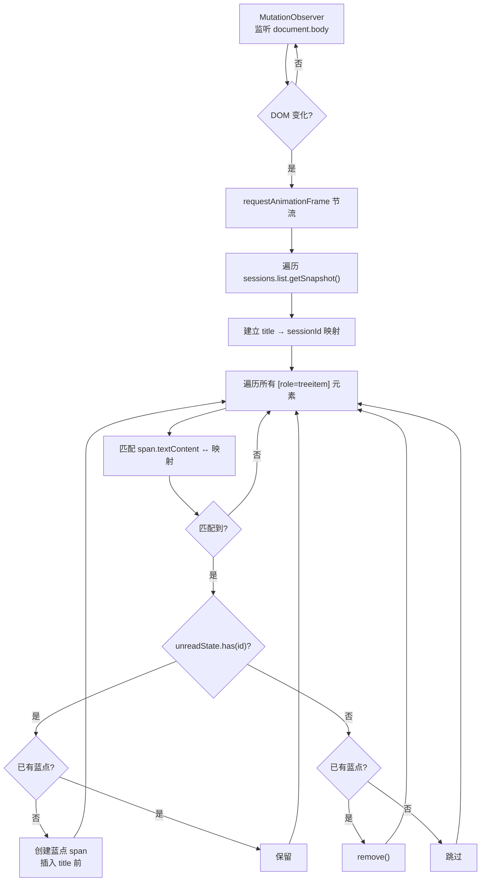

---

## 6. 数据流总览

### 6.1 删除操作的完整数据流

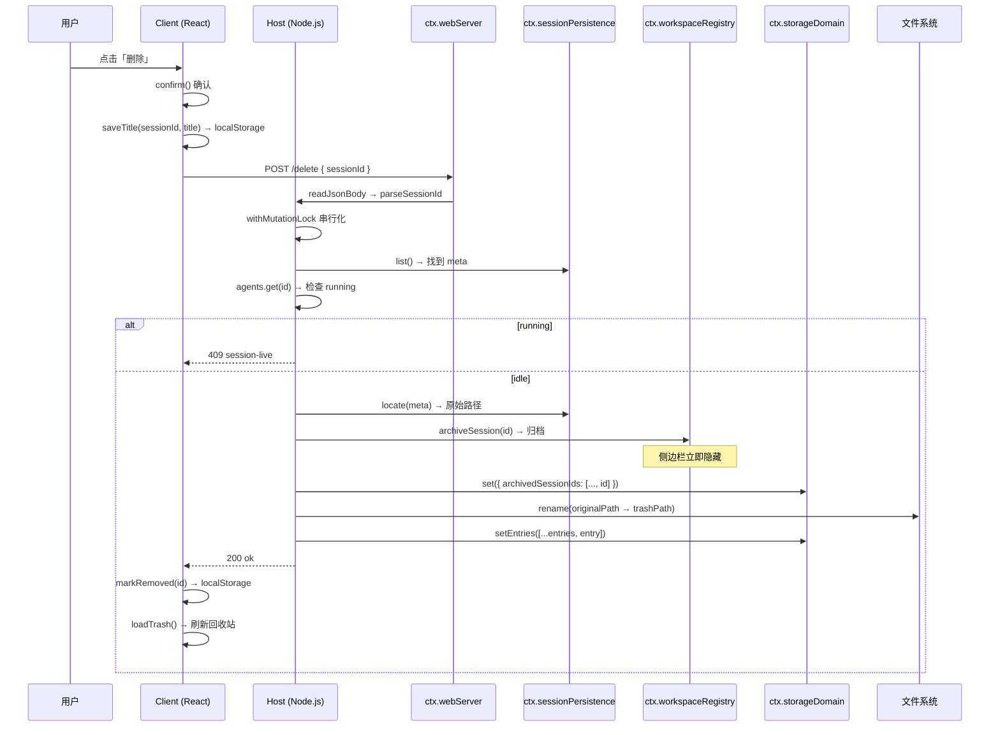

### 6.2 统计数据折叠流

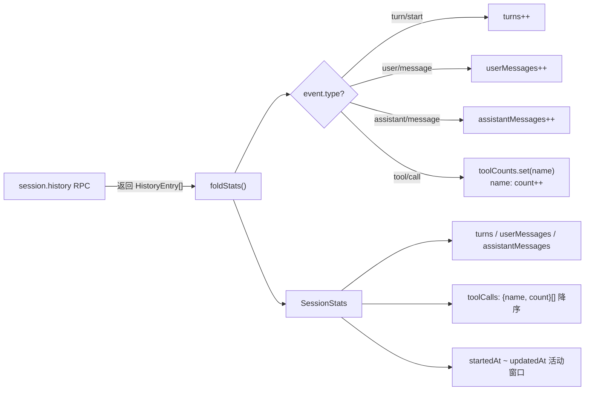

---

## 7. 功能模块详解

### 7.1 工作区管理

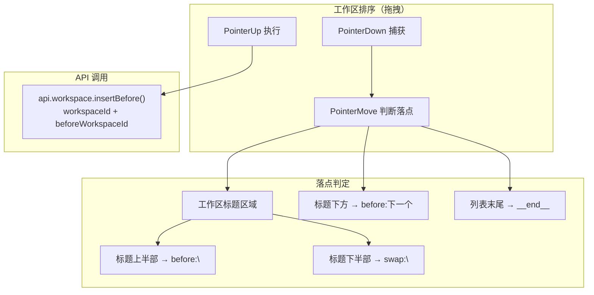

工作区操作通过 DSH 官方 API：
- **重排序**：`api.workspace.insertBefore({ workspaceId, beforeWorkspaceId })`
- **重命名**：`api.workspace.rename({ workspaceId, title })`
- **删除**：`api.workspace.delete({ workspaceId })`（仅移出列表，会话归入「未分组」）

### 7.2 Fork（新聊天中继续）

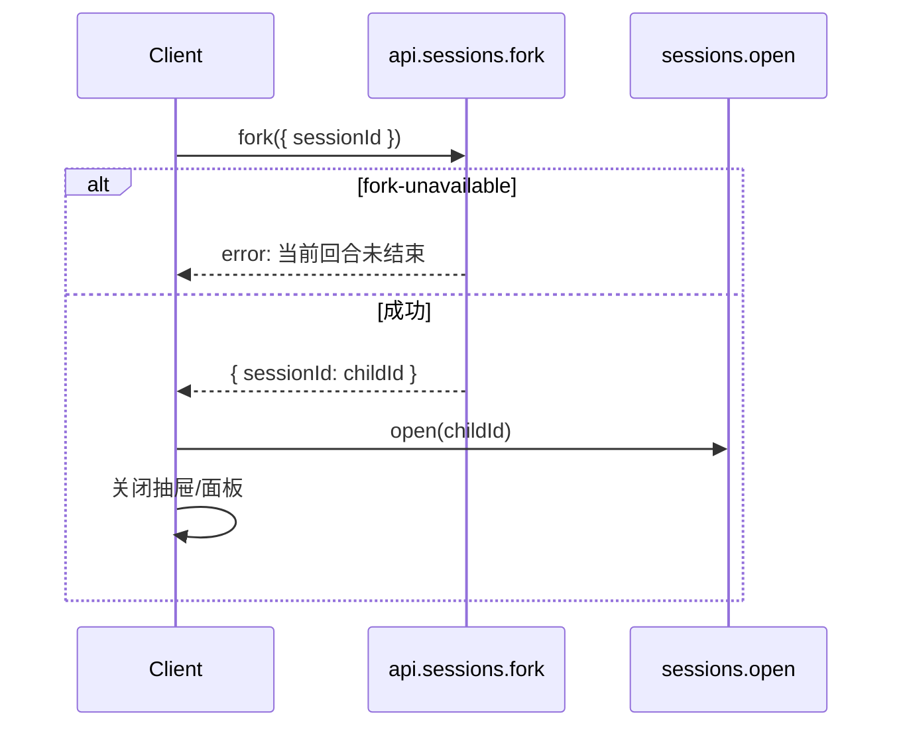

### 7.3 暂停运行中会话

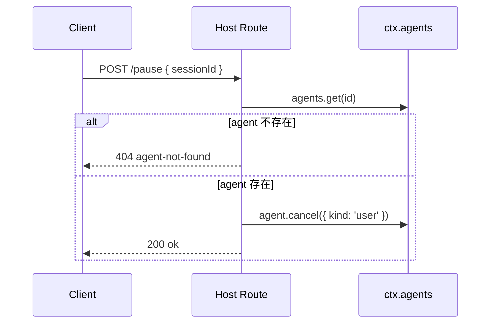

### 7.4 打开日志目录

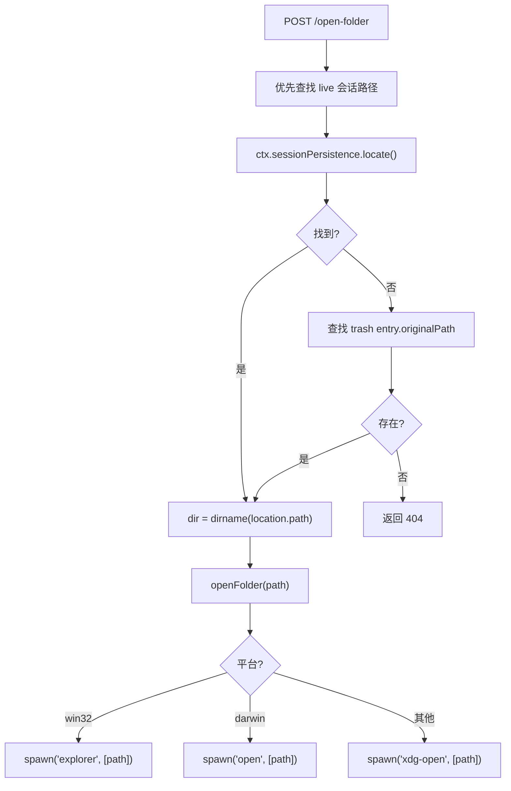

---

## 8. 语言与国际化

插件使用 DSH 官方 `ctx.locale` 服务进行中英文切换：

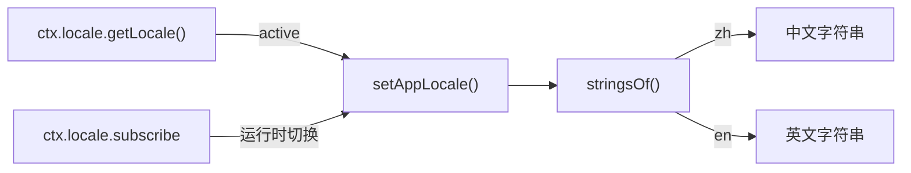

- 导航标签通过 `ctx.locale.register(NS, { zh: NAV_ZH, en: NAV_EN })` 注册
- 所有 UI 文本通过 `useLocaleStrings()` hook 响应语言切换
- 语言跟随 DSH 设置，不受浏览器语言影响

---

## 9. 关键工程决策

### 9.1 串行化互斥锁

所有文件/归档修改操作（delete / restore / purge / compaction-threshold 保存）共享 `withMutationLock`，基于 Promise 链串行化。这解决了多浏览器标签页同时操作时的竞态条件：后发操作会等待前一操作完成后再读取最新状态。

### 9.2 侧边栏未读点：标题文本匹配

官方侧边栏行元素不携带 session id，因此通过 `MutationObserver` 装饰时按标题文本匹配。已知限制：重复标题的会话会共享同一个蓝点。

### 9.3 回滚机制

删除操作失败时自动回滚：
1. 文件已移动但归档失败 → 移回文件 + unarchive
2. 归档成功但后续失败 → unarchive 恢复

### 9.4 localStorage 防刷新复活

删除的 session id 存入 `dsh-delete-session.removed`，刷新页面后客户端会过滤掉这些 id，避免 live 会话在重启后因 DSH 清理内存状态前短暂"复活"。

### 9.5 抽屉与面板数据源差异

| 入口 | 数据源 | 特点 |
|------|--------|------|
| 设置页 SessionManager | `useSessions` / `useWorkspaces` 标准 hook | 由框架注入，自动订阅 |
| 抽屉 SessionDrawer | `sessions.list.getSnapshot()` + `api.workspace.list()` | 手动订阅 ObservableSnapshot，每 5 秒轮询刷新 |

---

## 10. 依赖关系

### 10.1 peerDependencies（DSH 官方包）

| 包名 | 用途 |
|------|------|
| `@deepseek-ai/cordis` | 插件运行时框架 |
| `@deepseek-ai/dsh-session` | 会话类型定义 |
| `@deepseek-ai/dsh-session-persistence` | 会话持久化查询 |
| `@deepseek-ai/dsh-workspace` | 工作区归档 |
| `@deepseek-ai/dsh-storage-domain` | 持久化存储域 |
| `@deepseek-ai/dsh-home-paths` | DSH 主目录路径 |
| `@deepseek-ai/dsh-host-webserver` | 宿主 HTTP 路由注册 |
| `@deepseek-ai/dsh-agent-presets` | Agent 预设服务 |
| `@deepseek-ai/dsh-client-runtime` | 客户端运行时 |
| `@deepseek-ai/dsh-client-ui-slots` | 插槽系统 |
| `@deepseek-ai/dsh-client-ui-settings` | 设置页插槽 |
| `@deepseek-ai/dsh-client-ui-primitives` | Button / StateDot 等 UI 原语 |
| `@deepseek-ai/dsh-client-ui-conversation` | 对话头部插槽 |
| `@deepseek-ai/dsh-client-locale` | 多语言服务 |
| `@deepseek-ai/dsh-api-remotes` | Wire 客户端 API |

### 10.2 package.json dsh manifest

```json
{
  "dsh": {
    "bundle": { "patch": "./cordis.patch.yml" },
    "client": {
      "inject": [
        "@deepseek-ai/dsh-client-runtime",
        "@deepseek-ai/dsh-client-ui-slots",
        "@deepseek-ai/dsh-client-ui-primitives",
        "@deepseek-ai/dsh-client-ui-settings",
        "@deepseek-ai/dsh-client-locale",
        "@deepseek-ai/dsh-api-remotes",
        "@deepseek-ai/dsh-client-ui-conversation"
      ],
      "platform": "web"
    }
  }
}
```

---

## 11. 安装与开发

### 11.1 安装

```sh
# 从 GitHub
dsh plugin --profile web add 'github:dream12347/dsh-session-manager#v0.2.2'

# 从本地目录
dsh plugin --profile web add /absolute/path/to/dsh-session-manager

# 从 tarball
pnpm pack
dsh plugin --profile web add /absolute/path/to/dsh-session-manager-0.2.2.tgz
```

安装后需**重启** `dsh web`。

### 11.2 开发

```sh
pnpm install        # 安装依赖
pnpm run check      # typecheck + test + build
```

`lib/` 为提交的构建产物，修改源码后必须重新构建并提交 `lib/`。

### 11.3 cordis.patch.yml

```yaml
- insert:
    - id: dsh-session-manager
      name: dsh-session-manager
```

---

## 12. 限制与已知问题

| 限制 | 说明 |
|------|------|
| 运行中会话不可删除 | 按钮禁用且 host 拒绝，多标签页请先在别处停止 |
| 侧边栏蓝点按标题匹配 | 重复标题的会话共享同一个点（抽屉内按 session id 精确标记） |
| live 会话删除后内存状态由 DSH 重启清理 | 删除的 id 记录在 localStorage 防止刷新后短暂复活 |
| 彻底删除的 session id 无害残留 | 同时保留在 localStorage 和归档集合中 |
| 子代理会话可删除（非运行中） | 包括主会话已删除的「孤儿」子代理 |

---

## 13. 验证路径

1. 安装后重启 `dsh web`，确认设置页出现「会话管理」分栏
2. 创建多个会话（含一个运行中的），确认运行中的不可删除
3. 删除一个会话 → 确认侧边栏隐藏 + 出现在回收站
4. 恢复该会话 → 确认回到会话列表
5. 彻底删除 → 确认从回收站消失
6. 测试未读标记：标记未读 → 确认蓝点显示；打开会话 → 确认自动已读
7. 测试工作区拖拽排序、重命名、删除
8. 测试压缩阈值：修改 → 保存 → 确认生效
9. 测试 fork：点击「新聊天中继续」→ 确认创建并打开子会话
10. 测试统计弹窗：确认显示轮次、消息数、工具调用、活动窗口
11. 多标签页同时删除不同会话 → 确认无竞态
12. 刷新页面 → 确认回收站、未读、压缩阈值持久化
