# dsh-tidychat 项目完整说明文档

## 1. 项目概览

### 1.1 项目定位

`dsh-tidychat` 是一个 **DeepSeek Harness (DSH) 插件**，为 DSH Web UI 的长会话提供时间线整理能力。它的核心定位是：

> 把 DSH 的长会话变成**可扫读、可跳转**的结论流——已完成轮次自动折叠、思考/结论分隔线、Codex 式左缘定位条、智能加载更早历史，四个功能独立开关、即时生效。

插件以 npm 包形式发布（`@bananasoldier01/dsh-tidychat`），纯浏览器端实现（`exports "./client"`），宿主侧只注册 settings 命名空间，**不修改任何 DSH 源码**。

当前版本 v0.2.5，适配 DSH ≥ 0.1.0-rc.7。

### 1.2 核心设计原则

| 原则 | 说明 |
|------|------|
| **纯浏览器端实现** | 折叠/分隔/导航/自动加载全部在客户端完成，宿主侧仅注册 settings 命名空间 |
| **不修改 DSH 源码** | 通过 DOM 结构锚点（`data-chat-anchor-key`、`data-variant="think"` 等契约级属性）定位，不依赖编译期 hash 类名 |
| **功能独立可开关** | 四个功能各自独立，可在「设置 → 插件配置」里可视化开关，改动即时生效 |
| **会话隔离** | 折叠状态按 `sessionId` 隔离，跨会话同轮次不串扰 |
| **自适应布局** | 定位条固定高度全局映射，任意 turn 数量（20/200+）都映射在同一可视区 |

---

## 2. 项目架构

### 2.1 整体架构图

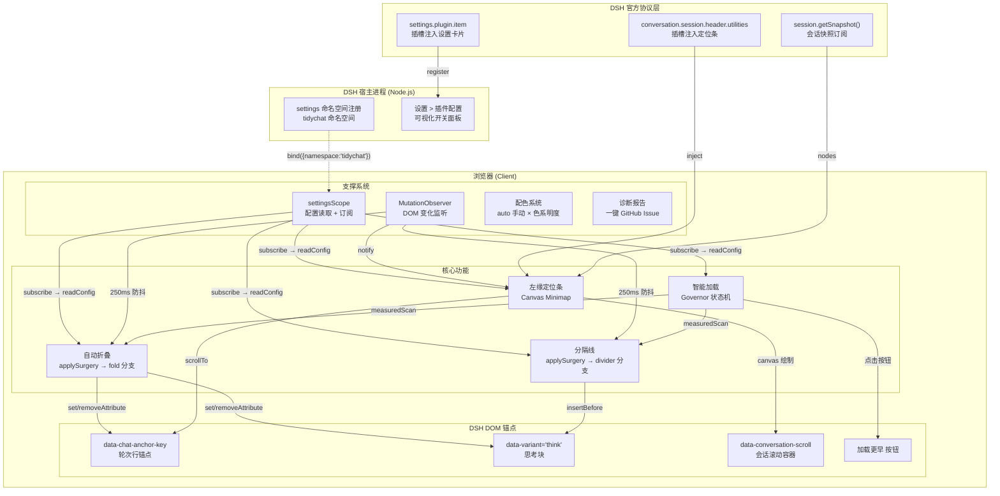
```mermaid
graph TB
    subgraph DSH_Host["DSH 宿主进程 (Node.js)"]
        SETTINGS_REG["settings 命名空间注册<br/>tidychat 命名空间"]
        SETTINGS_PANEL["设置 > 插件配置<br/>可视化开关面板"]
    end

    subgraph Browser["浏览器 (Client)"]
        subgraph Core_Features["核心功能"]
            FOLD["自动折叠<br/>applySurgery → fold 分支"]
            DIVIDER["分隔线<br/>applySurgery → divider 分支"]
            NAV["左缘定位条<br/>Canvas Minimap"]
            AUTOLOAD["智能加载<br/>Governor 状态机"]
        end

        subgraph Supporting["支撑系统"]
            MUTATION["MutationObserver<br/>DOM 变化监听"]
            SETTINGS_CLIENT["settingsScope<br/>配置读取 + 订阅"]
            COLORS["配色系统<br/>auto 手动 × 色系明度"]
            DIAG["诊断报告<br/>一键 GitHub Issue"]
        end

        subgraph DOM["DSH DOM 锚点"]
            ANCHOR["data-chat-anchor-key<br/>轮次行锚点"]
            THINK["data-variant='think'<br/>思考块"]
            SCROLL["data-conversation-scroll<br/>会话滚动容器"]
            LOAD_BTN["加载更早 按钮"]
        end
    end

    subgraph DSH_Protocol["DSH 官方协议层"]
        SLOTS["conversation.session.header.utilities<br/>插槽注入定位条"]
        PLUGIN_SLOT["settings.plugin.item<br/>插槽注入设置卡片"]
        SESSION_SNAP["session.getSnapshot()<br/>会话快照订阅"]
    end

    SETTINGS_REG -.->|"bind({namespace:'tidychat'})"| SETTINGS_CLIENT
    SETTINGS_CLIENT -->|"subscribe → readConfig"| FOLD
    SETTINGS_CLIENT -->|"subscribe → readConfig"| DIVIDER
    SETTINGS_CLIENT -->|"subscribe → readConfig"| NAV
    SETTINGS_CLIENT -->|"subscribe → readConfig"| AUTOLOAD

    MUTATION -->|"250ms 防抖"| FOLD
    MUTATION -->|"250ms 防抖"| DIVIDER
    MUTATION -->|"notify"| NAV

    AUTOLOAD -->|"点击按钮"| LOAD_BTN
    AUTOLOAD -->|"measuredScan"| FOLD
    AUTOLOAD -->|"measuredScan"| DIVIDER

    FOLD -->|"set/removeAttribute"| ANCHOR
    FOLD -->|"set/removeAttribute"| THINK
    DIVIDER -->|"insertBefore"| THINK
    NAV -->|"canvas 绘制"| SCROLL
    NAV -->|"scrollTo"| ANCHOR

    SLOTS -->|"inject"| NAV
    PLUGIN_SLOT -->|"register"| SETTINGS_PANEL
    SESSION_SNAP -->|"nodes"| NAV
```

### 2.2 目录结构

```
dsh-tidychat/
├── package.json              # 包描述 + dsh.plugin manifest
├── cordis.patch.yml          # DSH 运行时 provider 注册补丁
├── tsconfig.json             # TypeScript 配置
├── tsdown.config.ts          # 构建配置（Host ESM + Client CJS 双产物）
├── src/
│   ├── index.ts              # 宿主侧入口：settings 命名空间注册 + Config schema
│   └── client/
│       └── index.ts          # 客户端入口：折叠/分隔线/定位条/自动加载/诊断报告/设置卡片
├── lib/                      # 构建产物（提交到仓库）
│   ├── index.js              # Host 产物（ESM）
│   └── client.js             # Client 产物（CJS，UMD wrapper）
├── scripts/
│   └── whitelist-patch.sh    # DSH ≤ rc.6 白名单补丁脚本
├── assets/                   # 截图
│   ├── fold-collapsed.png
│   ├── fold-expanded.png
│   ├── navigator.png
│   └── settings.png
├── docs/
│   ├── dsh-tidychat.md       # 本文档
│   ├── dsh-session-manager.md
│   └── design.md
├── README.md / README.en.md
└── LICENSE
```

### 2.3 构建产物说明

构建使用 `tsdown`，产出两个独立 bundle：

| 产物 | 格式 | 平台 | 目标 | 说明 |
|------|------|------|------|------|
| `lib/index.js` | ESM | Node.js | ES2022 | 宿主侧插件，注册 settings 命名空间 |
| `lib/client.js` | CJS | Browser | — | 客户端插件，通过 `window.__ModuleLoader__` UMD wrapper 加载 |

客户端构建通过 `banner` + `footer` 注入模块加载器：
```javascript
window.__ModuleLoader__.load({ id: "@bananasoldier01/dsh-tidychat", factory: (require) => {
  // ... client code ...
  return module.exports; } });
```

`@deepseek-ai/dsh-settings` 和 `schemastery` 保持 external（neverBundle），`react` 由宿主 profile 提供。

---

## 3. 宿主侧（Host）详解

### 3.1 插件注册

```typescript
// src/index.ts
export const inject: string[] = []

export function apply(ctx: any, config?: Config): void {
  installSettingsSection(ctx, TIDYCHAT_SETTINGS_NAMESPACE, Config, config ?? {}, {
    setSource: () => {},
    onChange: () => {},
  })
}
```

宿主侧职责极简：只注册 `tidychat` 命名空间到 DSH 设置系统，让「设置 → 插件配置」面板能渲染开关 UI。`setSource` / `onChange` 留空——宿主侧不消费配置值。

### 3.2 配置 Schema

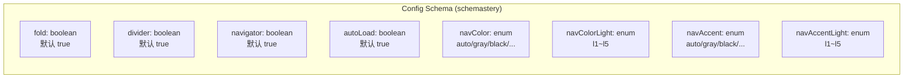
```mermaid
graph LR
    subgraph Config["Config Schema (schemastery)"]
        FOLD["fold: boolean<br/>默认 true"]
        DIVIDER["divider: boolean<br/>默认 true"]
        NAVIGATOR["navigator: boolean<br/>默认 true"]
        AUTOLOAD["autoLoad: boolean<br/>默认 true"]
        NAV_COLOR["navColor: enum<br/>auto/gray/black/..."]
        NAV_LIGHT["navColorLight: enum<br/>l1~l5"]
        NAV_ACCENT["navAccent: enum<br/>auto/gray/black/..."]
        NAV_ACCENT_LIGHT["navAccentLight: enum<br/>l1~l5"]
    end
```

| 字段 | 类型 | 默认值 | 说明 |
|------|------|--------|------|
| `fold` | `boolean` | `true` | 已完成轮次自动折叠 |
| `divider` | `boolean` | `true` | 思考↔文字分隔线 |
| `navigator` | `boolean` | `true` | 左缘定位条 |
| `autoLoad` | `boolean` | `true` | 智能加载更早历史 |
| `navColor` | `enum` | `'auto'` | 定位条默认色色系（auto 尊重主题） |
| `navColorLight` | `enum` | `'l3'` | 定位条默认色明度档（仅 navColor ≠ auto） |
| `navAccent` | `enum` | `'auto'` | 强调色色系（auto 跟随品牌色） |
| `navAccentLight` | `enum` | `'l3'` | 强调色明度档（仅 navAccent ≠ auto） |

---

## 4. 客户端（Client）详解

### 4.1 插件入口与服务注入

```typescript
// src/client/index.ts
export const inject = ['slots', 'sessions'] as const

export function apply(ctx: any): void {
  ctx.effect(() => injectStyle(CSS))   // 注入全局样式
  // ... 核心逻辑（折叠/分隔/导航/自动加载/设置卡片）
}
```

客户端通过 DSH 官方插槽系统注入两个 UI 组件：
- `conversation.session.header.utilities` → 定位条 Canvas
- `settings.plugin.item`（keyed: `tidychat`）→ 设置卡片

### 4.2 核心扫描引擎（applySurgery）

`applySurgery` 是整个插件的核心——每次 DOM 变化或设置变更时调用，对会话 DOM 执行折叠和分隔线操作。

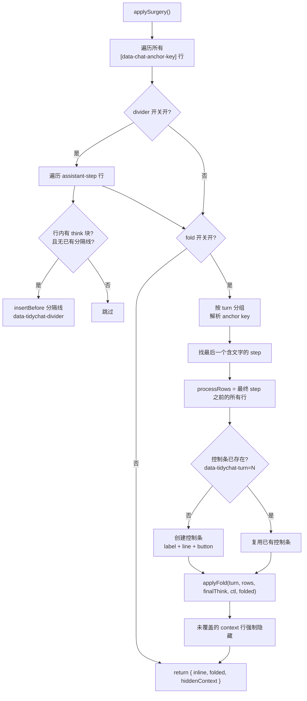
```mermaid
flowchart TD
    START["applySurgery()"] --> SCAN["遍历所有<br/>[data-chat-anchor-key] 行"]

    SCAN --> DIVIDER_BRANCH{"divider 开关开?"}
    DIVIDER_BRANCH -->|是| DIVIDER_LOOP["遍历 assistant-step 行"]
    DIVIDER_LOOP --> DIVIDER_CHECK{"行内有 think 块?<br/>且无已有分隔线?"}
    DIVIDER_CHECK -->|是| DIVIDER_INSERT["insertBefore 分隔线<br/>data-tidychat-divider"]
    DIVIDER_CHECK -->|否| DIVIDER_NEXT["跳过"]
    DIVIDER_LOOP --> FOLD_BRANCH
    DIVIDER_BRANCH -->|否| FOLD_BRANCH

    FOLD_BRANCH{"fold 开关开?"}
    FOLD_BRANCH -->|是| TURN_GROUP["按 turn 分组<br/>解析 anchor key"]
    TURN_GROUP --> FIND_FINAL["找最后一个含文字的 step"]
    FIND_FINAL --> PROC_ROWS["processRows = 最终 step 之前的所有行"]
    PROC_ROWS --> CTL_CHECK{"控制条已存在?<br/>data-tidychat-turn=N"}
    CTL_CHECK -->|否| CTL_CREATE["创建控制条<br/>label + line + button"]
    CTL_CHECK -->|是| CTL_REUSE["复用已有控制条"]
    CTL_CREATE --> FOLD_APPLY
    CTL_REUSE --> FOLD_APPLY
    FOLD_APPLY["applyFold(turn, rows, finalThink, ctl, folded)"]
    FOLD_APPLY --> CTX_HIDE["未覆盖的 context 行强制隐藏"]

    FOLD_BRANCH -->|否| RETURN
    CTX_HIDE --> RETURN

    RETURN["return { inline, folded, hiddenContext }"]
```

### 4.3 DOM 锚点识别

插件通过 DSH 官方 DOM 属性定位会话行：

| 锚点属性 | 值模式 | 说明 |
|----------|--------|------|
| `data-chat-anchor-key` | `14:assistant-step{N}:...` | 助手步骤行，`N` 为 turn 编号 |
| `data-chat-anchor-key` | `9:tool-call...` | 工具调用行 |
| `data-chat-anchor-key` | `9:turn-tail...` | 轮次尾部（含处理时长） |
| `data-chat-flow-kind` | `user` | 用户消息行 |
| `data-chat-flow-kind` | `context` | 上下文注入行 |
| `data-variant` | `think` | 思考块 |
| `data-conversation-scroll` | — | 会话滚动容器 |
| `data-composer-card` | — | 输入框（用于 gutter 测量） |

### 4.4 折叠状态管理

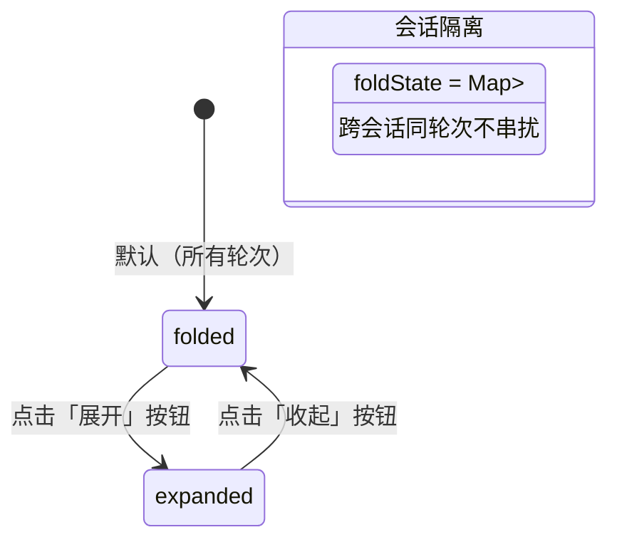
```mermaid
stateDiagram-v2
    [*] --> folded: 默认（所有轮次）
    folded --> expanded: 点击「展开」按钮
    expanded --> folded: 点击「收起」按钮

    state "会话隔离" as scope {
        note: foldState = Map<sessionId, Map<turn, boolean>>
        note: 跨会话同轮次不串扰
    }
```

折叠状态存储在内存 `Map<sessionId, Map<number, boolean>>` 中：
- **默认全部折叠**：新轮次自动折叠，只保留最终结论
- **会话隔离**：`foldScope()` 返回 `activeSessionId ?? '_global'`
- **刷新后重置**：刷新页面恢复默认（全部折叠）
- **DOM 属性驱动**：`data-tidychat-folded` / `data-tidychat-folded-inline` 通过 CSS `display: none !important` 隐藏

---

## 5. 核心功能模块详解

### 5.1 自动折叠（Fold）

**功能**：已完成轮次（有 `turn-tail`）的思考（Think）、工具调用与中间文字自动收起，只保留最终总结。

**控制条**：每个折叠轮次顶部插入控制条，包含：
- 标签：`过程 N 步 · 用时 · 首token · tok/s`（折叠态）/ `已展开 N 步`（展开态）
- 按钮：`展开` / `收起`

**折叠逻辑**：

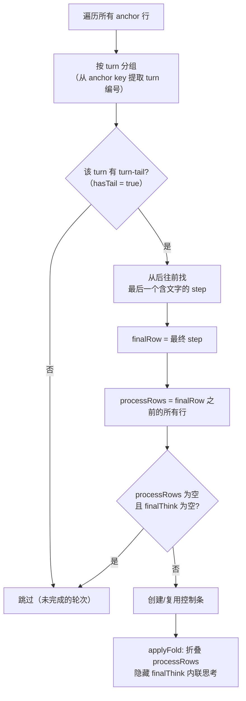
```mermaid
flowchart TD
    A["遍历所有 anchor 行"] --> B["按 turn 分组<br/>（从 anchor key 提取 turn 编号）"]
    B --> C{"该 turn 有 turn-tail?<br/>（hasTail = true）"}
    C -->|否| SKIP["跳过（未完成的轮次）"]
    C -->|是| D["从后往前找<br/>最后一个含文字的 step"]
    D --> E["finalRow = 最终 step"]
    E --> F["processRows = finalRow 之前的所有行"]
    F --> G{"processRows 为空<br/>且 finalThink 为空?"}
    G -->|是| SKIP
    G -->|否| H["创建/复用控制条"]
    H --> I["applyFold: 折叠 processRows<br/>隐藏 finalThink 内联思考"]
```

**关键细节**：
- 只折叠 `hasTail = true` 的轮次（有 `turn-tail` 事件 = 轮次已完成）
- 最终 step 的思考块用 `data-tidychat-folded-inline` 单独隐藏（保留正文，隐藏思考）
- 控制条标签只在文案真正变化时才写入，避免触发不必要的 DOM mutation

### 5.2 分隔线（Divider）

**功能**：在思考行（`data-variant="think"`）与正文文字之间插入实线分隔符。

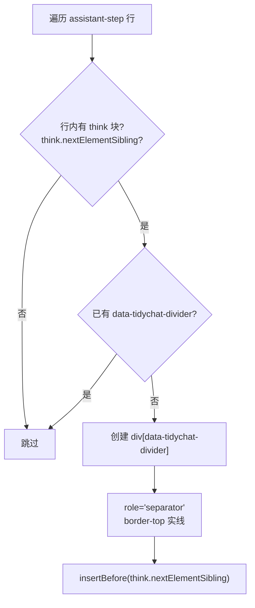
```mermaid
flowchart TD
    A["遍历 assistant-step 行"] --> B{"行内有 think 块?<br/>think.nextElementSibling?"}
    B -->|否| SKIP["跳过"]
    B -->|是| C{"已有 data-tidychat-divider?"}
    C -->|是| SKIP
    C -->|否| D["创建 div[data-tidychat-divider]"]
    D --> E["role='separator'<br/>border-top 实线"]
    E --> F["insertBefore(think.nextElementSibling)"]
```

分隔线用 CSS 实现视觉效果：`border-top: 1px solid var(--dsw-alias-border-l2)`，配合 `opacity: 0.55`。

### 5.3 左缘定位条（Navigation Rail）

**功能**：固定在会话区左缘的 Codex 式全局导航条，固定高度、任意 turn 数量全局映射。

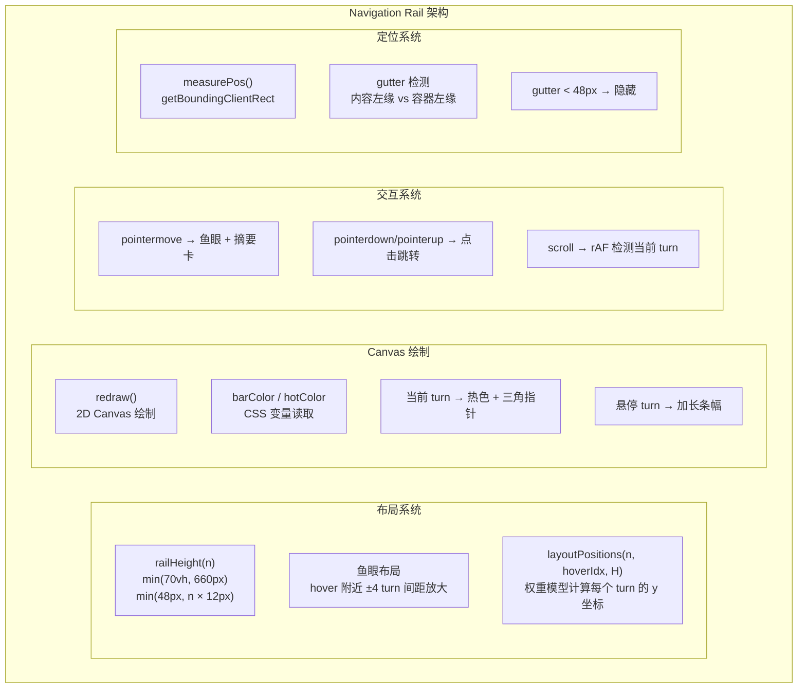
```mermaid
graph TB
    subgraph Rail["Navigation Rail 架构"]
        subgraph Layout["布局系统"]
            HEIGHT["railHeight(n)<br/>min(70vh, 660px)<br/>min(48px, n × 12px)"]
            FISH_EYE["鱼眼布局<br/>hover 附近 ±4 turn 间距放大"]
            POSITIONS["layoutPositions(n, hoverIdx, H)<br/>权重模型计算每个 turn 的 y 坐标"]
        end

        subgraph Canvas["Canvas 绘制"]
            DRAW["redraw()<br/>2D Canvas 绘制"]
            BAR_COLORS["barColor / hotColor<br/>CSS 变量读取"]
            CURRENT_INDICATOR["当前 turn → 热色 + 三角指针"]
            HOVER_EXPAND["悬停 turn → 加长条幅"]
        end

        subgraph Interaction["交互系统"]
            HOVER["pointermove → 鱼眼 + 摘要卡"]
            DRAG["pointerdown/pointerup → 点击跳转"]
            SCROLL_CURRENT["scroll → rAF 检测当前 turn"]
        end

        subgraph Positioning["定位系统"]
            MEASURE["measurePos()<br/>getBoundingClientRect"]
            GUTTER["gutter 检测<br/>内容左缘 vs 容器左缘"]
            HIDE["gutter < 48px → 隐藏"]
        end
    end
```

#### 关键参数

| 参数 | 值 | 说明 |
|------|-----|------|
| `NAV_RAIL_WIDTH` | 48px | 定位条横向占用（含 padding） |
| `NAV_RAIL_BAR_H` | 3px | 条幅高度 |
| `NAV_RAIL_BAR_LEN` | 14px | 普通条幅长度 |
| `NAV_RAIL_BAR_LEN_NEAR` | 26px | 悬停附近条幅长度 |
| `NAV_RAIL_BAR_LEN_CURRENT` | 22px | 当前 turn 条幅长度 |
| `NAV_RAIL_FISH_EYE_RADIUS` | 4 | 鱼眼影响范围（±4 turn） |
| `NAV_RAIL_FISH_EYE_BOOST` | 0.5 | 鱼眼权重增量 |
| `NAV_RAIL_TURN_SPACING` | 12px | 每 turn 基础间距 |
| `NAV_RAIL_MIN_HEIGHT` | 48px | 最小轨道高度 |
| `HEADER_OFFSET` | 64px | 阅读区顶部偏移 |

#### 鱼眼布局算法

```typescript
// 权重模型：hover 附近间距放大，远处压缩
const layoutPositions = (n, hoverIdx, H) => {
  for (let i = 0; i < n; i++) {
    let w = 1  // 基础权重
    if (hoverIdx !== null) {
      const d = Math.abs(i - hoverIdx)
      if (d <= FISH_EYE_RADIUS)
        w = 1 + (FISH_EYE_RADIUS - d + 1) * FISH_EYE_BOOST
    }
    weights.push(w)
  }
  // 按权重比例分配高度
  pos[i] = (累积权重 / 总权重) × usableHeight
}
```

#### 当前 turn 检测

以「阅读区顶部」（`scrollTop + HEADER_OFFSET`）为准，通过二分查找最近的上方 user 行：

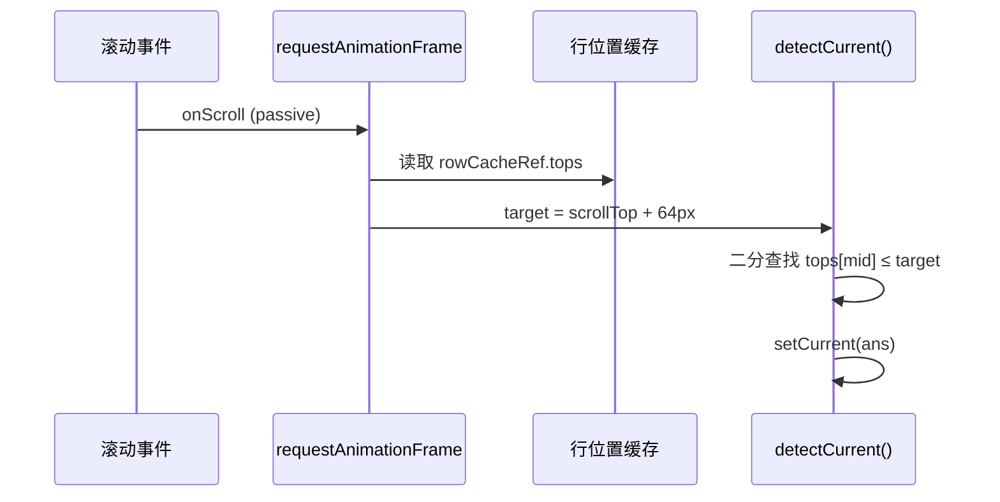
```mermaid
sequenceDiagram
    participant Scroll as 滚动事件
    participant RAF as requestAnimationFrame
    participant Cache as 行位置缓存
    participant Detect as detectCurrent()

    Scroll->>RAF: onScroll (passive)
    RAF->>Cache: 读取 rowCacheRef.tops
    RAF->>Detect: target = scrollTop + 64px
    Detect->>Detect: 二分查找 tops[mid] ≤ target
    Detect->>Detect: setCurrent(ans)
```

#### 会话切换流程

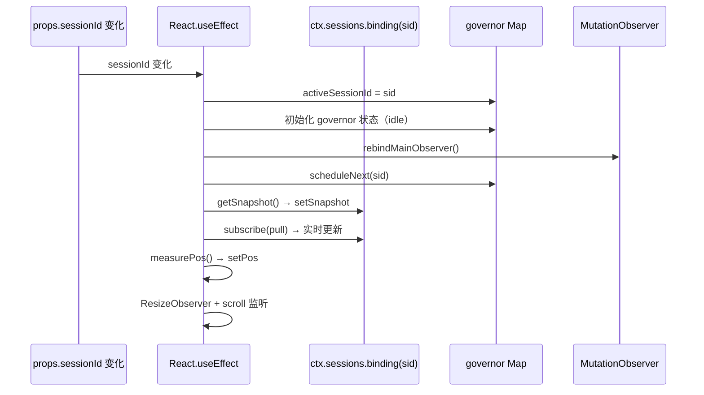
```mermaid
sequenceDiagram
    participant Props as props.sessionId 变化
    participant Effect as React.useEffect
    participant Session as ctx.sessions.binding(sid)
    participant Governor as governor Map
    participant Observer as MutationObserver

    Props->>Effect: sessionId 变化
    Effect->>Governor: activeSessionId = sid
    Effect->>Governor: 初始化 governor 状态（idle）
    Effect->>Observer: rebindMainObserver()
    Effect->>Governor: scheduleNext(sid)
    Effect->>Session: getSnapshot() → setSnapshot
    Effect->>Session: subscribe(pull) → 实时更新
    Effect->>Effect: measurePos() → setPos
    Effect->>Effect: ResizeObserver + scroll 监听
```

### 5.4 智能加载更早历史（AutoLoad Governor）

**功能**：页面空闲时自动点击「加载更早」按钮加载历史，检测到性能下降时自动暂停。

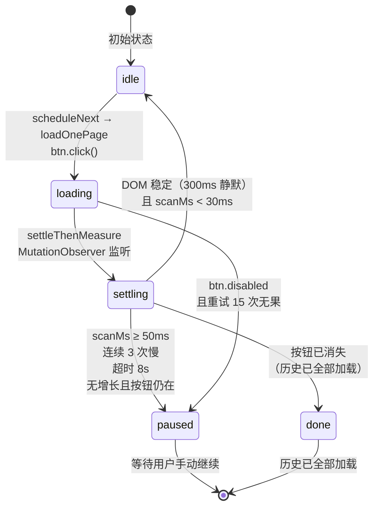
```mermaid
stateDiagram-v2
    [*] --> idle: 初始状态

    idle --> loading: scheduleNext → loadOnePage<br/>btn.click()
    loading --> settling: settleThenMeasure<br/>MutationObserver 监听
    settling --> idle: DOM 稳定（300ms 静默）<br/>且 scanMs < 30ms
    settling --> paused: scanMs ≥ 50ms<br/>连续 3 次慢<br/>超时 8s<br/>无增长且按钮仍在
    settling --> done: 按钮已消失<br/>（历史已全部加载）
    loading --> paused: btn.disabled<br/>且重试 15 次无果
    paused --> [*]: 等待用户手动继续
    done --> [*]: 历史已全部加载
```

#### Governor 参数

| 参数 | 值 | 说明 |
|------|-----|------|
| `SOFT_BUDGET_MS` | 30ms | 软性能预算（超过开始计数） |
| `HARD_BUDGET_MS` | 50ms | 硬性能预算（超过立即暂停） |
| `CONSECUTIVE_SLOW_LIMIT` | 3 | 连续慢次数上限 |
| `SETTLE_QUIET_MS` | 300ms | DOM 稳定静默期 |
| `SETTLE_TIMEOUT_MS` | 8000ms | 稳定超时上限 |
| `IDLE_FALLBACK_MS` | 50ms | `requestIdleCallback` 降级延迟 |
| `NULL_RETRY_LIMIT` | 15 | 按钮未找到重试上限 |
| `NULL_RETRY_DELAY_MS` | 2000ms | 重试间隔 |

#### 自动加载完整流程

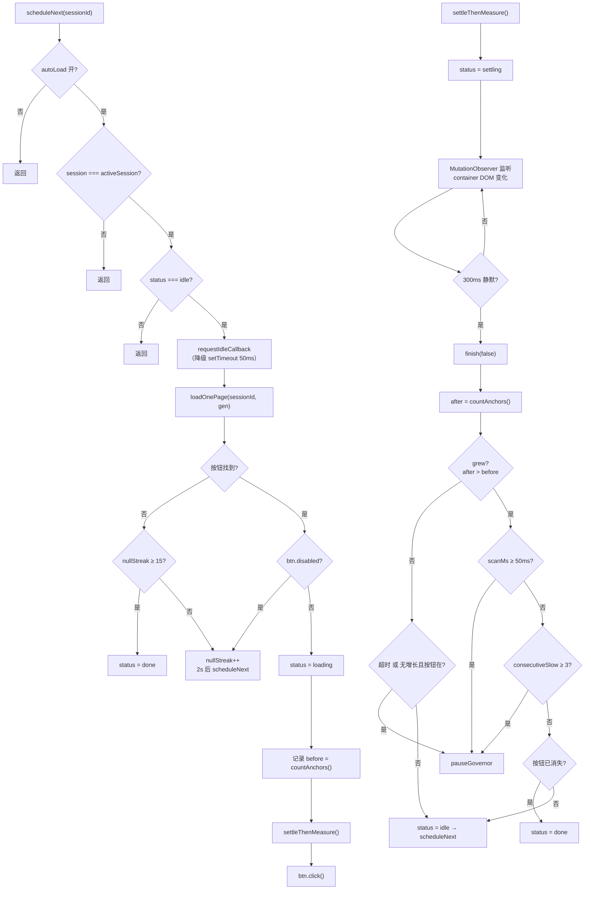
```mermaid
flowchart TD
    A["scheduleNext(sessionId)"] --> B{"autoLoad 开?"}
    B -->|否| STOP1["返回"]
    B -->|是| C{"session === activeSession?"}
    C -->|否| STOP2["返回"]
    C -->|是| D{"status === idle?"}
    D -->|否| STOP3["返回"]
    D -->|是| E["requestIdleCallback<br/>（降级 setTimeout 50ms）"]

    E --> F["loadOnePage(sessionId, gen)"]
    F --> G{"按钮找到?"}
    G -->|否| H{"nullStreak ≥ 15?"}
    H -->|是| DONE["status = done"]
    H -->|否| RETRY["nullStreak++<br/>2s 后 scheduleNext"]
    G -->|是| I{"btn.disabled?"}
    I -->|是| RETRY
    I -->|否| J["status = loading"]
    J --> K["记录 before = countAnchors()"]
    K --> L["settleThenMeasure()"]
    L --> M["btn.click()"]

    N["settleThenMeasure()"] --> O["status = settling"]
    O --> P["MutationObserver 监听<br/>container DOM 变化"]
    P --> Q{"300ms 静默?"}
    Q -->|否| P
    Q -->|是| R["finish(false)"]
    R --> S["after = countAnchors()"]
    S --> T{"grew?<br/>after > before"}
    T -->|否| U{"超时 或 无增长且按钮在?"}
    U -->|是| PAUSE["pauseGovernor"]
    U -->|否| IDLE["status = idle → scheduleNext"]
    T -->|是| V{"scanMs ≥ 50ms?"}
    V -->|是| PAUSE
    V -->|否| W{"consecutiveSlow ≥ 3?"}
    W -->|是| PAUSE
    W -->|否| X{"按钮已消失?"}
    X -->|是| DONE2["status = done"]
    X -->|否| IDLE
```

#### 关键细节

- **Generation 守卫**：每次 `scheduleNext` 递增 generation，异步回调检查 generation 是否匹配，防止旧会话的回调影响新会话
- **DOM 稳定检测**：点击按钮后挂 `MutationObserver`，300ms 内无 DOM 变化视为稳定
- **性能测量**：每批只执行一次 `measuredScan`（包含折叠+导航通知），测的是这批历史真实带来的首次处理成本
- **暂停提示**：暂停后在「加载更早」按钮旁插入提示文本

### 5.5 诊断报告（Diagnostics）

**功能**：一键生成包含环境信息、性能数据、异常检测的诊断报告，打开 GitHub issue 预填页。

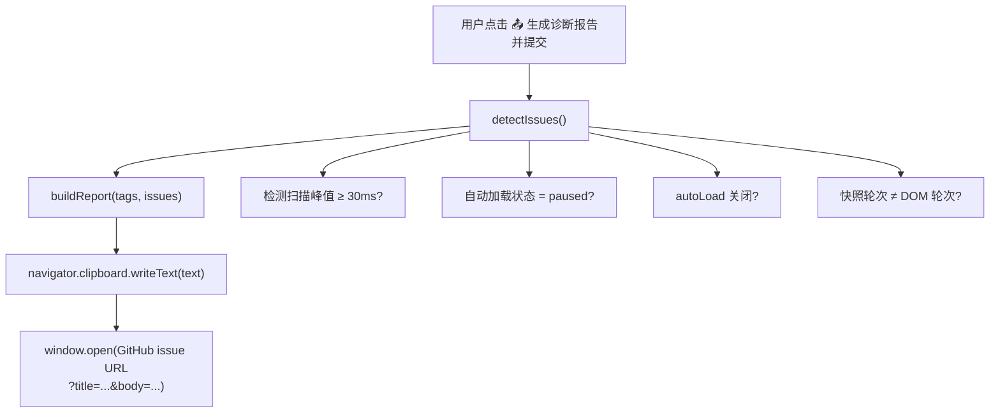
```mermaid
flowchart TD
    A["用户点击 📤 生成诊断报告并提交"] --> B["detectIssues()"]
    B --> C["buildReport(tags, issues)"]
    C --> D["navigator.clipboard.writeText(text)"]
    D --> E["window.open(GitHub issue URL<br/>?title=...&body=...)"]

    B --> F["检测扫描峰值 ≥ 30ms?"]
    B --> G["自动加载状态 = paused?"]
    B --> H["autoLoad 关闭?"]
    B --> I["快照轮次 ≠ DOM 轮次?"]
```

报告内容包含：
- **环境**：时间、插件版本、浏览器 UA
- **会话规模**：会话 ID、已加载用户轮次、消息行数、是否有更早历史
- **性能**：最近扫描耗时、峰值耗时、已扫描次数
- **自动加载**：开关状态、当前状态
- **定位条**：已渲染/快照轮次（含不一致检测）
- **系统检测**：自动检测的异常项
- **问题描述**：用户选择的现象标签

---

## 6. 配色系统

### 6.1 默认色（navColor）

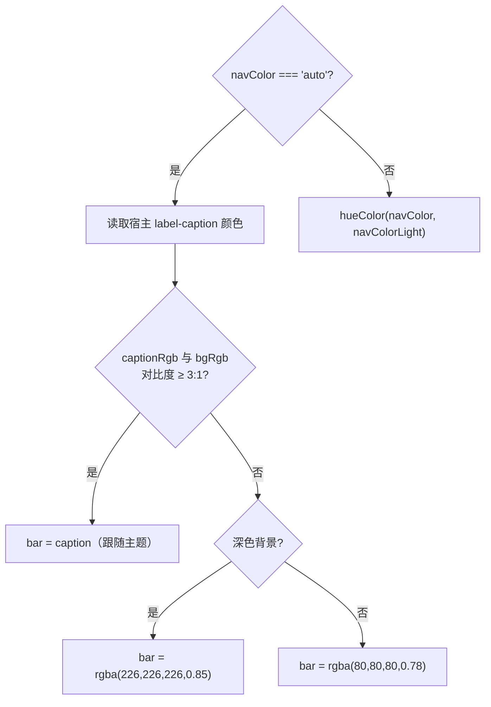
```mermaid
flowchart TD
    A{"navColor === 'auto'?"}
    A -->|是| B["读取宿主 label-caption 颜色"]
    B --> C{"captionRgb 与 bgRgb<br/>对比度 ≥ 3:1?"}
    C -->|是| D["bar = caption（跟随主题）"]
    C -->|否| E{"深色背景?"}
    E -->|是| F["bar = rgba(226,226,226,0.85)"]
    E -->|否| G["bar = rgba(80,80,80,0.78)"]
    A -->|否| H["hueColor(navColor, navColorLight)"]
```

### 6.2 强调色（navAccent）

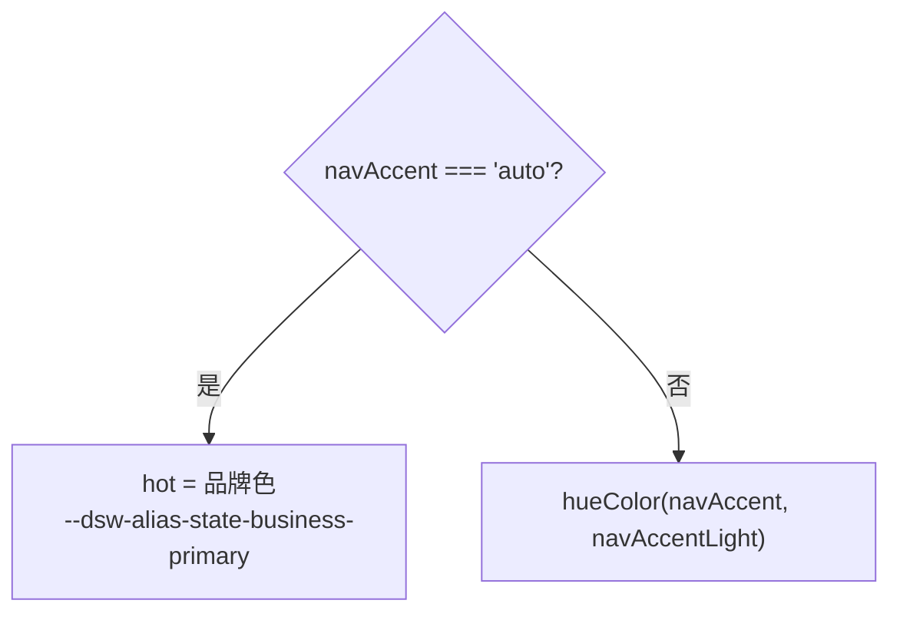
```mermaid
flowchart TD
    A{"navAccent === 'auto'?"}
    A -->|是| B["hot = 品牌色<br/>--dsw-alias-state-business-primary"]
    A -->|否| C["hueColor(navAccent, navAccentLight)"]
```

### 6.3 色系 × 明度正交组合

每个色系 5 档明度：`l1（极浅）` → `l5（极深）`，共 9 色系 × 5 明度 = 45 种组合。

| 色系 | l1 极浅 | l2 浅 | l3 中 | l4 深 | l5 极深 |
|------|---------|-------|-------|-------|---------|
| gray | `rgba(225,225,225,0.9)` | `rgba(190,190,190,0.78)` | `rgba(128,128,128,0.8)` | `rgba(70,70,70,0.85)` | `rgba(20,20,20,0.92)` |
| black | `rgba(90,90,90,0.8)` | `rgba(60,60,60,0.85)` | `rgba(30,30,30,0.9)` | `rgba(12,12,12,0.94)` | `rgba(0,0,0,0.97)` |
| white | `rgba(255,255,255,0.95)` | `rgba(250,250,250,0.9)` | `rgba(240,240,240,0.85)` | `rgba(225,225,225,0.8)` | `rgba(205,205,205,0.75)` |
| blue | `#93c5fd` | `#60a5fa` | `#3b82f6` | `#2563eb` | `#1e40af` |
| violet | `#c4b5fd` | `#a78bfa` | `#8b5cf6` | `#7c3aed` | `#5b21b6` |
| cyan | `#67e8f9` | `#22d3ee` | `#06b6d4` | `#0891b2` | `#155e75` |
| green | `#86efac` | `#4ade80` | `#22c55e` | `#16a34a` | `#166534` |
| orange | `#fdba74` | `#fb923c` | `#f97316` | `#ea580c` | `#9a3412` |
| red | `#fca5a5` | `#f87171` | `#ef4444` | `#dc2626` | `#991b1b` |

### 6.4 背景自适应检测

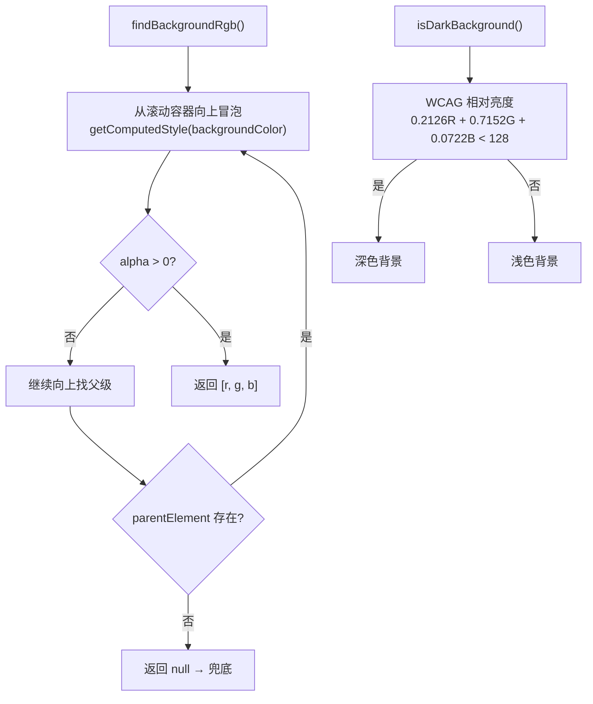
```mermaid
flowchart TD
    A["findBackgroundRgb()"] --> B["从滚动容器向上冒泡<br/>getComputedStyle(backgroundColor)"]
    B --> C{"alpha > 0?"}
    C -->|否| D["继续向上找父级"]
    C -->|是| E["返回 [r, g, b]"]
    D --> F{"parentElement 存在?"}
    F -->|是| B
    F -->|否| G["返回 null → 兜底"]

    H["isDarkBackground()"] --> I["WCAG 相对亮度<br/>0.2126R + 0.7152G + 0.0722B < 128"]
    I -->|是| J["深色背景"]
    I -->|否| K["浅色背景"]
```

### 6.5 提示卡对比度兜底

当浮层背景「不透明」（`bg-layer-3` alpha ≥ 0.85）且 label token 与背景对比 < 3:1 时，写入纠偏色到 `:root` CSS 变量：
- 深底 → `rgba(235,235,235,0.92)`（亮字）
- 浅底 → `rgba(55,55,55,0.92)`（深字）

玻璃/半透明浮层一律跳过，跟随主题 token。

---

## 7. 观察者与事件系统

### 7.1 主 MutationObserver

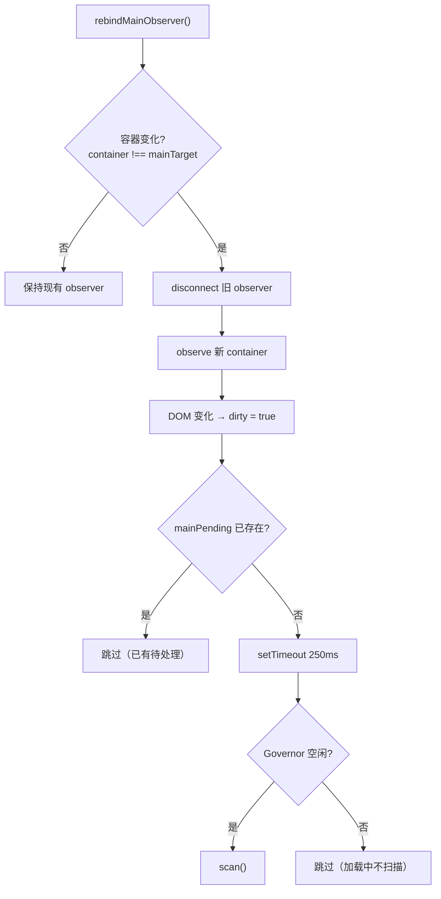
```mermaid
flowchart TD
    A["rebindMainObserver()"] --> B{"容器变化?<br/>container !== mainTarget"}
    B -->|否| C["保持现有 observer"]
    B -->|是| D["disconnect 旧 observer"]
    D --> E["observe 新 container"]
    E --> F["DOM 变化 → dirty = true"]
    F --> G{"mainPending 已存在?"}
    G -->|是| H["跳过（已有待处理）"]
    G -->|否| I["setTimeout 250ms"]
    I --> J{"Governor 空闲?"}
    J -->|是| K["scan()"]
    J -->|否| L["跳过（加载中不扫描）"]
```

### 7.2 主题切换监听

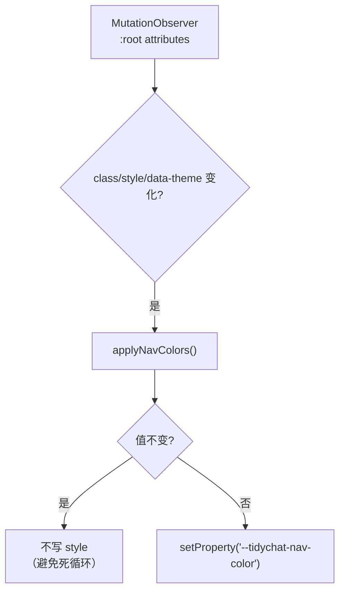
```mermaid
flowchart TD
    A["MutationObserver<br/>:root attributes"] --> B{"class/style/data-theme 变化?"}
    B -->|是| C["applyNavColors()"]
    C --> D{"值不变?"}
    D -->|是| E["不写 style<br/>（避免死循环）"]
    D -->|否| F["setProperty('--tidychat-nav-color')"]
```

### 7.3 定时兜底扫描

每 5 秒执行一次兜底检查：
1. `rebindMainObserver()` —— 会话切换时重绑
2. `applyNavColors()` —— 主题可能已变化
3. `dirty && !isGovernorBusy()` → `scan()` —— 处理遗漏的 DOM 变化

### 7.4 生命周期清理

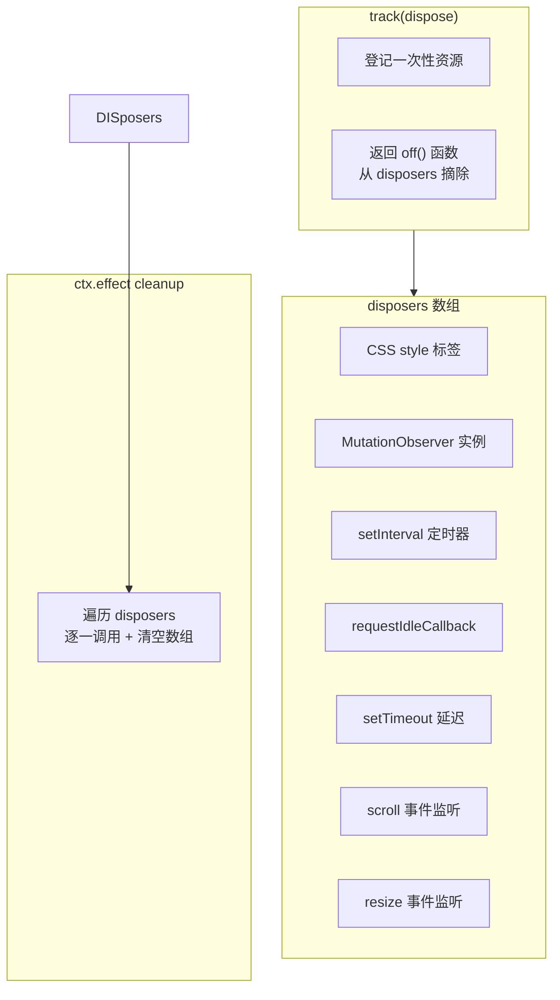
```mermaid
graph TB
    subgraph Disposers["disposers 数组"]
        D1["CSS style 标签"]
        D2["MutationObserver 实例"]
        D3["setInterval 定时器"]
        D4["requestIdleCallback"]
        D5["setTimeout 延迟"]
        D6["scroll 事件监听"]
        D7["resize 事件监听"]
    end

    subgraph Cleanup["ctx.effect cleanup"]
        CLEAN["遍历 disposers<br/>逐一调用 + 清空数组"]
    end

    subgraph Track["track(dispose)"]
        TRACK["登记一次性资源"]
        OFF["返回 off() 函数<br/>从 disposers 摘除"]
    end

    DISposers --> CLEAN
    Track --> Disposers
```

---

## 8. 数据流总览

### 8.1 配置生效流程

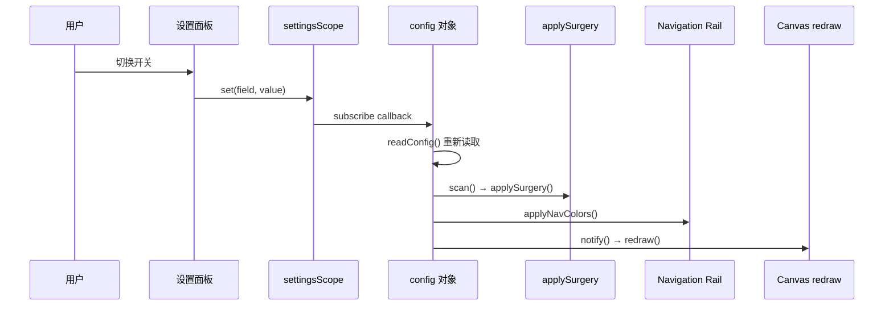
```mermaid
sequenceDiagram
    participant User as 用户
    participant Settings as 设置面板
    participant Scope as settingsScope
    participant Config as config 对象
    participant Surgery as applySurgery
    participant Nav as Navigation Rail
    participant Canvas as Canvas redraw

    User->>Settings: 切换开关
    Settings->>Scope: set(field, value)
    Scope->>Config: subscribe callback
    Config->>Config: readConfig() 重新读取
    Config->>Surgery: scan() → applySurgery()
    Config->>Nav: applyNavColors()
    Config->>Canvas: notify() → redraw()
```

### 8.2 自动加载数据流

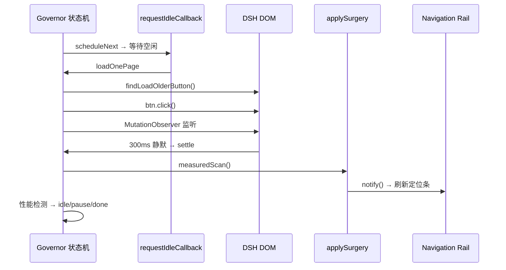
```mermaid
sequenceDiagram
    participant Governor as Governor 状态机
    participant Idle as requestIdleCallback
    participant DOM as DSH DOM
    participant Surgery as applySurgery
    participant Nav as Navigation Rail

    Governor->>Idle: scheduleNext → 等待空闲
    Idle->>Governor: loadOnePage
    Governor->>DOM: findLoadOlderButton()
    Governor->>DOM: btn.click()
    Governor->>DOM: MutationObserver 监听
    DOM->>Governor: 300ms 静默 → settle
    Governor->>Surgery: measuredScan()
    Surgery->>Nav: notify() → 刷新定位条
    Governor->>Governor: 性能检测 → idle/pause/done
```

### 8.3 导航条数据流

```mermaid
sequenceDiagram
    participant Session as ctx.sessions.binding
    participant Snapshot as getSnapshot()
    participant Users as users 数组
    participant RowCache as rowCacheRef
    participant Canvas as Canvas redraw
    participant Scroll as 滚动事件

    Session->>Snapshot: subscribe(pull)
    Snapshot->>Users: nodes.filter(kind=user)<br/>seq/time/summary
    Users->>RowCache: rebuildRowCache()<br/>记录行位置 tops[]
    RowCache->>Canvas: redraw()
    Scroll->>RowCache: detectCurrent()<br/>二分查找当前 turn
    RowCache->>Canvas: redraw() 高亮当前 turn
```

---

## 9. 设置面板 UI

### 9.1 卡片结构

```mermaid
graph TB
    subgraph Card["TidychatSettingsCard"]
        HEADER["卡片头部<br/>「会话整理」<br/>折叠/展开 chevron"]
        BODY["卡片内容"]

        subgraph Switches["四个功能开关"]
            FOLD_SW["自动折叠已完成轮次<br/>toggle → settingsScope.set"]
            DIVIDER_SW["思考↔文字分隔线"]
            NAV_SW["左缘定位条"]
            AUTOLOAD_SW["智能加载更早历史"]
        end

        subgraph Colors["配色（高级，可折叠）"]
            NAV_COLOR_FIELD["定位条默认色<br/>色系 chip × 明度 chip"]
            NAV_ACCENT_FIELD["强调色<br/>色系 chip × 明度 chip"]
        end

        subgraph Report["诊断报告"]
            TAGS["现象标签多选<br/>滚动卡顿/输入卡顿/..."]
            BTN["📤 生成诊断报告并提交"]
        end
    end
```

### 9.2 注册方式

rc.7 起 `settings.plugin.item` 改为 keyed 槽，注册用 `key`（不是 `id`）：

```typescript
ctx.slots.inject('settings.plugin.item', () => ctx.slots.register(
  { name: 'settings.plugin.item', key: 'tidychat', order: 100, inject: () => ({}) },
  TidychatSettingsCard,
))
```

---

## 10. 关键工程决策

### 10.1 纯 DOM 操作而非 React 渲染

插件的折叠/分隔线操作完全通过原生 DOM API（`setAttribute`、`insertBefore`、`createElement`）实现，而非 React 渲染。原因：
- DSH 的会话 DOM 由宿主 React 渲染，插件作为外部注入无法控制组件树
- `data-chat-anchor-key` 等属性是 DSH 的契约级属性（stable），不随编译 hash 变化
- CSS `display: none !important` 实现隐藏，零 JS 运行时开销

### 10.2 MutationObserver + 定时兜底

双保险策略：
- **MutationObserver**：实时监听 `data-conversation-scroll` 子树变化，250ms 防抖
- **定时兜底**：每 5 秒强制检查，处理可能遗漏的变化（如流式渲染的微小增量）

### 10.3 Canvas Minimap 而非 DOM 列表

定位条使用 Canvas 绘制而非 DOM 元素列表：
- 20+ turn 的会话如果每个 turn 一个 DOM 元素，hover 事件会频繁触发 React 渲染
- Canvas 只有 1 个 DOM 元素 + 1 个提示卡 div，pointermove 事件通过 rAF 节流后统一处理
- 鱼眼布局、条幅长度变化全部在 Canvas 2D context 中计算

### 10.4 Governor 的 Generation 守卫

自动加载的异步回调可能在会话切换后才执行，generation 机制防止旧会话的回调影响新会话：
```
每次 scheduleNext → generation++
异步回调检查: st.generation === gen && st.status === expected
```

### 10.5 测量前不渲染

v0.2.5 修复：`pos === null`（宿主布局未就绪）时不再渲染到写死的 280px 猜测位，测量成功后再出现，避免定位条闪烁。

---

## 11. 安装与开发

### 11.1 安装

前置：已安装 DSH（Web 版），`pnpm` 在 PATH 上。

```sh
# 方式 1（推荐）：npm 包
dsh plugin --profile web add @bananasoldier01/dsh-tidychat

# 方式 2：从 GitHub 安装（钉版本）
dsh plugin --profile web add git+https://github.com/BananaSoldier01/dsh-tidychat.git#v0.2.5
```

安装后重启 dsh web + 硬刷新（Cmd+Shift+R）。

### 11.2 更新

```sh
# npm 方式
dsh plugin --profile web update @bananasoldier01/dsh-tidychat

# GitHub tag 方式
dsh plugin --profile web add git+https://github.com/BananaSoldier01/dsh-tidychat.git#v0.2.5
```

### 11.3 本地开发（link 模式）

```sh
git clone https://github.com/BananaSoldier01/dsh-tidychat.git
cd dsh-tidychat
pnpm install
dsh plugin --profile web add link:$PWD
```

改源码后 `pnpm run build`，重启 dsh web / 硬刷新即生效。

### 11.4 构建与检查

```sh
pnpm install
pnpm run build      # tsdown 构建 lib/
pnpm run typecheck   # tsc --noEmit
```

---

## 12. 版本历史

| 版本 | 日期 | 变更 |
|------|------|------|
| 0.1.0 | — | 初始版本：折叠 + 分隔线 + 定位条（列表式）+ 自动加载 |
| 0.2.0 | — | Adaptive Conversation Navigation Rail：Canvas Minimap 全局导航 |
| 0.2.1 | — | 定位条配色完善：背景冒泡 + auto 尊重主题 + 配色折叠 |
| 0.2.2 | — | 提示卡可读性：头部提级 + 对比度兜底 + 长摘要折行 |
| 0.2.3 | — | npm 发布准备：peerDeps 化 + 投稿 awesome-dsh-plugin |
| 0.2.4 | — | npm 包元数据刷新 |
| 0.2.5 | — | Hardening：折叠状态会话隔离 + 定位条节流 + 诊断增强 |

---

## 13. 限制与已知问题

| 限制 | 说明 |
|------|------|
| 刷新后折叠状态重置 | 展开/收起状态为会话内内存态，刷新后恢复默认（全部折叠） |
| 定位条需要左侧留白 | 窄窗口内容铺满时定位条自动隐藏（`gutter < 48px`） |
| 按标题文本匹配的局限 | 定位条摘要来自 `getSnapshot().nodes`，不依赖 DOM 标题匹配 |
| 自动加载依赖按钮文案 | 仅匹配「加载更早 / Load earlier / Load older」，不泛化 |
| CSS `!important` 覆盖 | 折叠隐藏用 `!important`，可能与极端自定义主题冲突 |
| DSH ≤ rc.6 需白名单补丁 | rc.7 起命名空间动态注册，不需要补丁 |

---

## 14. 验证路径

1. 安装后重启 `dsh web`，确认设置页出现「会话整理」卡片
2. 创建一个包含多轮次的会话（含思考 + 工具调用），确认已完成轮次自动折叠
3. 点击「展开」→ 确认恢复完整过程；点击「收起」→ 确认重新折叠
4. 开关关闭「自动折叠」→ 确认所有行展开；重新开启 → 确认重新折叠
5. 开关关闭「分隔线」→ 确认思考↔文字之间无分隔线
6. 定位条：悬停显示摘要卡 + 时间；点击跳转到对应消息；拖动预览
7. 滚动会话 → 确认当前 turn 高亮跟随滚动
8. 自动加载：打开一个有大量历史的会话 → 确认自动加载更早记录
9. 检查暂停状态：确认性能下降时自动暂停 + 提示文本
10. 诊断报告：点击「📤 生成诊断报告并提交」→ 确认 GitHub issue 预填页打开
11. 主题切换：切换深色/浅色主题 → 确认定位条配色自动适配
12. 多会话切换：在两个会话间切换 → 确认折叠状态互不影响
