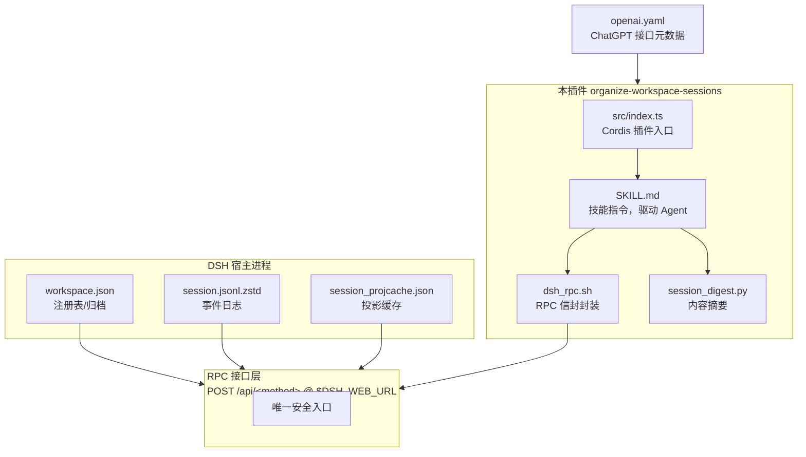
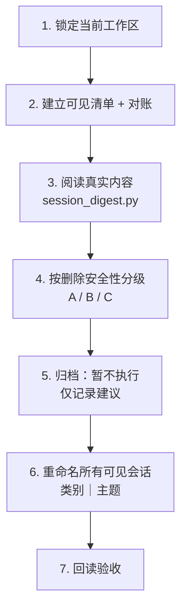
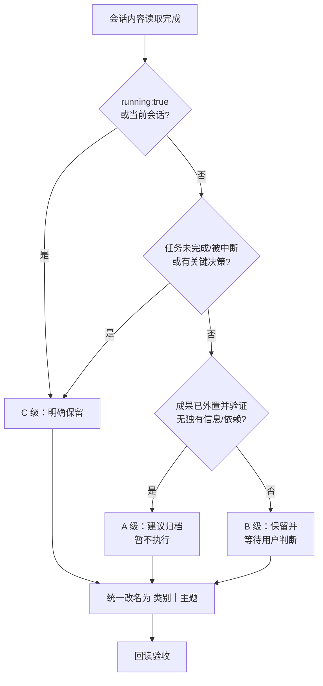
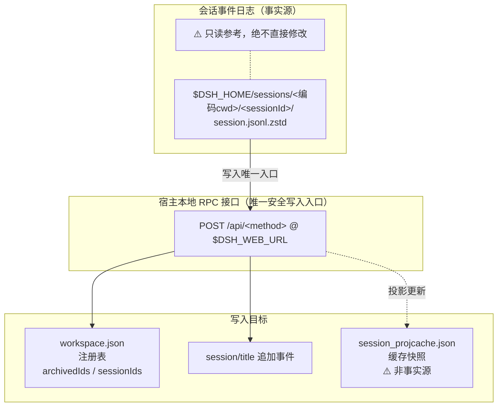
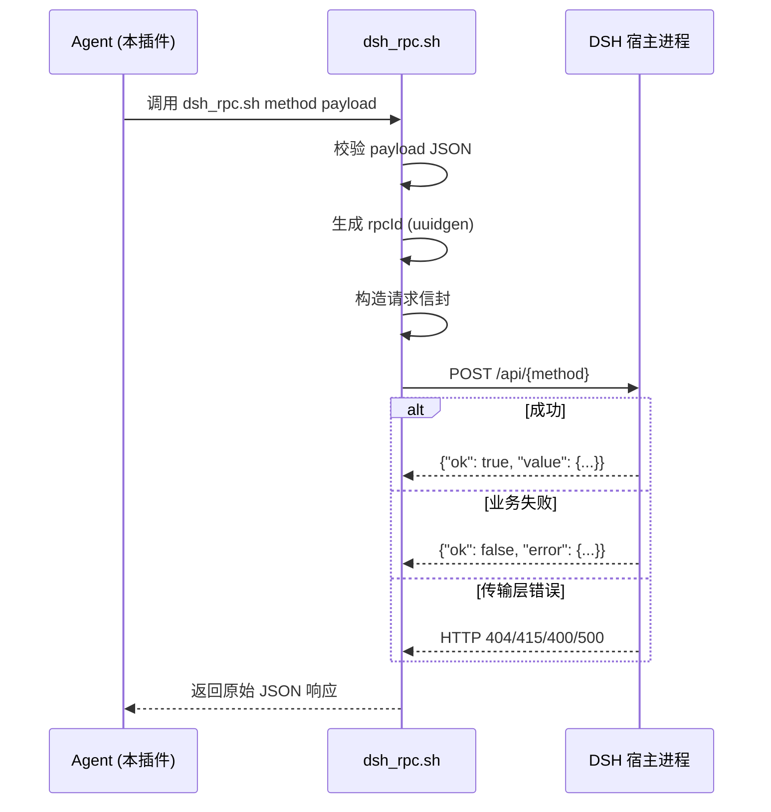
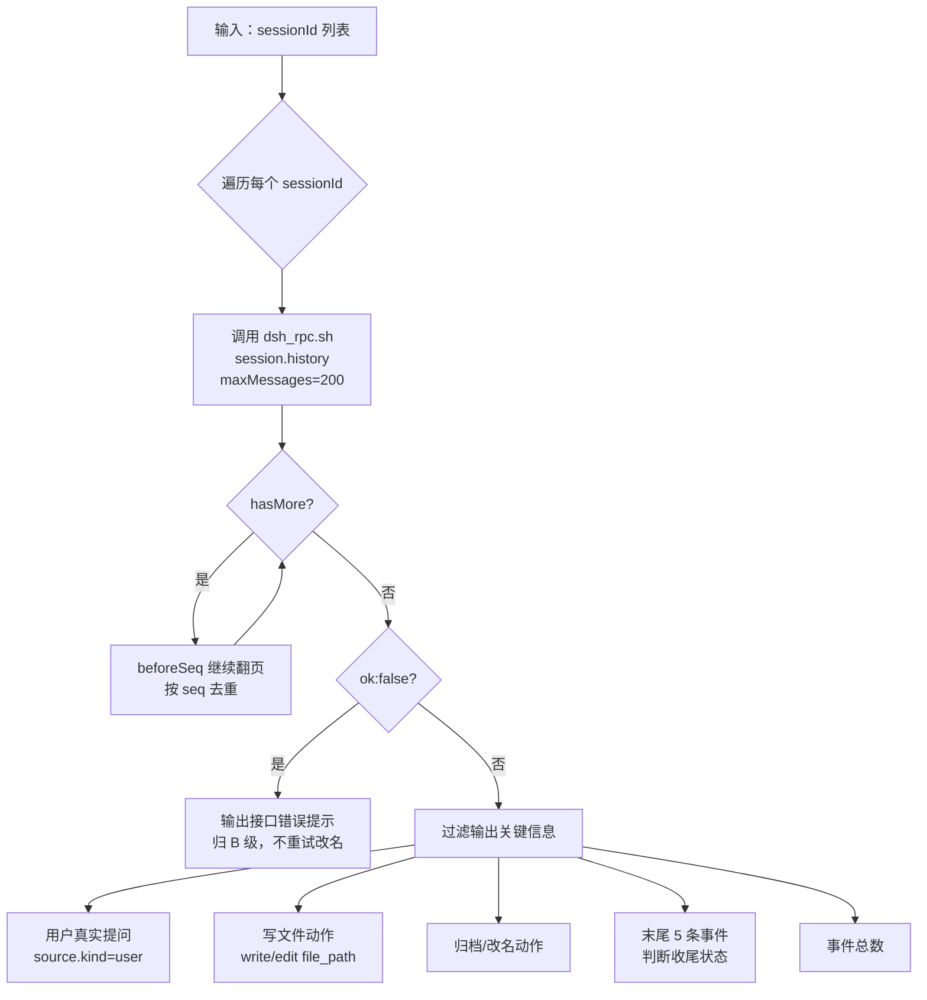

# organize-workspace-sessions 项目完整说明文档

## 1. 项目概览

### 1.1 项目定位

`organize-workspace-sessions` 是一个 **DeepSeek Harness (DSH) 技能插件**，用于自动整理 DSH 工作区中的会话列表。它的核心能力是：

> 读取工作区所有可见会话的真实内容 → 按删除安全性分级 → 统一改名为 `类别｜主题` 格式 → 输出归档/改名/待判断报告。

项目以 npm 包形式发布（包名 `organize-workspace-sessions`），同时兼容 ChatGPT；Claude 因缺少必要能力而不支持。

### 1.2 核心设计原则

| 原则 | 说明 |
|------|------|
| **只改标题，不碰内容** | 只通过 RPC 改会话标题，绝不修改会话正文、工作区归属、cwd 或其他元数据 |
| **绝不直接改写存储文件** | 绝不直接写入 `~/.dsh/storages/*.json` 或会话日志，一切变更通过宿主 RPC |
| **当前不执行归档** | DSH 暂无归档查看入口，归档后用户无法找回；A 级会话仅列入"建议归档"报告 |
| **绝不永久删除** | 除非用户另行明确授权，否则不做任何不可逆操作 |

---

## 2. 项目架构

### 2.1 目录结构

```
organize-workspace-sessions/
├── src/
│   └── index.ts                          # Cordis 插件入口：解析 SKILL.md 并注册到 DSH 运行时
├── lib/
│   ├── index.js                          # 编译产物
│   └── types/
│       └── index.d.ts                    # TypeScript 类型声明
├── skills/
│   └── organize-workspace-sessions/
│       ├── SKILL.md                      # 技能指令（核心文档，驱动 Agent 行为）
│       ├── agents/
│       │   └── openai.yaml               # ChatGPT 接口元数据（display_name / default_prompt）
│       └── scripts/
│           ├── dsh_rpc.sh                # RPC 信封封装脚本（bash）
│           └── session_digest.py         # 一次拉取的会话内容摘要脚本（python3）
├── test/
│   ├── index.test.mjs                    # 插件注册 & SKILL.md 解析测试
│   └── scripts.test.mjs                  # 脚本契约测试
├── cordis.patch.yml                      # DSH 运行时 provider 注册补丁
├── package.json
├── tsconfig.json
├── CHANGELOG.md
├── CONTRIBUTING.md
├── README.md / README.zh-CN.md
└── docs/
    └── organize-workspace-sessions.md    # 本文档
```

### 2.2 模块关系图



---

## 3. 核心交互流程

### 3.1 触发方式

用户在 DSH 工作区中**新建一个会话**后，说出以下任意触发词：

- "整理对话"、"整理会话"、"整理工作区会话"、"清理会话"
- "归档无用会话"、"规范会话名称"、"给会话分类改名"、"重命名工作区会话"

Agent 接收到指令后**直接执行完整流程**，不再逐批询问确认。

### 3.2 七步执行流程



### 3.3 各步骤详解

#### 步骤 1：锁定当前工作区

- 通过本会话的环境变量 `$DSH_SESSION_ID` 和当前目录确定"当前工作区"。
- 调用 `workspace.list`，找出 `path` 与当前工作目录相同的工作区记录。
- 取其 `workspaceId` 和 `sessionIds` 作为后续操作的基准。
- 若无匹配或有歧义：只做只读盘点并询问，不执行改名。

#### 步骤 2：建立可见清单并对账

- 调用 `session.list` 获取全量会话行（含 `projections.values.title`）。
- 与 `workspace.list` 的 `sessionIds`（记账）和 `archivedSessionIds`（已归档）交叉核对，区分三类：

| 类别 | 定义 | 处理 |
|------|------|------|
| **当前工作区可见会话** | 在 `sessionIds` 中且不在 `archivedSessionIds` 中 | 参与改名 |
| **已归档会话** | 在 `archivedSessionIds` 中 | 默认不动（当前无归档查看入口） |
| **子代理/内部会话** | `origin==="subagent"` 或带 `parentSessionId` | 可读取/改名，但不计入工作区可见数 |

- 记录起始快照：工作区可见会话数、已归档会话数、内部会话数。
- 数量与用户侧边栏对不上时先重新核对，不带着错误数量继续。

#### 步骤 3：阅读真实内容

**关键约束**：禁止只根据标题、首句、预览、时间或 cwd 判断；必须读正文。

使用 `session_digest.py` 脚本一次性为所有可见会话生成分级摘要：

```bash
python3 "$SKILL/scripts/session_digest.py" <sid1> <sid2> <sid3> ...
```

脚本对每个会话只拉一次 `session.history`（支持 `hasMore` 分页 + `seq` 去重），只输出分级真正需要的信息：

- 接口错误（`ok:false`，如 `corrupt session log`）
- 用户真实提问（仅 `source.kind==="user"` 的 `user/message`）
- 写文件动作（`write`/`edit` 的 `file_path`，去重）
- 归档/改名动作
- 末尾 5 条事件（判断是否完整收尾）
- 事件总数

**已知失败模式**：`session.history` 返回 `ok:false` 且 message 含 `corrupt session log` / `seq gap` 时，说明日志损坏——正文不可读，`session.rename` 也会因 `resume failed` 失败。此时直接归 B 级保留，不要重试改名。

#### 步骤 4：按删除安全性分级



##### A 级：建议归档（暂不执行）

必须高置信满足全部条件：

1. 任务已完成，没有待办、阻塞或续办意图
2. 结果已沉淀到会话之外，并核实路径/页面/状态真实存在
3. 不含外部成果未覆盖的独有决策、事实、用户纠正或业务认知
4. 没有其他会话依赖它作为父对话、证据或基线
5. 以后永久删除也能从现有材料低成本重建

**核心判断式**：`可归档 = 已完成 + 无后续 + 成果已外置并验证 + 无独有信息 + 无引用依赖 + 可低成本重建`

##### B 级：保留并等待用户判断

出现以下任一情况：

- 看起来可能已完成，但无法确认外部成果是否完整
- 含有少量可能独有的过程判断、修正或审计信息
- 是否被其他会话引用无法确认
- 内容读取不完整、重复关系不确定

B 级仍需改名，最终报告列出新名称、建议倾向、判断理由和风险。

##### C 级：明确保留

出现以下任一情况：

- 尚未完成、被中断、被阻塞、等待输入、仍有待办（含 `running:true`）
- 包含关键决策、用户纠正、业务事实、客户沟通、项目约束
- 是正式交付物、合同、会议记录、培训复盘的主要证据
- 重要内容尚未进入正式文件或知识库
- 被其他会话引用，或作为后续工作的父对话、审计记录
- **当前正在执行整理的会话本身**（`$DSH_SESSION_ID`，绝不归档）

#### 步骤 5：归档（暂不执行）

- A 级会话记入"建议归档"清单，**不调用 `workspace.archiveSession`**。
- A、B、C 三级统一进入步骤 6 改名。
- 等 DSH 提供归档查看入口后恢复执行。

#### 步骤 6：重命名所有可见会话

命名规则：

- 格式严格为 `类别｜主题`（**一个全角竖线**，不用半角 `|`、`丨` 或两个竖线）
- `类别`：稳定工作类型词（如 `项目管理`、`需求分析`、`方案设计`、`资料研究`、`代码开发` 等）
- `主题`：概括最终产出或实际处理对象，不复述最初提问
- 删除"帮我"、"如何"、"讨论一下"等口语
- 时间是主题核心时保留日期，否则省略
- 不额外添加工作区名、成果或状态段（禁止 `类别｜主题｜成果`）
- 已符合格式且内容一致时保持不变
- 当前整理会话自身最后改名

改名调用：`session.rename`，payload 为 `{"sessionId":"...","title":"类别｜主题"}`

#### 步骤 7：回读验收

- 每条改名后回读 `session.list` 的 `projections.values.title`。
- 未变化时只重试一次；第二次仍失败则停止并报告。
- 确认每个新名称只有一个全角 `｜` 且与真实内容一致。
- 重新计算工作区可见会话数和内部会话数，与起始快照逐项对账。

---

## 4. 数据流程

### 4.1 存储层级与权威关系

DSH 的会话数据分布在三个存储层，本技能严格区分它们的权威关系：



| 状态 | 事实源 | 说明 |
|------|--------|------|
| **标题** | 事件日志里的 `session/title` 事件 | 通过 `session.rename` 追加一条 `source.kind="user"` 的 `session/title`，把标题"钉死" |
| **归档** | `workspace.json` 的 `archivedSessionIds` | 通过 `workspace.archiveSession` 幂等加入；当前技能暂不调用 |
| **归属** | `workspace.json` 的 `tables.workspaces.<id>.sessionIds` | 当前工作区 = 路径与本会话 `cwd` 相同的工作区记录 |

### 4.2 RPC 通信协议

所有与 DSH 宿主的交互都通过统一的 RPC 信封完成：

**请求格式**：
```json
{
  "type": "client-request",
  "rpcId": "<uuid>",
  "method": "<method>",
  "payload": { ... }
}
```

**成功响应**：
```json
{
  "type": "server-response",
  "rpcId": "<same>",
  "result": { "ok": true, "value": { ... } }
}
```

**业务失败**：
```json
{
  "type": "server-response",
  "rpcId": "<same>",
  "result": { "ok": false, "error": { "code": "...", "message": "...", "details": {} } }
}
```

**关键规则**：
- 业务错误恒为 HTTP 200 + `ok:false`
- 只有 404/415/400/500 是传输层错误
- 判断成败只看 `result.ok`，不只看 HTTP 状态码
- `rpcId` 仅用于请求-响应配对，可自造唯一字符串

### 4.3 RPC 交互时序



### 4.4 RPC 接口清单

| 方法 | 请求 payload | 响应 value | 用途 |
|------|-------------|-----------|------|
| `workspace.list` | `{}` | `{items:[{workspaceId,path,title,sessionIds,createdAt,updatedAt}], archivedSessionIds:[...]}` | 工作区清点 |
| `session.list` | `{}` | `{items:[{sessionId,updatedAt,running,blank,parentSessionId?,origin?,cwd?,agentPreset?,projections:{asOfSeq,values:{title,...}}}]}` | 会话清单 |
| `session.history` | `{sessionId, beforeSeq?, maxMessages?}` | `{events:[{event:{type,seq,time,data,...},view?}], hasMore, projections?}` | 读正文 |
| `session.rename` | `{sessionId, title}` | `{title, seq}` | 改标题 |
| `workspace.archiveSession` | `{sessionId}` | `{archivedSessionIds:[...]}` | 归档（当前禁用） |

### 4.5 事件类型与内容提取

`session.history` 返回原始事件流，按事件类型过滤读取：

| 事件类型 | 关键字段 | 读取规则 |
|---------|---------|---------|
| `user/message` | `data.content[]`, `data.source.kind` | **只有 `source.kind==="user"` 是用户真实提问**；`source.kind==="plugin"` 是注入内容，忽略 |
| `assistant/message` | `data.message.content[]` | 助手回复文本 |
| `tool/call` + `tool/result` | `data.name`, `data.input` | 操作记录（write/edit 的 `file_path` 等），判断"成果是否已外置" |
| `session/title` | `data.title`, `data.source.kind` | `source.kind==="user"` 表示已被手动钉死；`"provider"` 表示模型自动生成 |
| `turn/start` / `turn/end` | — | 判断是否完整收尾 |

**分页机制**：不传 `maxMessages` 时默认最多 50 条；`hasMore:true` 时用 `beforeSeq` 继续向前翻，直到读完或达到上限。

---

## 5. 脚本工具详解

### 5.1 dsh_rpc.sh

**路径**：`skills/organize-workspace-sessions/scripts/dsh_rpc.sh`

封装 DSH 宿主的 RPC 信封，是与宿主通信的唯一入口。

```bash
# 用法
dsh_rpc.sh <method> '<json-payload>'           # payload 作为参数
echo '<json-payload>' | dsh_rpc.sh <method>    # payload 走 stdin

# 示例
bash "$SKILL/scripts/dsh_rpc.sh" workspace.list '{}'
bash "$SKILL/scripts/dsh_rpc.sh" session.list '{}'
bash "$SKILL/scripts/dsh_rpc.sh" session.history '{"sessionId":"xxx","maxMessages":2}'
bash "$SKILL/scripts/dsh_rpc.sh" session.rename '{"sessionId":"xxx","title":"资料研究｜蓝皮书"}'
```

**内部逻辑**：
1. 读取 `$DSH_WEB_URL`（默认 `http://127.0.0.1:3080`）
2. 校验 payload 为合法 JSON（python3 解析）
3. 生成唯一 `rpcId`（`uuidgen` 或 `timestamp-random`）
4. 构造请求信封，通过 `curl -s -m 30 POST` 发送到 `$BASE/api/$method`

### 5.2 session_digest.py

**路径**：`skills/organize-workspace-sessions/scripts/session_digest.py`

一次拉取多个会话的分级摘要，避免反复拉取大会话的整条事件流（实测可达数万条事件）。

```bash
# 用法：一次性为多条会话生成摘要
python3 "$SKILL/scripts/session_digest.py" session-xxx session-yyy session-zzz
```

**输出结构**（每个会话）：

```
======================================================================
SESSION: <sessionId>
  事件总数: <N>
  --- 用户真实提问 ---
    * <截断到300字的用户消息>
  --- 写文件（成果可能已外置，需回读验证）---
    - /path/to/file1
    - /path/to/file2
  --- 末尾 5 条（判断是否收尾/被中断）---
    [助手] ...
    [用户] ...
    [标题] ... kind=provider
```

**内部逻辑**：



---

## 6. 插件注册机制（Cordis 层）

### 6.1 src/index.ts

作为 Cordis 插件，通过 `apply(ctx)` 注册技能到 DSH 运行时：

```typescript
export function apply(ctx: Context): void {
  const skill = parseSkill(readFileSync(SKILL_URL, 'utf8'))
  ctx.skills.register({
    ...skill,
    source: 'bundled',
    provider: 'organize-workspace-sessions',
    resourceBase: {
      kind: 'directory',
      path: fileURLToPath(new URL('../skills/organize-workspace-sessions/', import.meta.url)),
    },
  })
}
```

**注册过程**：
1. 读取 `SKILL.md` 文件内容
2. 用 `parseSkill()` 解析 YAML frontmatter（无外部依赖，纯正则解析）
3. 提取 `name`、`description`、`content`（markdown 正文）
4. 通过 `ctx.skills.register()` 注册到 DSH 运行时，附带资源目录路径

### 6.2 cordis.patch.yml

```yaml
- insert:
    - id: organize-workspace-sessions
      name: 'organize-workspace-sessions'
```

声明 DSH 运行时应将此 provider 插入当前 profile 的插件列表。

### 6.3 openai.yaml

```yaml
interface:
  display_name: "工作区会话整理"
  short_description: "把工作区会话改名为 类别｜主题，建议归档并报告待判断项"
  default_prompt: "使用 $organize-workspace-sessions 整理当前工作区会话..."
policy:
  allow_implicit_invocation: true
```

为 ChatGPT 等外部 Agent 宿主提供界面展示信息和默认提示词。

---

## 7. 安全边界

### 7.1 绝对禁止的操作

| 操作 | 原因 |
|------|------|
| 直接改写 `~/.dsh/storages/*.json` | 文件被运行中的宿主进程持有，直接改会丢失更新或损坏 |
| 直接改写会话日志文件 | 日志是事实源，只读参考 |
| 直接改写 `session_projcache.json` | 只是缓存快照，下次 checkpoint 会被覆盖 |
| 调用 `workspace.archiveSession` | DSH 无归档查看入口，归档后用户无法找回 |
| 永久删除会话 | 不可逆操作，必须另行明确授权 |
| 合并或迁移会话 | 改变工作区归属，可能破坏状态 |

### 7.2 常见错误与反例

| 错误做法 | 正确做法 |
|----------|----------|
| 直接改 `session_projcache.json` 里的 `title.val` | 用 `session.rename` RPC 追加 `session/title` 事件 |
| 把 `session.list` 的近期列表当完整清单 | 与 `workspace.list` 的 `sessionIds` + `archivedSessionIds` 对账 |
| 把插件注入的 `user/message` 当用户问题 | 只读 `source.kind==="user"` 的消息 |
| 只看标题/首句就分级 | 每条会话必须读正文后分级 |
| 把 `running:true` 的会话列入建议归档 | 运行中会话一律 C 级保留 |
| 用半角 `|` 或两个竖线 | 严格一个全角 `｜` |
| 反复拉取/打印整条事件流 | 用 `session_digest.py` 一次拉全、只打印摘要 |
| 对 corrupt log 重试 `session.rename` | 归 B 级、报告"日志损坏"，不重试改名 |

---

## 8. 安装与使用

### 8.1 安装

作为 DSH 插件安装：
```bash
dsh plugin --profile web add "github:caoqinnan-web/organize-workspace-sessions#main"
```

或直接使用技能目录：将 `skills/organize-workspace-sessions` 放入 skills 目录。

### 8.2 使用

1. 打开 DSH 工作区
2. 新建一个会话
3. 说 **"整理对话"**（或"整理会话"、"整理工作区会话"、"清理会话"等）

### 8.3 兼容性

| 环境 | 状态 | 说明 |
|------|------|------|
| DeepSeek Harness / DSH | ✅ 支持 | 通过宿主本地 RPC 接口 |
| ChatGPT | ✅ 支持 | 同一套"类别｜主题"改名流程 |
| Claude | ❌ 不支持 | 缺少必要能力 |

---

## 9. 最终报告格式

执行完成后一次性输出：

1. **起始与最终的工作区可见会话数**（以及内部会话数、已归档会话数）
2. **"建议归档"清单**（A 级，未执行归档）：新名称 + 理由
3. **成功改名清单**：`旧名称 → 新名称`
4. **"需要判断"清单**（B 级）：新名称、建议倾向、理由和风险
5. **失败项及原因**

---

## 10. 开发与测试

### 10.1 开发环境要求

- Node.js ≥ 22
- Python 3（用于 `session_digest.py`）
- TypeScript 7+

### 10.2 验证流程

```bash
npm run check    # = typecheck (tsc --noEmit) + build (tsc) + test (node --test)
```

单独运行：
```bash
npm run typecheck   # TypeScript 类型检查
npm run build       # 编译到 lib/
npm test            # 运行 node --test test/*.test.mjs
```

### 10.3 测试覆盖

- **test/index.test.mjs**：验证 SKILL.md 解析、Cordis 注册、格式约束（触发词、七步流程、改名格式、RPC 方法名）
- **test/scripts.test.mjs**：验证 `dsh_rpc.sh` 使用 `$DSH_WEB_URL` 路径、`session_digest.py` 包含关键字段、SKILL.md 包含安全约束关键词

### 10.4 开发约定

- `skills/organize-workspace-sessions/SKILL.md` 是真正的核心产品，所有 Agent 行为由它驱动
- 保持触发词和 `类别｜主题` 改名格式不变（测试覆盖）
- 用户可见变更更新到 `CHANGELOG.md` 的 `[Unreleased]` 下
- 绝不直接改写存储文件，所有变更走宿主 RPC

---

## 11. 版本历史

| 版本 | 日期 | 变更 |
|------|------|------|
| 0.1.0 | 2026-08-14 | 初始发布，DSH 项目整理技能 |
| 0.2.0 | 2026-08-15 | 聚焦项目会话标题 |
| 1.0.0 (unreleased) | — | 更名为 `organize-workspace-sessions`，通过宿主 RPC 接口驱动，明确 ChatGPT 支持 / Claude 不支持 |
