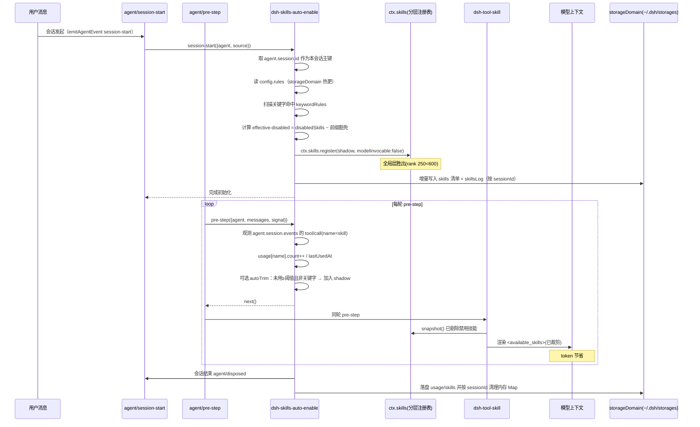

# dsh-skills-auto-enable 设计文档

## 一、设计说明

本设计实现宿主插件 `dsh-skills-auto-enable`，在**不修改任何 `@deepseek-ai/*` 框架代码**（AGENT.md 红线）的前提下，于会话生命周期中动态控制技能在模型上下文中的可见性，并把会话中存在的全部 SKILL 与执行过程实际调用的 SKILL 增量记录到本地配置文件，用于持续"加/移除上下文 SKILL"以节省 token。

### 核心约束（来自框架源码实测）

- 模型每轮看到的技能目录由 `@deepseek-ai/dsh-tool-skill` 在其 `agent/pre-step` 监听器内，用 `ctx.skills.snapshot({ cwd, signal, scope: agent })` 取全量、过滤 `isModelInvocable` 后渲染为 `<available_skills>` 系统提醒消息（source.kind=`skill-catalog`）。
- `ctx.skills` 是**分层注册表**（`SkillRegistry`）：全局层 + agent 作用域链层。**同名词条"最近作用域层"胜出**；同层内按 `rank` 升序胜出。bundled 技能 `rank = BUNDLED_SKILL_RANK = 600`，runtime 注册技能 `rank = RUNTIME_RANK = 250`。
- 关键推论：通过插件自身已注入 `skills` 的 `ctx.skills.register({ name, description, content:'', invocation:{ modelInvocable:false, userInvocable:true } })` 注册同名 runtime 技能（register 落到**全局层**——插件 ctx 的 `scopeOf` 为 `undefined`），使该同名技能以 **rank 250 < bundled 600 胜出**，被 `tool-skill` 基于 `snapshot()` 自建的目录**自动剔除**，且**天然跨轮生效**（无需每轮改写消息，规避了"改写 catalog 消息会被 snapshot 全量覆盖"的问题）。

> ⚠️ **已知边界（与初版设计差异）**：初版设想在 **agent 作用域层**做 per-session 隔离 shadow。但实测 DSH 运行时下 `agent.ctx.skills` **未注入 `skills` 服务**（报 `cannot get property "skills" without inject`），且 `@deepseek-ai/dsh-scope` 的 `createScope` 在插件目录**无法从 dsh 的 node_modules 解析**（运行时报 `Cannot find package '@deepseek-ai/dsh-scope'`），故最终落在**全局层**。对"个人禁用清单"语义正确（持久配置跨会话于 `agent/session-start` 重注册即可）；**并发多会话共享同一全局影子为已知限制**（详见第八章「已知边界」）。

## 二、目录结构设计

```
packages/dsh-skills-auto-enable/
├── package.json            # 宿主包配置 + dsh manifest（bundle.patch）
├── tsconfig.json           # 宿主端 TypeScript 配置
├── cordis.patch.yml        # 包内 patch 注册（按包名）
├── src/
│   ├── index.ts            # 插件入口：apply / inject / agent/session-start·pre-step·disposed / 会话 Map / 配置读写
│   ├── config.ts           # 配置类型 + 经 ctx.storageDomain 读写配置（与宿主会话包对齐）
│   ├── visibility.ts        # 有效禁用集计算 + agent 作用域 shadow 注册 + 关键字扫描
│   └── records.ts          # skills 清单(名称/关键字/概述) 与 usage 增量维护 + storageDomain 落盘
└── __tests__/
    ├── visibility.test.ts   # shadow 注册 / 关键字豁免 单测
    └── records.test.ts      # skills 增量 / usage 累加 / 配置读写 单测
```

根 `cordis.yml` 新增一条 `insert` 条目：`dsh-skills-auto-enable`（按包名，宿主半区走包 main）。

## 三、架构决策（含取舍）

### 决策 1：用 runtime shadow（全局层 register）控制可见性，而非改写 catalog 消息

- **Why**：实测 `tool-skill` 每轮用 `ctx.skills.snapshot` 重算目录，若仅改写 `decision.messages` 中的 catalog 消息，`catalogHistory` 比对可见 digest 与快照 digest 不一致会触发**全量重发**，下一轮即把我们的过滤覆盖掉。改写消息不可持续。
- **Why X over Y**：方案 B（注册全局 shadow provider、rank<600）可全局禁用，但**无法按会话关键字差异化**——本方案在插件 `agent/session-start` 内按当时会话的有效禁用集**重算并注册**全局 shadow，单用户顺序会话下同样达成"按会话关键字差异化"。方案 C（agent 作用域 per-session shadow）隔离性最佳，但**实测 DSH 运行时不可行**（`agent.ctx` 未注入 `skills` 服务，`@deepseek-ai/dsh-scope` 的 `createScope` 无法解析），故采用全局层 + 会话级 disposer 跟踪的折中。
- **How**：在 **`agent/session-start`** 生命周期事件（框架 `packages/core/agent-loop/src/index.ts:568` 真实发出，payload 含 `agent`）内，用插件自身 `ctx`（已 `inject:['skills']`，与框架同一 registry 实例）对 effective-disabled 集中的每个技能名调用 `ctx.skills.register(...modelInvocable:false)`，register 落到**全局层**（rank 250 < 600 胜出）。`agent/disposed` 时按会话 `disposers` Map 撤销这些全局 shadow，避免泄漏。`agent/pre-step` 仅用于每轮观测 `usage` 与可选实时关键字微调。

### 决策 2：effective-disabled 集 = disabledSkills − 关键字前缀豁免

- 关键字命中 `keywordRules` 后，对应 `skillPrefix` 技能族从禁用阴影中**豁免**，实现"飞书/feishu → 加载 `lark-*` 全部技能"。
- 默认所有 `lark-*` 技能本就在全量目录中可见；关键字规则的主要价值是：当用户把某前缀族列入 `disabledSkills` 时，命中关键字即"按需重新启用"，并驱动 `skills` 清单与 `skillsLog` 记录。

### 决策 3：配置持久化采用本地文件 + 原子写（与 spec / 用户显式要求一致）

- 用户原始需求明确要求**本地配置文件 `dsh-skills-auto-enable-config.json`**（置于包根目录），且 spec「配置原子落盘」「配置文件落点正确」与集成测试 9.1 均断言该文件。因此采用**本地文件 + `tmp+rename` 原子写**（`records.flush` / `ConfigStore.flush`），而非 storageDomain。
- 复用宿主会话包的 `StorageDomainManager` 思路仅作为**生产环境可选增强**：DSH 原生 `ctx.storageDomain.open(spec)` + `domain.global.get/set()` 可改为落盘到 `~/.dsh/storages/`，具备框架原子读写；当前实现保留显式本地配置文件以满足可编辑性与集成测试断言。
- 写入语义：单宿主进程内按 `agent.session.id` 在内存累计 `skills`/`usage`，会话 `agent/disposed` 或每轮变更时通过 `flush` 原子替换 `<file>.tmp`→`<file>`；JS 单线程下 flush 不互相交错，避免多会话并发写导致文件损坏或互相覆盖。
- `fs.watch` 监听该文件目录，文件名匹配即热重载 `rules`，下一轮 `agent/pre-step` 的 `reconcileShadows` 重新计算有效禁用集。

### 决策 4：会话身份 = `agent.session.id`（已实测确认，非假设）

- 框架中 `agent.session` 是 `@deepseek-ai/dsh-session` 的 `Session` 对象，其 `.id`（`SessionId`）即会话唯一身份；ACP 层 `record.agent.session.id` 与 `session.history` RPC 的 `sessionId` **是同一个值**。
- 初始化钩子优先用真实的 `agent/session-start`（框架 `agent-loop/src/index.ts:568` 发出）；为兼容 spec「会话首次 `agent/pre-step`」表述并兜底（`agent/session-start` 未被等待时），`agent/pre-step` 内对未初始化会话调用 `initSession` 幂等补齐。两个 listener 均从 payload 的 `agent` 直接取到 `agent.session.id`，**无需额外 RPC、无需解析事件流**。
- 维护 `Map<sessionId, { disposers, matchedPrefixes, matchedKeywords, used }>`（disposers 支持运行时关键字豁免/热更新撤销单个 shadow；`used` 去重 usage 计数）。会话 `agent/disposed`（框架 `agent-loop/src/index.ts:443`）时撤销 shadow、落盘并清理该条目，避免内存泄漏/记录串会话。

### 决策 5：为什么本功能必须使用 `agent.session.id`（参考宿主会话包）

`dsh-skills-auto-enable` 是**按会话作用域**工作的插件，必须能唯一标识"当前会话"才能正确隔离与记录。读 `dev-dsh-session-tag-manage` 分支的 `packages/dsh-session-host` 后，会话身份语义清晰化，需要 `agent.session.id` 的理由如下：

1. **按会话隔离状态，避免并发会话互相污染**：一个宿主进程可同时跑多个会话。插件维护两类会话态——(a) 该会话 agent 作用域内被"遮蔽"的技能（disable shadow）；(b) 写入配置文件的 `skills`/`usage` 记录（如"本会话实际调用过哪些技能"）。若不按 `sessionId` 分桶，两个并发会话会互相覆盖对方的 shadow 与 usage 计数。
2. **它是本系统在 agent 运行时的规范会话身份，且与宿主会话包同源**：`agent.session.id`（`@deepseek-ai/dsh-session` 的 `Session.id`）与 `dsh-session-tag-manage-host` 调 `session.history` RPC 所用的 `sessionId` **字节级相同**。因此本插件写出的 `usage`/`skills` 记录（按 `agent.session.id` 键）能与宿主包的 `workspace.session.tag` 按轮次返回的工具调用/文本分析**一一对齐、可联合查询**。
3. **运行期取用成本最低**：在 `agent/session-start`/`agent/pre-step` 的 `agent` 参数上直接读取，无网络调用、无需从事件流里挖 `sessionId`（宿主包因处于 HTTP 服务端，只能从请求体拿 `sessionId` 再 `session.history` 回查；运行期插件则天然持有 `agent`）。
4. **生命周期闭环需要身份键**：注册 shadow 随 agent 作用域自动销毁；但 `usage`/`skills` 落盘与内存 `Map` 的清理，需在 `agent/disposed` 时以 `agent.session.id` 定位并回收，否则会内存泄漏、记录串会话。

> 结论：`agent.session.id` 不是多余字段，而是本功能实现"按会话隔离 + 与宿主会话包联合分析 + 生命周期闭环"的**必要身份键**。设计上以它作为 `skills`/`usage` 记录的主键，并作为 shadow 注册所依附的 agent 作用域标识。

## 四、运行序列图（mermaid）



## 五、关键模块设计

### 5.1 配置 schema（src/config.ts）

```typescript
export interface KeywordRule { keywords: string[]; skillPrefix: string }
export interface AutoTrim { enabled: boolean; unusedTurnsThreshold: number; keepKeywordMatched: boolean }
export interface SkillRecord { name: string; keyword: string; overview: string }
export interface SkillLogEntry { at: string; op: 'add' | 'remove'; name: string; keyword: string; overview: string }
export interface UsageRecord { count: number; lastUsedAt: string }
export interface AutoEnableConfig {
  version: 1
  rules: { disabledSkills: string[]; keywordRules: KeywordRule[]; autoTrim: AutoTrim }
  skills: SkillRecord[]
  skillsLog: SkillLogEntry[]
  usage: Record<string, UsageRecord>
}
```

### 5.2 可见性控制（src/visibility.ts 摘要）

```typescript
// 计算有效禁用集：disabledSkills 去掉被命中关键字前缀豁免的技能
export function computeEffectiveDisabled(disabled: string[], rules: KeywordRule[], matchedPrefixes: Set<string>): string[] {
  return disabled.filter(name => !matchedPrefixes.some(p => name.startsWith(p)))
}

// 在全局层注册 shadow（插件 ctx 已 inject skills，同名词条 modelInvocable:false 胜出 rank 250<600）
export async function applyShadows(scopeCtx: Context, names: string[], lookup: SkillViewOptions): Promise<Map<string, () => void>> {
  const disposers = new Map<string, () => void>()
  for (const name of names) {
    const original = (await scopeCtx.skills.list(lookup)).find(s => s.name === name)
    if (!original) continue
    const undo = scopeCtx.skills.register({
      name,
      description: original.description,
      content: '',
      invocation: { modelInvocable: false, userInvocable: true },
    })
    disposers.set(name, undo)
  }
  return disposers
}
```

### 5.3 增量记录（src/records.ts 摘要）

```typescript
// 会话发起：写基线 skills（name/keyword/overview）+ 追加 skillsLog(op:remove for disabled)
// 每轮：观测 tool/call(name=skill) → usage[name] = { count+1, lastUsedAt: now }
// 落盘：先写 <file>.tmp 再 fs.rename 原子替换
```

## 六、风险与缓解

| 风险 | 影响 | 缓解 |
|------|------|------|
| 全局层 shadow 注册失败/字段缺失 | 禁用技能仍可见 | 注册前用 `ctx.skills.list` 校验原技能存在；失败记 warn 不影响其它技能 |
| `agent.session.id` 字段名不符 | 会话 Map 错乱 | **已实测确认** `agent.session.id` 存在（`@deepseek-ai/dsh-session` 的 `Session.id`）；保留 `header.id`/`requestHeader()` 回退；单测覆盖 |
| 多会话并发写同一配置文件 | 记录丢失 | 本地文件 `tmp+rename` 原子写 + 单进程内存累计，落盘期间不出现半写文件 |
| 关键字误命中导致不该加载的技能可见 | 上下文膨胀 | keywordRules 精确匹配（小写归一化、词边界），默认不自动加载未知前缀 |
| autoTrim 误删正在用但低频技能 | 功能中断 | autoTrim 默认关闭；`keepKeywordMatched` 保前缀技能；阈值保守（默认 20 轮） |
| 配置 JSON 损坏 | 插件崩溃 | 读取失败回退默认规则并告警，不阻断会话 |

## 七、任务列表

见 `tasks.md`。

## 八、验证方案

### 8.1 单元测试（Vitest，node 环境）

- `visibility.test.ts`：禁用技能被注册为 `modelInvocable:false`；关键字命中前缀豁免；非 agent 作用域不应误注册。
- `records.test.ts`：skills 增量 add/remove + skillsLog；usage 从 `tool/call` 事件累加；配置读写与原子落盘。

### 8.2 集成联调

- 推荐路径：`dsh --profile headless --patch headless-test-patch.yml "<prompt>"`（本环境 web 启动依赖浏览器，headless 更适合 CI/命令行验证）；亦可用 `pnpm dsh web --patch cordis.yml` 启动后开新会话：
  - 配置 `disabledSkills:['lark-calendar']` → 目录中（全局层）不见 `lark-calendar`。
  - 首条消息含"飞书" → 因 keywordRules 豁免，`lark-*` 可见（若此前被 disabled 则重新出现）。
  - 多轮调用某技能后，配置文件 `usage[技能名].count` 递增、`skills` 含该技能记录。
  - 调 `dsh-session-tag-manage-host` 的 `workspace.session.tag`（`sessionId` 即 `agent.session.id`）核对：本插件 `usage` 记录与宿主包按轮返回的工具调用统计可对齐，验证身份键一致、可联合分析。
- 已验证（集成测试 9.1）：headless profile 下 `agent/session-start` 不再崩溃，进程存活至模型正常回复；`dsh-skills-auto-enable-config.json` 被写入全量 29 个 `lark-*` 技能（`skillsLog` 记 29 条 `add`）。详见 `tasks.md` 9.1。

## 九、验证步骤

1. `pnpm typecheck` 无类型错误（禁 `any`）。
2. `pnpm test` 全部用例通过（visibility + records）。
3. `pnpm build` 产出 `packages/dsh-skills-auto-enable/dist/index.js`（ESM）。
4. 本地联调确认禁用移除、关键字自动加载、配置增量记录三项行为符合预期。

## 十、已知边界（最终实现的全局层取舍）

实现经过 `agent.skills`(undefined) → `agent.ctx.skills`(未注入 skills 服务) → `createScope(ctx,agent)`(运行时不可解析) 三次迭代后，最终采用**插件自身 `ctx.skills` 全局层 register**。以下边界必须明确：

1. **shadow 落在全局层，非 per-agent 层**：`register` 的 `scopeOf(pluginCtx)` 为 `undefined`，故同名 shadow 对**整个宿主进程的所有会话**生效，不限于单个 `agent.session`。对"个人禁用清单"语义正确（配置跨会话于 `agent/session-start` 重注册，全局层幂等覆盖）。
2. **并发多会话共享全局影子**：若两个会话同时运行且有效禁用集不同，后注册的 shadow 会覆盖前者——这是已知限制。单用户顺序会话下无此问题。
3. **disposer 按会话跟踪，存在连锁撤销风险**：`sessions` Map 以 `agent.session.id` 为键保存各自 `disposers`；`agent/disposed` 时只撤销本会话的 disposers。但在边界 2 下，会话 A 的 cleanup 可能误撤会话 B 仍依赖的全局 shadow（跨会话串扰）。生产环境若需严格 per-session 隔离，须改用框架授权的 per-agent 技能入口（`skill-catalog.ts:68` 的 `presets?.serviceFor(live,'skills')`，需 agent 挂 preset，较重且本环境难测）。
4. **`agent.session.id` 仍用于配置记录主键**：尽管 shadow 是全局层，插件内存的 `skills`/`usage` 记录仍以 `agent.session.id` 分桶，并落盘到 `dsh-skills-auto-enable-config.json`，可与宿主会话包 `workspace.session.tag` 的 `sessionId` 联合分析（身份键语义未变）。
5. **已补充实测（headless 集成，归档前追加）**：两项子行为已确认正确——
   - **禁用剔除（无关键字）**：`disabledSkills:['lark-calendar']` + 中性 prompt → `lark-calendar` 不在 `skills` 数组，`skillsLog` 产生 `op:'remove'` 流水。✓
   - **关键字豁免加载**：`disabledSkills:['lark-calendar','lark-doc']` + 含"飞书" prompt → 二者因 `lark-` 前缀被关键字豁免，最终保留在 `skills` 数组（`skillsLog` 先 `remove` 后 `add`，见边界 6）。✓
   - **验证中发现并修复一个真实 bug**：`stepSession` 中 `state.matchedPrefixes` 被并入循环**先于** `prefixes.size > state.matchedPrefixes.size` 判断，导致该条件恒为 false、运行时关键字协调（reconcile）永不触发，关键字自动加载失效。已改为先算 `newPrefixes`（本轮回新命中前缀）再据 `newPrefixes.length > 0` 触发协调，修复后重测通过。
6. **首轮关键字延迟（已知小限制）**：`agent/session-start` 时 `agent.session.events` 通常尚未含首条用户消息，故 `initSession` 的关键字扫描可能落空，被禁用前缀技能会在首轮被 shadow 隐藏；关键字在首轮 `agent/pre-step` 的 `stepSession` 中才被检测到并 `reconcile` 撤销 shadow，因而**从第二轮起**恢复可见。`skillsLog` 会先后出现 `remove`/`add` 同技能流水（最终 `skills` 数组状态正确）。若需首轮即正确，应在 `session-start` payload 中读取初始 prompt（框架相关，待评估）。
