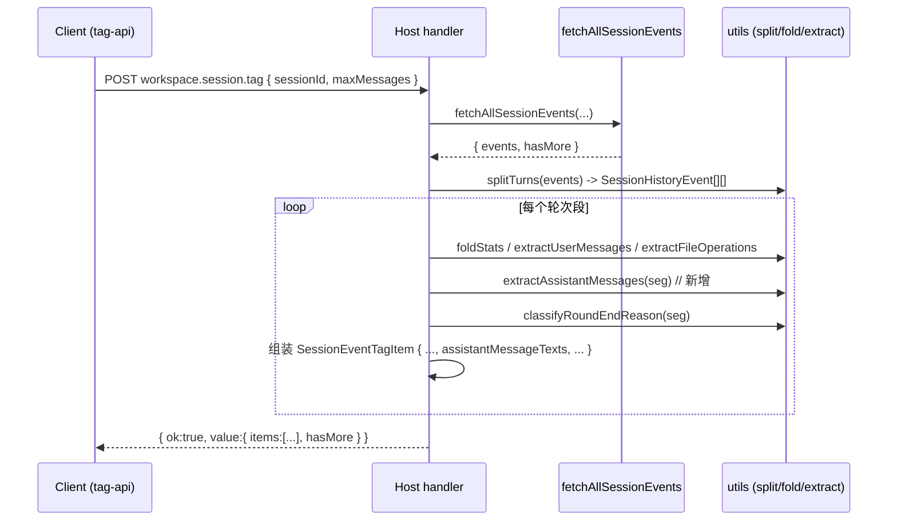

# 设计文档：workspace.session.tag 补充 LLM(助手)返回文本字段

## Context

`workspace.session.tag` 接口（经 `session-tag-turn-items` 改造后）按 `turn` 切分返回 `SessionEventTagItem[]`，逐轮提供 `userMessageTexts`（用户提问）、`assistantMessages`（助手消息**计数**）、`toolCalls`、`fileOperations` 等。

但接口**缺失 LLM 实际返回的文本**：`assistant/message` 事件携带的 `content`（`type==='text'` 的可读正文）没有被抽取与返回。调用方无法逐轮获知「助手到底回了什么」。

事件溯源模型中，`assistant/message` 事件结构为：
```ts
interface AssistantMessageData {
  content: Array<{ type: string; text: string }>
  role: 'assistant'
  id: string
}
```
其中 `content` 可能混合 `text`（可读正文）与 `tool_use`（工具调用指令）等不同类型块。本次只抽取 `type==='text'` 的正文，与既有 `extractUserMessages`（同样只取 `type==='text'`）保持行为一致。

**约束**：
- 宿主/客户端双包拆分，共享类型两处手维护，需保持同步。
- 复用既有 `splitTurns` / `foldStats` / `extractUserMessages` 折叠框架，不重复实现。
- 本次不涉及客户端 UI 渲染。

## Goals / Non-Goals

**Goals:**
- 为 `SessionEventTagItem` 新增 `assistantMessageTexts: string[]`，逐轮（每条 item）携带 LLM 返回的可读正文。
- 新增 `extractAssistantMessages(events)` 工具（镜像 `extractUserMessages`），按 `type==='text'` 过滤抽取。
- 宿主 handler 在逐轮折叠循环内调用 `extractAssistantMessages(seg)`。
- 宿主/客户端类型同步；API 文档同步。
- 保留既有 `assistantMessages: number` 计数，不破坏既有字段。

**Non-Goals:**
- 不抽取推理/思考（reasoning/thinking）块（按 `type` 过滤自然排除；如需后续单独加字段）。
- 不抽取 `tool/result` 文本（那是工具执行结果，非 LLM 直接返回）。
- 不改造 `items` 结构、`hasMore`、信封、错误码、分页逻辑。
- 不修改 `workspace.list.tag` / `workspace.tag.set` 等其它端点。

## Decisions

### 决策 1：字段命名 `assistantMessageTexts`，与 `userMessageTexts` 同源异构

- **选择**：新增字段命名为 `assistantMessageTexts: string[]`，与既有 `userMessageTexts` 形成「用户提问 / 助手回答」对称结构。
- **理由**：命名一致、语义对称，前端/消费方一眼可对照；`assistantMessages`（计数）保留，文本与计数互补。
- **被否方案**：`llmResponses` / `assistantTexts` 等——不与 `userMessageTexts` 对齐，易产生命名割裂。

### 决策 2：新增独立工具 `extractAssistantMessages`，镜像 `extractUserMessages`

- **选择**：`extractAssistantMessages(events)` 仅遍历 `assistant/message`，取 `content` 中 `type==='text'` 片段，`join('\n')` 成一条，非空推入数组。
- **理由**：与 `extractUserMessages` 实现对称，行为可预测、便于测试对照；不混入用户/工具逻辑。
- **取舍**：`tool_use` / `reasoning` 块（非 `text`）被自然排除，避免把工具调用指令或思考过程当作「助手正文」。

### 决策 3：逐轮（每条 item）返回，而非全局字段

- **选择**：`assistantMessageTexts` 放在每条 `SessionEventTagItem` 内（与 `userMessageTexts` 同级）。
- **理由**：`items` 已按 `turn` 切分，逐轮文本天然对齐「本轮助手回了什么」，比额外加一个全局列表更内聚、更易消费。

## 关键流程

### 序列图：handler 处理一次请求（增量）



## Risks / Trade-offs

- **[风险] 助手消息可能很长**：`assistantMessageTexts` 保留完整正文，可能增大响应体。→ 缓解：与 `userMessageTexts` 同等处理（不做截断）；若需控制体积，后续可加 `maxTextLength` 参数（列为 Open Question）。
- **[风险] 双包类型漂移** → 缓解：任务项强制同步 `tag-api.ts`，并以 `pnpm typecheck` 作为收尾校验门禁。
- **[取舍] 仅取 `text` 块**：`tool_use`/`reasoning` 不计入文本列表，符合「助手可读正文」语义；如后续需要可见性，单独加字段。

## Migration Plan

1. 部署顺序：先上线宿主 `dsh-session-host`（contract + 工具 + handler），再同步客户端 `dsh-session-client` 类型（仅类型，无 UI 行为变化）。
2. 兼容：本次为**纯字段新增**，`assistantMessages` 等既有字段不变；旧调用方忽略新字段即可，无破坏性。
3. 回滚：若异常，仅回退 handler 中 `extractAssistantMessages` 调用与 item 组装（工具函数不影响其它路径），或回退至上一 bundle。

## Open Questions

- 是否需要 `maxTextLength` 截断参数以控制响应体体积？—— 当前保留完整正文，待后续评估。
- 是否需要单独的「思考过程（reasoning）」字段？—— 当前按 `type==='text'` 过滤排除，待后续评估。

## 设计说明

- **抽取规则**：`extractAssistantMessages` 仅取 `assistant/message` 事件，`content?.filter(c => c.type === 'text').map(c => c.text).join('\n')`，非空推入。
- **逐轮**：handler 在 `segments.map` 循环内调用，每条 item 自带本轮 `assistantMessageTexts`。

## 任务列表

按 `tasks.md` 执行，顺序如下：

1. 更新 `contract.ts` 类型定义（item 增加 `assistantMessageTexts`）。
2. 新增 `extractAssistantMessages` 工具并导出。
3. 改造 `index.ts` handler 逐轮写入 `assistantMessageTexts`。
4. 同步客户端 `tag-api.ts` 的 `SessionEventTagItem`。
5. 同步 API 文档 `workspace.session.tag.md`。
6. 同步与新增测试。
7. `pnpm typecheck` + `pnpm test` 校验。
8. 子代理任务审计（末项，闭环）。

## 验证方案

- **单元验证**：构造「多轮 + 单条 assistant 正文 + 仅 tool_use 块」样例，断言 `extractAssistantMessages` 正确抽取、`tool_use` 被排除。
- **类型一致性**：`pnpm typecheck` 0 错误。
- **集成冒烟**：host handler 测试断言 `value.items[].assistantMessageTexts` 与 mock 一致。
- **文档一致性**：`apiDocs/plugin-api/workspace.session.tag.md` 出参与 `contract.ts` 一致。

## 验证步骤

1. 在 `packages/dsh-session-host` 新增/扩展 `*.test.ts`（Vitest），覆盖上述样例，运行 `pnpm test`。
2. 仓库根目录运行 `pnpm typecheck`，确认 0 错误。
