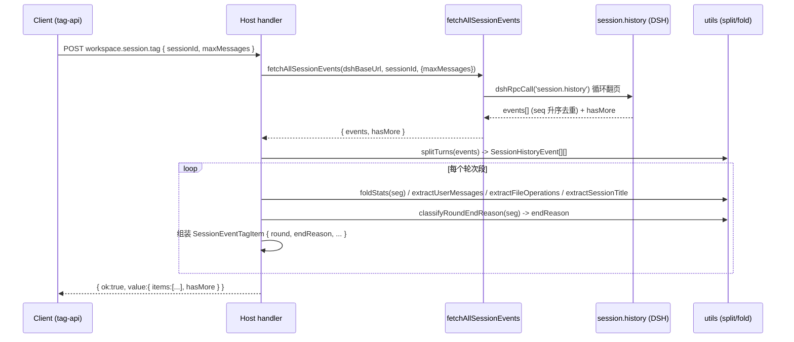
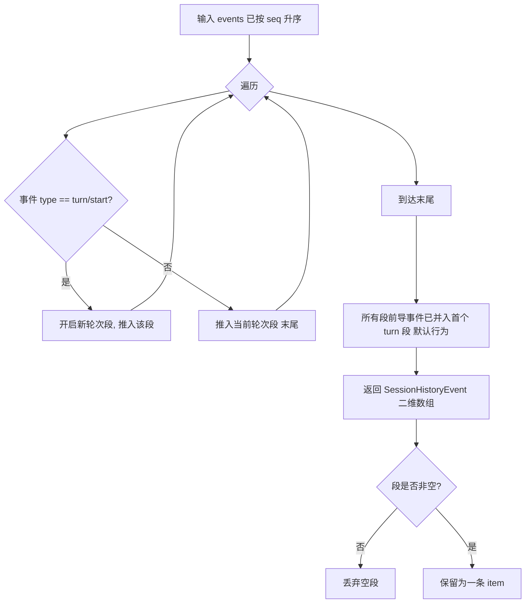

# 设计文档：workspace.session.tag 按轮次（turn）输出 items 数组

## Context

当前 `workspace.session.tag` 接口接收 `sessionId` 后，通过 `fetchAllSessionEvents` 分页拉取该会话的**整段**事件流（`session.history`），再用 `foldStats` / `extractUserMessages` / `extractFileOperations` / `extractSessionTitle` 把整段事件流折叠成**单条** `SessionEventTagItem`，包在 `value.item` 中返回。

DSH 的事件溯源模型里，一次会话是一份仅追加的事件日志。每个「用户发起 → 会话结束 / 异常终止」的轮次（turn）由 `turn/start` 开启、`turn/end`（携带 `reason.kind`）收尾。`session/end-seed` 标记「重新打开 / 恢复」等生命周期边界，其之前的事件为前导种子段。

现状问题：当会话存在多个 turn 时，所有轮次的统计数据被混成一条，前端无法区分：
- 这是第几轮、当前轮是正常完成 / 用户取消（aborted）/ 异常终止（error）/ 进行中（ongoing）；
- 每轮各自的消息数、工具调用、文件操作、用户原话。

这与「按每轮会话整合数据、重点跟进异常终止轮次」的诉求相悖。

**约束**：
- 宿主/客户端为双包拆分（`packages/dsh-session-host` / `packages/dsh-session-client`），共享类型在两处手维护，需保持同步。
- `fetchAllSessionEvents` 已返回按 `seq` 升序、去重后的事件数组，且保留 `hasMore` 分页边界。
- 本次**不涉及客户端 UI 渲染**（客户端当前仅 `console.log` 结果），仅做类型同步以免 `typecheck` 失败。

## Goals / Non-Goals

**Goals:**
- 将出参由单条 `value.item` 改为 `value.items: SessionEventTagItem[]`，按 turn 切分，每 turn 一条。
- 每条 item 新增 `round`（1-based 轮次序号）与 `endReason`（本轮结束/异常原因）。
- 种子段不排陻：`session/end-seed` 之前的前导事件并入首个 turn 轮次，不丢失任何事件数据。
- 复用现有 `foldStats` / `extractUserMessages` / `extractFileOperations` / `extractSessionTitle` 工具，逐段折叠。
- `hasMore` 从原 `item` 内上移到 `value` 级（分页边界对整个会话事件流负责，而非单轮）。
- 宿主与客户端共享类型两处同步；错误码与 RPC 信封不变。

**Non-Goals:**
- 不改造方案 A（`session/end-seed` 生命周期切分）或方案 C（`request/header` 切分）。
- 不排陻 fork / 恢复继承的种子段（按已确认决策：继承种子段不做排除）。
- 不新增客户端 UI 组件 / 不渲染 `items`（待后续迭代）。
- 不修改 `workspace.list.tag`、`workspace.tag.set` 等其它端点。
- 不改动 `fetchAllSessionEvents` 的分页与去重逻辑。

## Decisions

### 决策 1：轮次边界采用「方案 B —— 按 turn/start ~ turn/end 切分」

- **选择**：以 `turn/start` 事件为界开启一轮，该轮事件 = 从本 `turn/start` 起、到下一个 `turn/start` 之前（含自身 `turn/end`）的所有事件。
- **理由**：用户诉求的「每一轮会话（用户发起 → 结束 / 异常终止）」在事件模型上正对应一个 turn；`turn/end.reason.kind` 直接表达结束状态，`endReason` 可零成本得出。
- **被否方案**：
  - 方案 A（`session/end-seed` 生命周期切分）：粒度偏粗，一个生命周期内可能包含多个 turn，无法逐 turn 跟进；且 `end-seed` 边界与「用户直观的一轮对话」不完全等价。
  - 方案 C（`request/header` 的 `initial`/`resume` 切分）：依赖信封 reason，resume 信封未变时可能不重发，边界不稳定，且不直接表达异常终止。

### 决策 2：种子段不排陻（前导事件并入首个 turn 轮次）

- **选择**：首条 `turn/start` 之前的事件（`session/end-seed`、`session/title`、`request/header` 等）全部保留，并入首个 turn 轮次，不丢弃。
- **理由**：用户已明确「继承种子段不做排除」。且前导事件承载会话标题（`session/title`）、时间窗起点、可能的早期文件操作，丢则导致首轮统计缺漏。
- **取舍**：fork 场景下，父会话历史会随种子段计入本会话首个 turn。这是已接受的代价（按决策 2 原样执行）。

### 决策 3：item 新增 `round` 与 `endReason` 字段

- `round: number` —— 取该轮 `turn/start.data.turn`（1-based）；纯前导段（无 `turn/start`）记为 `0`。
- `endReason: RoundEndReason` 取值：
  - `completed` / `aborted` / `error` / `interrupted` / `max-tokens` / `blocked` —— 取自该轮最后一条 `turn/end` 的 `reason.kind`；
  - `ongoing` —— 末轮且无 `turn/end`（中断 / 进行中）；
  - `seed` —— 纯前导段（无 `turn/start`）。
- **理由**：这是「会话结束或异常终止」诉求的必要落点，便于前端区分多轮并高亮异常终止轮。

### 决策 4：出参结构 `value.items` + `hasMore` 上移

- **选择**：`WorkspaceSessionTagResponse.value` 由 `{ item }` 改为 `{ items: SessionEventTagItem[]; hasMore: boolean }`。
- **理由**：`hasMore` 描述「会话事件流是否还有更早分页」，是对整段事件流负责，不应放在某个单轮 item 内。原 `item.hasMore` 字段从 `SessionEventTagItem` 移除。

### 决策 5：复用现有工具，新增两个纯函数

- 新增 `splitTurns(events)` 与 `classifyRoundEndReason(events)`，均为无副作用纯函数，复用 `foldStats` 等折叠工具；在 `utils/index.ts` 统一导出。
- **理由**：避免重复实现统计逻辑，保持单一数据源。

## 关键流程

### 序列图：handler 处理一次请求

### 流程图：splitTurns 切分逻辑

> 说明：首条 `turn/start` 之前的前导事件在遍历时作为「当前段尚未开启」的缓冲，待首个 `turn/start` 出现后随首段一并输出；若整段无 `turn/start`（纯种子段），则归为 `round=0, endReason=seed` 的单条 item。

## Risks / Trade-offs

- **[风险] 复用现有类型手维护两份（host/client）易漂移** → 缓解：`tasks.md` 第 4 项强制同步 `tag-api.ts` 的 `WorkspaceSessionTagValue`，并以 `pnpm typecheck` 作为收尾校验门禁；后续可引入 Typert RPC 生成桩彻底消除漂移（不在本次范围）。
- **[风险] fork 场景父会话历史污染首轮统计** → 缓解：已与用户确认「继承种子段不排陻」为可接受代价；如后续需要隔离，可基于 `firstLiveSeq` 等线索单独追加过滤逻辑（列为 Open Question）。
- **[风险] `turn/end.reason` 结构差异（不同 DSH 版本）** → 缓解：`classifyRoundEndReason` 对缺失 `reason.kind` 的情形回退为 `ongoing`，保证不抛错。
- **[取舍] 出参为破坏性变更（单条 → 数组）** → 调用方需适配；错误码与 RPC 信封保持不变以降低迁移成本。

## Migration Plan

1. 部署顺序：先上线宿主 `dsh-session-host`（contract + handler + utils），再同步客户端 `dsh-session-client` 类型（仅类型，无 UI 行为变化）。
2. 兼容：旧调用方若仍按 `value.item` 解析会失败 —— 因本次属破坏性变更，由 `workspace.session.tag` 调用方（当前仅本插件客户端 `console.log`）同步升级；错误码与信封不变。
3. 回滚：若线上异常，可单独回退 `index.ts` handler 的 `items` 组装分支（保留 `splitTurns`/`classifyRoundEndReason` 工具不影响其它路径），或直接回退至上一个 bundle 版本。

## Open Questions

- fork 继承段是否需要单独的「来源会话 ID」标记（以便前端区分本会话实时工作 vs 继承历史）？—— 当前不处理，待后续迭代评估。
- 是否需要按 `endReason` 提供「仅异常终止轮次」的快捷过滤参数？—— 当前返回全量 `items`，由前端按需筛选。

## 设计说明

- **切分算法 `splitTurns(events)`**：事件已按 `seq` 升序；以 `turn/start` 为界开新一轮，该轮事件 = 本 `turn/start` 起至下一个 `turn/start` 之前（含自身 `turn/end`）的所有事件；首条 `turn/start` 之前的前导事件并入首个 turn 轮次；返回 `SessionHistoryEvent[][]`（顺序即轮次顺序）。
- **结束原因 `classifyRoundEndReason(events)`**：取该轮最后一条 `turn/end` 的 `reason.kind` → `completed`/`aborted`/`error`/`interrupted`/`max-tokens`/`blocked`；末轮且无 `turn/end`（中断/进行中）→ `ongoing`；纯前导段（无 `turn/start`）→ `seed`。前导段 `round=0`。
- **每轮整合**：复用 `foldStats` / `extractUserMessages` / `extractFileOperations` / `extractSessionTitle`，逐段折叠为一条 `SessionEventTagItem`，并填入 `round` / `endReason` / `title`。

## 任务列表

按 `tasks.md` 执行，顺序如下：

1. 更新 `contract.ts` 类型定义（响应 `items` + `RoundEndReason` + item 字段）。
2. 新增 `splitTurns` / `classifyRoundEndReason` 工具并导出。
3. 改造 `index.ts` handler 循环生成 `items`、`hasMore` 上移。
4. 同步客户端 `tag-api.ts` 的 `WorkspaceSessionTagValue`。
5. 同步 API 文档 `workspace.session.tag.md`。
6. `pnpm typecheck` 校验。
7. 子代理任务审计（末项，闭环）。

## 验证方案

- **单元/逻辑验证**：构造「多 turn + 前导种子段 + 异常终止（`turn/end.reason=error` / `aborted`）」的样例事件序列，断言 `splitTurns` 切分轮数、`classifyRoundEndReason` 输出、`foldStats` 各段统计正确，且前导事件不丢失。
- **类型一致性**：运行 `pnpm typecheck`，确认 host 与 client 共享类型一致、无编译错误。
- **契约兼容性冒烟**：以既有 `api_session.history.md` 真实样例为输入，模拟 handler 全流程，确认 `value.items` 数组结构与文档一致、`hasMore` 位置正确、错误码与信封不变。
- **文档一致性**：核对 `apiDocs/plugin-api/workspace.session.tag.md` 出参与 `contract.ts` 类型一致。

## 验证步骤

1. 在 `packages/dsh-session-host` 新增 `*.test.ts`（Vitest），覆盖上述样例，运行 `pnpm test`（或 `pnpm --filter dsh-session-host test`）。
2. 仓库根目录运行 `pnpm typecheck`，确认 0 错误。
3. 人工对照 `api_session.history.md` 中真实样例，校验 `splitTurns` + handler 输出形态。
