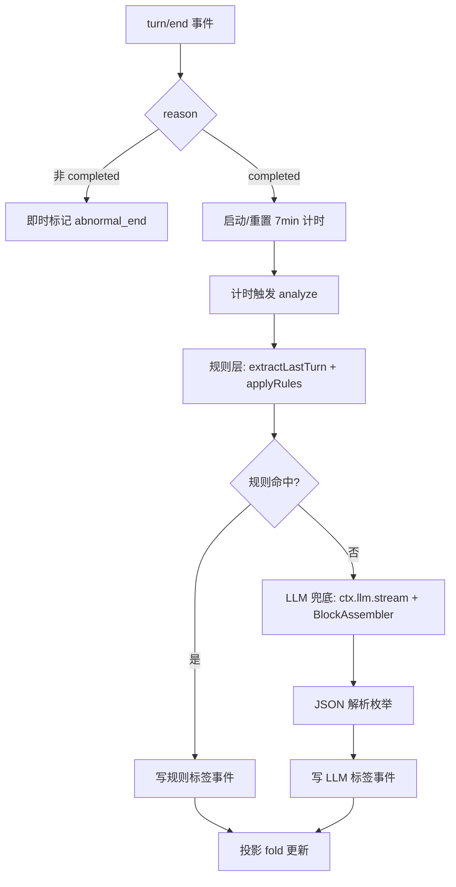
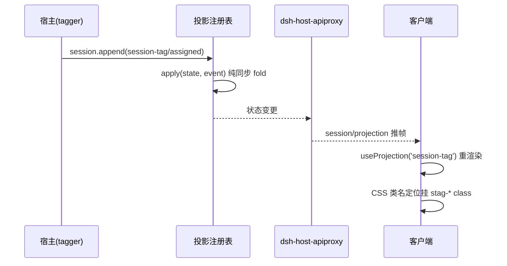
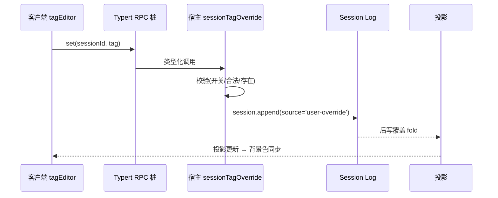

## Context

DeepSeek Harness（DSH）是"一切皆插件"架构的 TypeScript 应用。会话是一份仅追加的类型化 `SessionEvent` 日志，所有派生状态（UI、持久化、恢复）都从同一组事件派生。本插件 `dsh-session-tag-manage` 是**纯事件消费者 + 投影贡献者**：不侵入 Agent Loop，通过 `ctx.on('session/event')` 监听轮次生命周期，产出会话标签，经投影同步到浏览器端渲染。

技术栈约束：
- 宿主框架：Cordis（`@deepseek-ai/cordis`），`ctx.effect` 生命周期托管、`ctx.service` 服务注册、`ctx.llm.stream` LLM 调用、`ctx.sessionProjections` 投影注册。
- 客户端：React + 客户端槽位（`slots` / `clientRuntime` / `SessionStandardProps.useProjection`）。
- 写通路：Typert RPC（构建时生成类型化客户端桩 + 宿主服务桩）。
- 配置：Schemastery。

已核实的官方契约（见 `docs/design.md` 第十三章）确认：`turn/end.reason` 六枚举、`approval/asked`/`decided` 配对、`todo/write` 全量快照、`SessionEventMap` 声明合并扩展、投影 `stateSchema` + `wire:{viewSchema,view}` 契约、`ctx.llm.stream` + BlockAssembler、`useProjection(key)` hook、CSS 类名定位（无逐会话行槽位）。

## Goals / Non-Goals

**Goals:**
- 会话标签五分类自动分析：`in_progress` / `abnormal_end` / `waiting` / `completed` / `invalid`，规则前置 + LLM 兜底。
- AI 回复结束后 7 分钟（可配置 `delayMs`）打标；异常 reason 即时打标。
- 标签以自定义 `session-tag/assigned` 事件持久化，随日志回放 / Fork / 恢复一致。
- Web UI 按标签渲染会话行背景色（异常红、等待橙重点强调），冷读恢复。
- 每日 17:00 桌面提醒：统计当天有活动且 ∈ {`abnormal_end`, `waiting`} 的会话数。
- Web UI 手动改标签：经 Typert RPC 写入，数据与 UI 同步；锁定手动标签不被自动覆盖。

**Non-Goals:**
- 不修改 Agent Loop 或 ui-workspace 源码；不新增上游槽位。
- 不做多用户 / 多空间会话列表的权限管理（仅当前浏览器上下文）。
- 不实现历史会话的批量清理 / 归档操作（仅打标 + 可视化 + 提醒）。
- 不引入宿主→客户端主动推送通道（每日提醒走客户端本地汇总 + 聚焦兜底）。

## Decisions

### 决策 1：标签判定 —— 规则前置 + LLM 兜底
结构化信号全走纯函数规则层（`src/rules.ts`），LLM（`src/tagger.ts` 兜底）只判规则判不了的语义类（`completed` / `invalid` / 兜底 `in_progress`），JSON 约束输出枚举。

- `abnormal_end`：`turn/end.reason ∈ {error, max-tokens, aborted, blocked, interrupted}`（即时，不等计时）。
- `waiting`：扫日志，`approval/asked` 无配对 `approval/decided`（`Map<ApprovalRequestId,'asked'>` 配对追踪）。
- `in_progress` / `completed`：`todo/write` 全量快照（`pending/in_progress` → 进行中；全 `completed` 或空 → 候选完结）+ `turn/start` 重置。
- `agent/status`（`idle|running`）：**降级为可选**——官方明示是 whole-agent 运行态、不可作单轮信号；"进行中"主信号由 `todo/write` + `turn/start` 承担。

备选方案：全量 LLM 判定（准确率不稳、Token 成本高）→ 否决；全量规则判定（`invalid` 等语义类判不了）→ 否决。

### 决策 2：计时管理 —— 重置式 setTimeout + ctx.effect
`turn/end(completed)` 重置 7 分钟；`turn/start` 取消旧计时并回 `in_progress`；异常 reason 即时标记不等计时。定时器必须走 `ctx.effect()` 纳入生命周期，插件卸载 / 会话销毁自动回收，不留幽灵回调。

### 决策 3：内容提取 —— 只取最后一轮、排除文件/编辑/思考
从后往前定位最后一个 `turn/start` 的 seq 为边界；只收 `user/message` 与 `assistant/message` 的 `text` 块，过滤文件附件块、`reasoning` 块；`tool/call`、`tool/result`、`assistant/chunk` 一律不进分析输入；截断到 `maxLastTurnMessages`（默认 50）。

### 决策 4：标签持久化 —— 自定义 SessionEvent（log-only）
`src/events.ts` 用声明合并扩展 `SessionEventMap`，新增 `session-tag/assigned`（`ignorable: true`、whole-value 快照式）。非 `SurfaceEventType` 的 log-only 事件，无需 `SurfaceIntent`；`session.append()` 保证 JSON 可序列化。标签随会话日志持久化，重启 / 恢复 / Fork 可重放。

### 决策 5：投影注册 —— stateSchema + wire 契约
`src/projection.ts` 注册 `session-tag` 投影：
- 合并声明 `SessionProjectionMap`（客户端可见值：`tag`/`source`/`lastActiveAt`）与 `SessionProjectionStateMap`（宿主 fold 状态：多一个 `assignedAt`）。
- `stateSchema`（Zod）校验持久化 state；`wire:{viewSchema,view}` 定义客户端视图。
- `apply` 纯同步 fold：对无关事件返回同一引用（`Object.is` 相等 → 零下游工作）；`ACTIVITY_EVENTS`（`turn/start`、`user/message`、`assistant/message`、`tool/call`、`tool/result`、`approval/asked`）刷新 `lastActiveAt`。
- `stateVersion: 3` 使旧缓存失效。

### 决策 6：Web UI 背景色 —— 投影 + CSS 类名定位（阻断点 1 决策 A）
会话列表由 ui-workspace 渲染进 `sidebar.workspaces` 单槽、**无逐会话行槽位**，故不依赖内部类名（生产 CSS-module 哈希化风险）。客户端只读投影成品值，遍历会话行 DOM（`data-session-id` 优先、缺失时容器选择器 + 行序匹配）挂插件自有 `stag-*` class，注入全局样式；`MutationObserver` 兜底行增删与投影更新后的重新 apply。异常红 / 等待橙 `!important` 强调。

### 决策 7：每日 17:00 提醒 —— 客户端本地汇总 + 聚焦兜底（决策 6）
- 投影已含 `lastActiveAt`；客户端在 `dailyReminderTime`（默认 `17:00`）定时 + `visibilitychange`/`focus` 兜底时，遍历会话投影，过滤 `lastActiveAt` 属今日且 `tag ∈ {abnormal_end, waiting}` 计数。
- 载体：**Web Notifications API**（`Notification.requestPermission()`，拒绝静默降级），不占页签 UI；`desktopReminderEnabled` 开关（默认开）控制。
- 去重：`localStorage['last-notified-date']` 记今日已提醒，防重复；两数皆 0 不发。
- 后台节流兜底：聚焦时若已过提醒时刻且今日未提醒，立即补查。
- 备选：宿主权威计时 + Typert RPC 拉取（方案 B）留作投影覆盖不足时的升级路径；宿主主动推送（方案 C）因未验证推送通道而否决。

### 决策 8：手动标签更新 —— Typert RPC + 后写覆盖 + 锁定手动标签（阻断点 2 决策 B）
- 写通路：客户端 `tagEditor.tsx` 经 **Typert RPC**（构建时生成桩）调用宿主 `sessionTagOverride.set(sessionId, tag)`。
- 宿主 `src/override.ts` 注册服务：校验开关 `manualTagUpdateEnabled` / 合法标签（5 枚举闭集）/ 会话存在，通过后追加 `source: 'user-override'` 的 `session-tag/assigned` 事件。
- 投影是 whole-value 快照、后写覆盖：手动写一条事件即完成数据与 UI 同步，无需新增投影逻辑。
- 冲突策略（方案 B 推荐）：`analyze()` 写自动标签前读最近一次标签的 `source`，若 `user-override` 则跳过；新 `turn/start` 仍重置 `in_progress`。
- 开关双重生效：客户端隐藏编辑入口 + 宿主拒绝写入。

### 决策 9：配置 —— Schemastery Schema
`src/config.ts` 定义 7 个可配置字段：`delayMs`（默认 `7*60*1000`）、`analysisModel`（默认 `deepseek-v4-flash`）、`maxLastTurnMessages`（默认 50）、`highlightTags`（默认 `['abnormal_end','waiting']`）、`dailyReminderTime`（默认 `'17:00'`，HH:mm 运行时校验）、`desktopReminderEnabled`（默认 true）、`manualTagUpdateEnabled`（默认 true）。

### 决策 10：打包与分发 —— 先本地 patch，后 bundle
开发期：`cordis.yml` + `pnpm dsh web --patch <绝对路径>/cordis.yml`（绝对路径引用 src）。分发：`package.json` 声明 `dsh.bundle.patch`（宿主）+ `dsh.client`（浏览器端），`dsh plugin --profile web add dsh-session-tag-manage`。

## Risks / Trade-offs

- [CSS-module 哈希化使内部类名不可依赖] → 只用 `data-session-id` / 行序 + 插件自有 `stag-*` class + 全局样式；`MutationObserver` 兜底渲染时序。
- [浏览器后台 `setTimeout` 节流延迟提醒] → 聚焦/`visibilitychange` 兜底补查 + `localStorage` 去重；若投影覆盖不足升级宿主权威计时方案 B。
- [LLM 判 `invalid`/`completed` 准确率不足] → 结构化规则前置兜底；后续可继续把可判定信号前置。
- [Typert RPC 工具链对独立插件较重] → 换取类型安全与宿主/客户端接口一致；构建命令与 contract 语法按目标 dsh 版本核对（0.1.0-rc.x ~ 0.1.1-rc.1 存在破坏性变更预告）。
- [`agent/status` 不可作单轮信号] → 已降级为可选，"进行中"主信号由 `todo/write` + `turn/start` 承担。
- [`dsh.client` 字段格式 / 客户端读取投影 API 随版本变动] → 落地前按目标 dsh 版本核对；投影 API 已在 rc.1 升级过。

## Migration Plan

1. 阶段 1（宿主核心）：`events.ts` / `config.ts` / `rules.ts` / `tagger.ts` / `projection.ts`，完成标签自动分析与持久化。
2. 阶段 2（客户端渲染）：`client/index.ts` 背景色渲染（CSS 类名定位），验证 dev 环境。
3. 阶段 3（提醒）：`client/reminder.ts` 每日 17:00 桌面提醒 + 聚焦兜底。
4. 阶段 4（手动更新）：`override.ts` 宿主服务 + Typert RPC 生成 + `client/tagEditor.tsx`。
5. 回滚：移除 `cordis.yml` patch 或卸载插件即可，事件日志保留、无状态残留；`localStorage` 去重标记不影响功能。

## Open Questions

- `ctx.llm.stream` 的 `GenerateOptions` provider 路由在目标 dsh 版本的确切取值（默认路由或需显式配置）。
- 客户端读取"全部会话投影"与"会话列表 DOM"的 API 形态需按目标 dsh 版本核对。
- Typert contract 语法与构建命令（`dsh build` / 专用 CLI）需在目标版本落地时确认。
