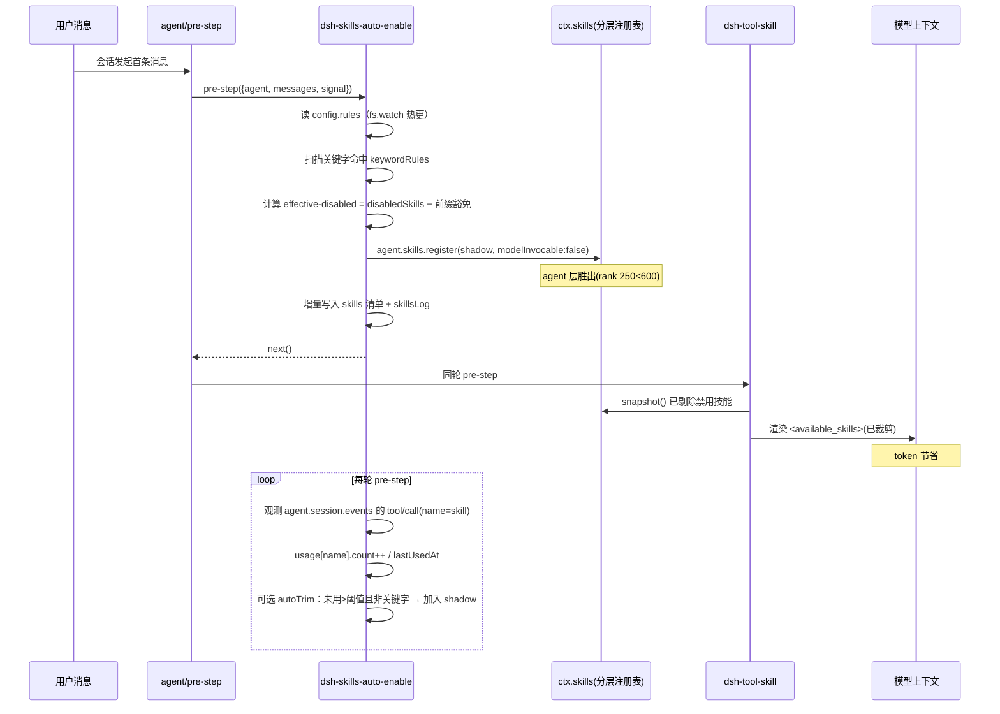

# dsh-skills-auto-enable 设计文档

## 一、设计说明

本设计实现宿主插件 `dsh-skills-auto-enable`，在**不修改任何 `@deepseek-ai/*` 框架代码**（AGENT.md 红线）的前提下，于会话生命周期中动态控制技能在模型上下文中的可见性，并把会话中存在的全部 SKILL 与执行过程实际调用的 SKILL 增量记录到本地配置文件，用于持续"加/移除上下文 SKILL"以节省 token。

### 核心约束（来自框架源码实测）

- 模型每轮看到的技能目录由 `@deepseek-ai/dsh-tool-skill` 在其 `agent/pre-step` 监听器内，用 `ctx.skills.snapshot({ cwd, signal, scope: agent })` 取全量、过滤 `isModelInvocable` 后渲染为 `<available_skills>` 系统提醒消息（source.kind=`skill-catalog`）。
- `ctx.skills` 是**分层注册表**（`SkillRegistry`）：全局层 + agent 作用域链层。**同名词条"最近作用域层"胜出**；同层内按 `rank` 升序胜出。bundled 技能 `rank = BUNDLED_SKILL_RANK = 600`，runtime 注册技能 `rank = RUNTIME_RANK = 250`。
- 关键推论：在 **agent 作用域**通过 `agent.skills.register({ name, description, content:'', invocation:{ modelInvocable:false, userInvocable:true } })` 注册同名 runtime 技能，可在该会话的目录中"遮蔽"原技能（rank 250 < 600 + agent 层更近），使 `tool-skill` 自建目录**自动剔除**该技能，且**天然跨轮生效**（无需每轮改写消息，规避了"改写 catalog 消息会被 snapshot 全量覆盖"的问题）。

## 二、目录结构设计

```
packages/dsh-skills-auto-enable/
├── package.json            # 宿主包配置 + dsh manifest（bundle.patch）
├── tsconfig.json           # 宿主端 TypeScript 配置
├── cordis.patch.yml        # 包内 patch 注册（按包名）
├── src/
│   ├── index.ts            # 插件入口：apply / inject / 注册 agent/pre-step / 会话 Map / 配置热更新
│   ├── config.ts           # 配置加载与 fs.watch 热更新 + 类型定义
│   ├── visibility.ts        # 有效禁用集计算 + agent 作用域 shadow 注册 + 关键字扫描
│   └── records.ts          # skills 清单(名称/关键字/概述) 与 usage 增量维护 + 原子落盘
└── __tests__/
    ├── visibility.test.ts   # shadow 注册 / 关键字豁免 单测
    └── records.test.ts      # skills 增量 / usage 累加 / 配置读写 单测
```

根 `cordis.yml` 新增一条 `insert` 条目：`dsh-skills-auto-enable`（按包名，宿主半区走包 main）。

## 三、架构决策（含取舍）

### 决策 1：用 agent 作用域层 shadow 控制可见性，而非改写 catalog 消息

- **Why**：实测 `tool-skill` 每轮用 `ctx.skills.snapshot` 重算目录，若仅改写 `decision.messages` 中的 catalog 消息，`catalogHistory` 比对可见 digest 与快照 digest 不一致会触发**全量重发**，下一轮即把我们的过滤覆盖掉。改写消息不可持续。
- **Why X over Y**：方案 B（注册全局 shadow provider、rank<600）可全局禁用，但**无法按会话关键字差异化**；方案 C（agent 作用域 runtime shadow）既能按会话隔离，又零框架改动，故采用 C。
- **How**：会话首次 `agent/pre-step` 时，对 effective-disabled 集中的每个技能名调用 `agent.skills.register(...modelInvocable:false)`（包在 `ctx.effect` 内，会话销毁自动撤销）。

### 决策 2：effective-disabled 集 = disabledSkills − 关键字前缀豁免

- 关键字命中 `keywordRules` 后，对应 `skillPrefix` 技能族从禁用阴影中**豁免**，实现"飞书/feishu → 加载 `lark-*` 全部技能"。
- 默认所有 `lark-*` 技能本就在全量目录中可见；关键字规则的主要价值是：当用户把某前缀族列入 `disabledSkills` 时，命中关键字即"按需重新启用"，并驱动 `skills` 清单与 `skillsLog` 记录。

### 决策 3：配置文件单文件 + 内存累计 + 会话结束原子落盘

- `dsh-skills-auto-enable-config.json` 置于包根目录（用户要求的"本地配置文件"）。
- 单宿主进程内，按 `sessionId` 在 Memory 中累计 `skills`/`usage`；去抖写盘（writeFile 先写临时文件再 rename，保证原子性），避免多会话并发写同一文件互相覆盖。

### 决策 4：会话身份与幂等

- 会话身份取 `agent.session.id`（实现时确认字段；若为 `header.id` 则回退）。
- 维护 `Map<sessionId, { disposer, usedSkills, lastKeywordAt }>`；首次 pre-step 完成 shadow 注册与基线 `skills` 写入，后续轮仅观测 `usage` 与可选实时关键字；会话 `session/end` 或 Map 淘汰时落盘并清理 effect。

## 四、运行序列图（mermaid）



## 五、关键模块设计

### 5.1 配置 schema（src/config.ts）

```typescript
export interface KeywordRule { keywords: string[]; skillPrefix: string }
export interface AutoTrim { enabled: boolean; unusedTurnsThreshold: number; keepKeywordMatched: boolean }
export interface SkillRecord { name: string; keyword: string; overview: string }
export interface SkillLogEntry { at: string; op: 'add' | 'remove'; name: string; keyword: string; overview: string }
export interface UsageRecord { count: number; lastUsedAt: string }
export interface AutoEnableConfig {
  version: 1
  rules: { disabledSkills: string[]; keywordRules: KeywordRule[]; autoTrim: AutoTrim }
  skills: SkillRecord[]
  skillsLog: SkillLogEntry[]
  usage: Record<string, UsageRecord>
}
```

### 5.2 可见性控制（src/visibility.ts 摘要）

```typescript
// 计算有效禁用集：disabledSkills 去掉被命中关键字前缀豁免的技能
export function computeEffectiveDisabled(disabled: string[], rules: KeywordRule[], matchedPrefixes: Set<string>): string[] {
  return disabled.filter(name => !matchedPrefixes.some(p => name.startsWith(p)))
}

// 在 agent 作用域注册 shadow（同名词条 modelInvocable:false 胜出）
export async function applyShadows(agent: AgentCtx, names: string[], lookup: SkillViewOptions): Promise<() => void> {
  const disposers: (() => void)[] = []
  for (const name of names) {
    const original = (await agent.skills.list(lookup)).find(s => s.name === name)
    if (!original) continue
    const undo = agent.skills.register({
      name,
      description: original.description,
      content: '',
      invocation: { modelInvocable: false, userInvocable: true },
    })
    disposers.push(undo)
  }
  return () => disposers.forEach(d => d())
}
```

### 5.3 增量记录（src/records.ts 摘要）

```typescript
// 会话发起：写基线 skills（name/keyword/overview）+ 追加 skillsLog(op:remove for disabled)
// 每轮：观测 tool/call(name=skill) → usage[name] = { count+1, lastUsedAt: now }
// 落盘：先写 <file>.tmp 再 fs.rename 原子替换
```

## 六、风险与缓解

| 风险 | 影响 | 缓解 |
|------|------|------|
| agent 作用域 shadow 注册失败/字段缺失 | 禁用技能仍可见 | 注册前用 `ctx.skills.list` 校验原技能存在；失败记 warn 不影响其它技能 |
| `agent.session.id` 字段名不符 | 会话 Map 错乱 | 实现时确认字段，回退 `header.id`；单测覆盖 |
| 多会话并发写同一配置文件 | 记录丢失 | 单进程内存累计 + 去抖原子写（tmp+rename） |
| 关键字误命中导致不该加载的技能可见 | 上下文膨胀 | keywordRules 精确匹配（小写归一化、词边界），默认不自动加载未知前缀 |
| autoTrim 误删正在用但低频技能 | 功能中断 | autoTrim 默认关闭；`keepKeywordMatched` 保前缀技能；阈值保守（默认 20 轮） |
| 配置 JSON 损坏 | 插件崩溃 | 读取失败回退默认规则并告警，不阻断会话 |

## 七、任务列表

见 `tasks.md`。

## 八、验证方案

### 8.1 单元测试（Vitest，node 环境）

- `visibility.test.ts`：禁用技能被注册为 `modelInvocable:false`；关键字命中前缀豁免；非 agent 作用域不应误注册。
- `records.test.ts`：skills 增量 add/remove + skillsLog；usage 从 `tool/call` 事件累加；配置读写与原子落盘。

### 8.2 集成联调

- `pnpm dsh web --patch cordis.yml` 启动，开新会话：
  - 配置 `disabledSkills:['lark-calendar']` → 目录中不见 `lark-calendar`。
  - 首条消息含"飞书" → 因 keywordRules 豁免，`lark-*` 可见（若此前被 disabled 则重新出现）。
  - 多轮调用某技能后，配置文件 `usage[技能名].count` 递增、`skills` 含该技能记录。

## 九、验证步骤

1. `pnpm typecheck` 无类型错误（禁 `any`）。
2. `pnpm test` 全部用例通过（visibility + records）。
3. `pnpm build` 产出 `packages/dsh-skills-auto-enable/dist/index.js`（ESM）。
4. 本地联调确认禁用移除、关键字自动加载、配置增量记录三项行为符合预期。
